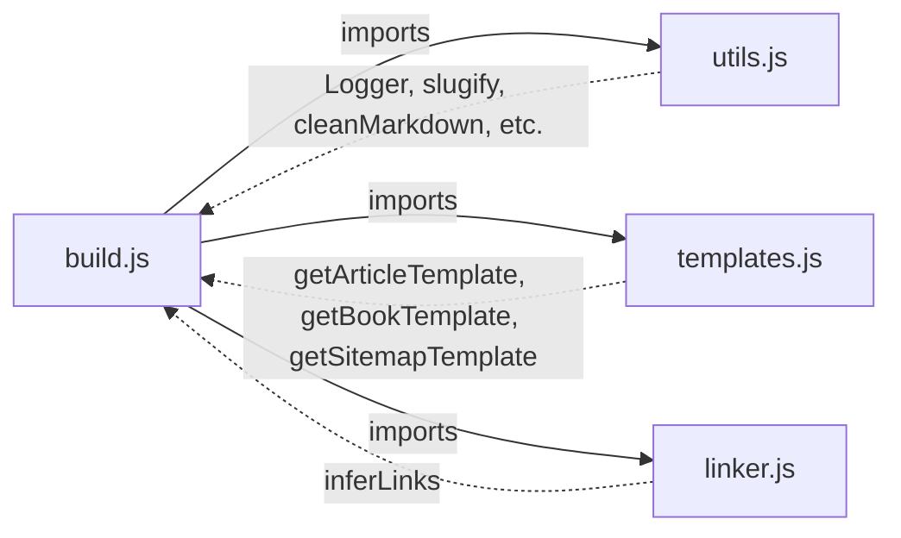
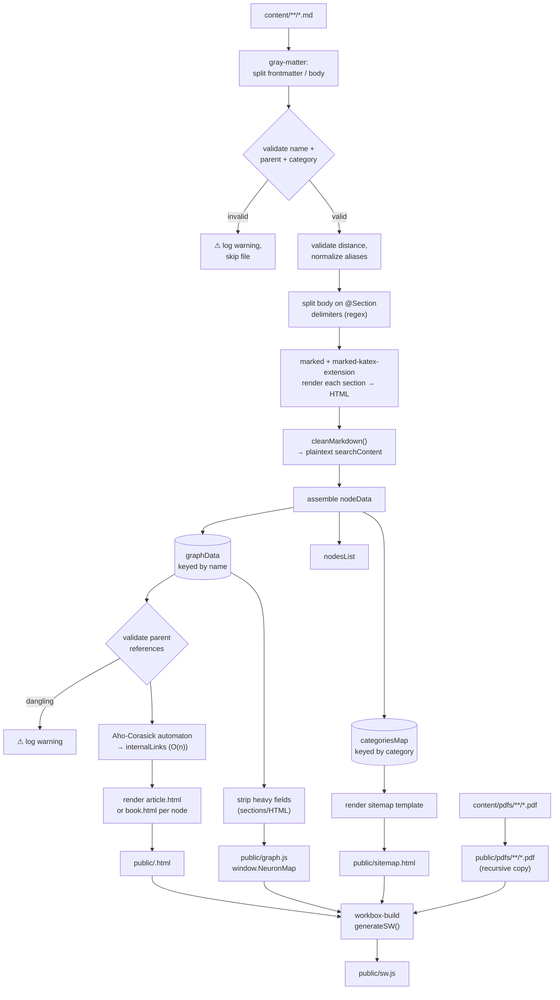

# 🧠 `build.js` — Neuron-IQ Static Knowledge Graph Compiler

> A modular, zero-server build pipeline that turns a folder of Markdown notes into a fully-linked, searchable, offline-capable PWA — complete with an **auto-inferred knowledge graph** (via Aho-Corasick), KaTeX math, and a Workbox service worker.

---

## Table of Contents

1. [What This Script Actually Does](#what-this-script-actually-does)
2. [Architecture Overview](#architecture-overview)
3. [Dependency Map](#dependency-map)
4. [Directory Contract](#directory-contract)
5. [Content Authoring Model](#content-authoring-model)
6. [Pipeline Walkthrough](#pipeline-walkthrough)
   - [Phase 1 — Discovery & Parsing](#phase-1--discovery--parsing)
   - [Phase 2 — Frontmatter Validation](#phase-2--frontmatter-validation)
   - [Phase 3 — Section Splitting](#phase-3--section-splitting)
   - [Phase 4 — Search Content Extraction](#phase-4--search-content-extraction)
   - [Phase 5 — Parent Reference Validation](#phase-5--parent-reference-validation)
   - [Phase 6 — Aho-Corasick Link Inference](#phase-6--aho-corasick-link-inference)
   - [Phase 7 — Static Asset Passthrough](#phase-7--static-asset-passthrough)
   - [Phase 8 — Page Rendering & Breadcrumbs](#phase-8--page-rendering--breadcrumbs)
   - [Phase 9 — Sitemap Generation](#phase-9--sitemap-generation)
   - [Phase 10 — Client Graph Payload](#phase-10--client-graph-payload)
   - [Phase 11 — PWA Compilation via Workbox](#phase-11--pwa-compilation-via-workbox)
7. [Output Artifact Map](#output-artifact-map)
8. [Template Comparison](#template-comparison)
9. [CLI Usage](#cli-usage)
10. [Module Reference](#module-reference)
11. [Performance Notes](#performance-notes)
12. [Running the Build](#running-the-build)

---

## What This Script Actually Does

`build.js` is a **Node.js static site generator (SSG)** purpose-built for a "digital garden"-style knowledge base. It is not a general-purpose SSG — it encodes a specific mental model:

- Every concept is a **node** (`content/**/*.md`) with a `name`, a `parent`, and a `category`.
- Nodes link to each other **automatically** — there is no `[[wikilink]]` syntax to maintain. If Node A's text merely *mentions* Node B's name (or an alias), the build infers a directed edge `A → B` using an Aho-Corasick automaton (O(n) per node, not O(n²)).
- The entire graph, once computed, is serialized into a single client-side payload (`graph.js`) so that navigation, search, and "sub-concept" sidebars work with zero server round-trips.
- The final output is wrapped in a Workbox-generated service worker, making the whole knowledge base installable and browsable offline.

In short: **content-as-data in, installable PWA out**, in one `node build.js` invocation.

---

## Architecture Overview

The build pipeline is split across four modules:

```
build.js        Orchestrator — CLI args, pipeline coordination, validation
utils.js        Shared utilities — Logger, slugify, cleanMarkdown, filesystem helpers
templates.js    HTML templates — article, book (PDF), sitemap page generators
linker.js       Aho-Corasick automaton — O(n) internal link inference
```



---

## Dependency Map

| Package | Import Style | Role |
|---|---|---|
| `fs`, `path` | `require` (built-in) | Filesystem traversal, path joining |
| `gray-matter` | `require` | Splits each `.md` file into YAML frontmatter + body |
| `workbox-build` | `require` (`generateSW`) | Compiles `sw.js` from the finished `public/` output |
| `marked` | `await import()` — dynamic | Markdown → HTML (ESM-only package, hence the dynamic import inside an otherwise CJS file) |
| `marked-katex-extension` | `await import()` — dynamic | Teaches `marked` to render `$...$` / `$$...$$` into KaTeX HTML **at build time** |

> **Why the mixed `require`/`import`?** `marked` ships ESM-only in recent majors, so it can't be `require()`'d from a CommonJS module. The script sidesteps this with a dynamic `import()` inside the async `buildGraph()` function.

---

## Directory Contract

```
project-root/
├── content/                  # SOURCE OF TRUTH — hand-authored Markdown
│   ├── pdfs/                 # (optional) PDFs referenced by `pdf:` frontmatter
│   │   └── subfolder/        # nested folders are now recursively copied
│   └── **/*.md               # any nesting depth is fine; only .md is read
├── build.js                  # Pipeline orchestrator
├── utils.js                  # Shared utilities (Logger, slugify, etc.)
├── templates.js              # HTML template functions
├── linker.js                 # Aho-Corasick link inference
└── public/                   # BUILD OUTPUT — overwritten on every run
    ├── <slug>.html           # one file per node (article or book template)
    ├── sitemap.html
    ├── graph.js              # window.NeuronMap — the client-side graph
    ├── pdfs/                 # copied recursively from content/pdfs
    └── sw.js                 # generated last, by Workbox
```

`public/` is expected to **already contain** `page.css`, `global.js`, `router.js`, and `manifest.json` before this script runs — `build.js` references them in every template but never writes them.

---

## Content Authoring Model

Every node is one Markdown file with YAML frontmatter plus a lightweight custom section syntax:

```markdown
---
name: Gradient Descent
parent: Optimization
category: Machine Learning
distance: 2
aliases: [GD, Steepest Descent]
---

This is the overview text. It renders directly under the H1,
with **no** "## Overview" header — it's the article's lede.

@Mathematical Formulation

The update rule is $\theta \leftarrow \theta - \eta \nabla J(\theta)$.

@Convergence Properties

Discussion of convergence guarantees goes here, and if this text
mentions "Adam Optimizer" by name, a directed link to that node
is created automatically — no markup required.
```

### Frontmatter Schema

| Field | Type | Required | Behavior |
|---|---|---|---|
| `name` | `string` | ✅ | Primary key. Must be **exactly** matched by any child's `parent` field (case-sensitive). Also used to slugify the output filename. |
| `parent` | `string` | ✅ | The literal string `"Root"` for top-level nodes, or another node's exact `name`. **Validated post-load** — dangling references produce a warning. |
| `category` | `string` | ✅ | Groups nodes on the sitemap; also shown as a badge on the article page. |
| `distance` | `string`/`number` | optional | Parsed with `parseInt(…, 10)`. If absent or non-numeric, **defaults to 0** with a warning. |
| `aliases` or `alias` | `string` or `string[]` | optional | Alternate names checked during auto-link inference. Both singular and plural forms are accepted and normalized. |
| `pdf` | `string` (filename or full URL) | optional | Switches the node to the **book template** — an embedded PDF viewer instead of an article. |

### The `@Section Title` Delimiter

The body is split on any line matching `@SomeTitle` (must be on its own line). Text before the first `@` becomes an unlabeled **"Overview"** section (`isPreamble: true`, no rendered `<h2>`); everything after becomes a titled section, slugified into an anchor ID for the sidebar table of contents.

---

## Pipeline Walkthrough



### Phase 1 — Discovery & Parsing

`getAllFiles()` (from `utils.js`) is a recursive directory walker that returns every file under `content/`, filtered down to `.md`. Each file is read synchronously and handed to `gray-matter`.

### Phase 2 — Frontmatter Validation

Each file's frontmatter is validated for the three required fields (`name`, `parent`, `category`). Files missing any are **logged with a `[WARN]`** specifying the filename and missing field(s), then skipped. This replaces the old silent-drop behavior.

Additional validations:
- **`distance`**: If absent or non-numeric, defaults to `0` with a warning. No more `NaN` badges.
- **`aliases`/`alias`**: Both singular and plural forms are accepted and normalized into a string array.

### Phase 3 — Section Splitting

```js
const parts = body.split(/(?:^|\n)@([^\n]+)\n/);
```

Because the regex has a capturing group, `String.split` interleaves the delimiter matches into the result array. `parts[0]` (if non-empty) becomes the preamble/"Overview" section; the loop `for (let i = 1; ...)` walks title/content pairs.

### Phase 4 — Search Content Extraction

`cleanMarkdown()` (from `utils.js`) reduces each section's raw Markdown to plain, searchable text by stripping HTML tags, math fences, formatting markers, and link syntax. The result (`searchContent`) is what both the Aho-Corasick linker and the client-side Fuse.js search index operate on.

### Phase 5 — Parent Reference Validation

After all nodes are loaded, the build walks every node and checks that `parent` (unless `"Root"`) matches an existing key in `graphData`. Dangling references produce a `[WARN]` with the node name and the bad parent value. The build continues — pages are still generated — but the problem is now visible.

### Phase 6 — Aho-Corasick Link Inference

This is the build's signature feature, now running in **O(n × content_length)** instead of O(n²):

1. A single Aho-Corasick trie is built from all node names + aliases (lowercased).
2. Failure links are computed via BFS.
3. Each node's `searchContent` is scanned through the automaton once.
4. Matches are filtered for word-boundary compliance.

The result is a **directed, non-reciprocal** graph — Node A mentioning Node B does not imply B mentions A.

### Phase 7 — Static Asset Passthrough

If `content/pdfs/` exists, all `.pdf` files are copied **recursively** into `public/pdfs/`, preserving subdirectory structure. (Previously this was shallow — only top-level files were copied.)

### Phase 8 — Page Rendering & Breadcrumbs

For each node:

1. `parentLink` = `"index.html"` if `parent === "Root"`, else `slugify(parent) + ".html"`.
2. `plainTextDesc` = first section's HTML with tags stripped, truncated at the **last word boundary** before 155 characters, then HTML-attribute-escaped. No more mid-word/mid-entity cuts.
3. The breadcrumb trail is built by walking `graphData[curr.parent]` upward until `name === "Root"`.
4. Depending on whether `node.pdf` is set, either `getBookTemplate` or `getArticleTemplate` (from `templates.js`) is rendered.

Each page render is wrapped in try/catch — a single broken node doesn't kill the entire build.

### Phase 9 — Sitemap Generation

Categories are iterated, each sorted alphabetically, and rendered into card-per-category HTML via `getSitemapTemplate`.

### Phase 10 — Client Graph Payload

A trimmed copy of `graphData` — dropping the heavy `sections` (full rendered HTML) — is serialized to `window.NeuronMap` in `public/graph.js`.

### Phase 11 — PWA Compilation via Workbox

`generateSW()` globs `public/**/*.{html,js,css,json,svg}`, excludes `sw.js` itself, and writes `public/sw.js` with immediate activation and CDN caching rules.

---

## Output Artifact Map

| File | Produced In | Purpose |
|---|---|---|
| `public/<slug>.html` (×N) | Phase 8 | One article or book page per content node |
| `public/sitemap.html` | Phase 9 | Category-grouped index of every node |
| `public/graph.js` | Phase 10 | `window.NeuronMap` — client-side graph/search payload |
| `public/pdfs/**/*.pdf` | Phase 7 | Recursively copied source PDFs for book-template nodes |
| `public/sw.js` | Phase 11 | Workbox-generated offline service worker |

---

## Template Comparison

| | `getArticleTemplate` | `getBookTemplate` | `getSitemapTemplate` |
|---|---|---|---|
| Used when | `!node.pdf` | `node.pdf` is set | Once, globally |
| Sidebar / TOC | ✅ (sections + lineage tree) | ❌ | ❌ |
| Breadcrumbs | ✅ | ✅ | ❌ |
| KaTeX | Build-time only (no client scripts) | N/A | N/A |
| Main content | Rendered Markdown sections | `<iframe>` embedding a PDF | Category cards |

---

## CLI Usage

```bash
node build.js              # Default build with structured logging
node build.js --strict      # Treat warnings as errors (exit 1). For CI.
node build.js --quiet       # Suppress info output; only show warnings/errors.
node build.js --help        # Print usage and exit.
```

---

## Module Reference

### `utils.js`

| Export | Type | Purpose |
|---|---|---|
| `Logger` | Class | Structured logging with `info`, `warn`, `error`, `fatal`, `summary` methods |
| `slugify(text)` | Function | Converts a title to a URL-safe slug |
| `cleanMarkdown(text)` | Function | Strips Markdown/HTML/KaTeX to plain text |
| `truncateDescription(text, maxLen)` | Function | Word-boundary-aware truncation with ellipsis |
| `escapeHtmlAttr(str)` | Function | Escapes `&`, `"`, `<`, `>` for use in HTML attributes |
| `getAllFiles(dirPath)` | Function | Recursively collects all files under a directory |
| `copyFilesRecursive(src, dest, ext, log)` | Function | Recursively copies files by extension |
| `parseCliArgs()` | Function | Parses `--strict`, `--quiet`, `--help` from `process.argv` |
| `HELP_TEXT` | String | CLI help message |

### `templates.js`

| Export | Purpose |
|---|---|
| `getArticleTemplate(node, parentLink, desc, breadcrumbs)` | Full article page HTML |
| `getBookTemplate(node, parentLink, desc, breadcrumbs)` | Full-viewport PDF viewer page |
| `getSitemapTemplate(categoriesHTML)` | Sitemap index page |

### `linker.js`

| Export | Purpose |
|---|---|
| `inferLinks(nodesList)` | Aho-Corasick-based link inference; populates `node.internalLinks` in-place, returns total link count |

---

## Performance Notes

The Aho-Corasick automaton (Phase 6) replaces the old O(n²) regex-per-pair approach. For `N` nodes with average content length `L` and total pattern length `P`:

- **Old**: O(N² × L) — each node's content scanned against every other node's name.
- **New**: O(N × L + P) — one automaton built once (O(P)), each node scanned once (O(L)).

Everything else in the pipeline (frontmatter parsing, Markdown rendering, template writing) is linear in file count and dominated by disk I/O.

---

## Running the Build

```bash
node build.js
```

No config file — all paths are hardcoded relative to `__dirname`. The script expects `gray-matter`, `workbox-build`, `marked`, and `marked-katex-extension` installed, and expects `public/` to already contain the hand-maintained static assets. On failure, the process exits with code `1`. In `--strict` mode, warnings also trigger exit code `1`.