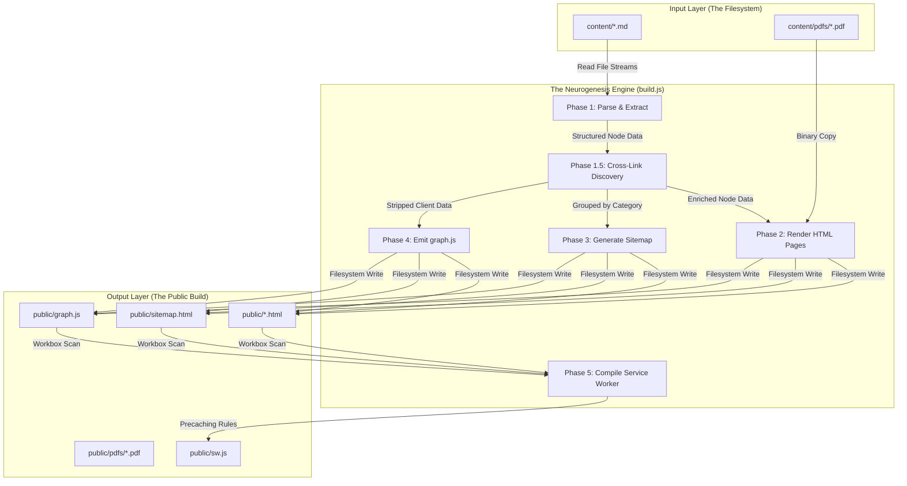
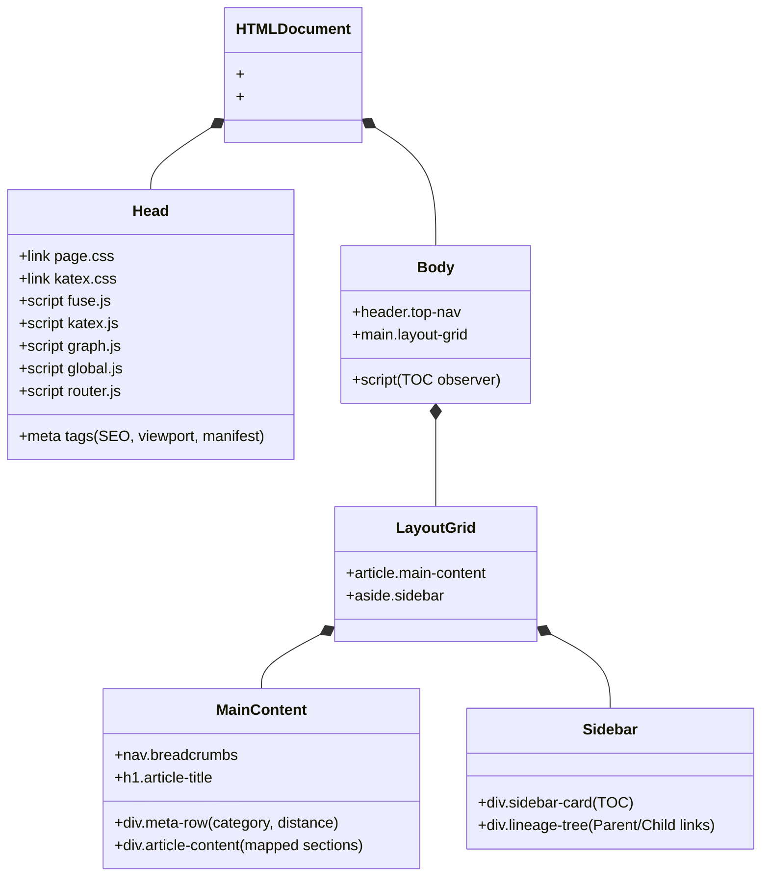
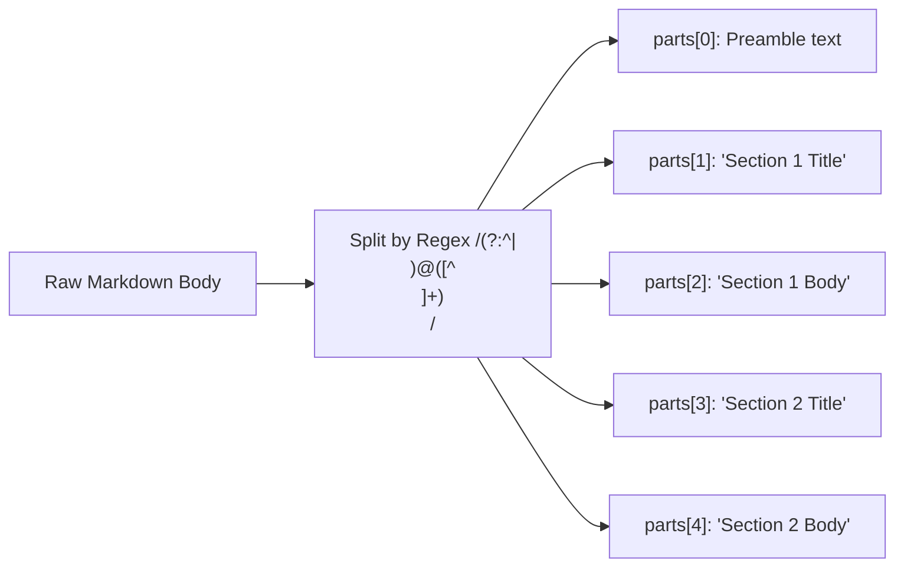
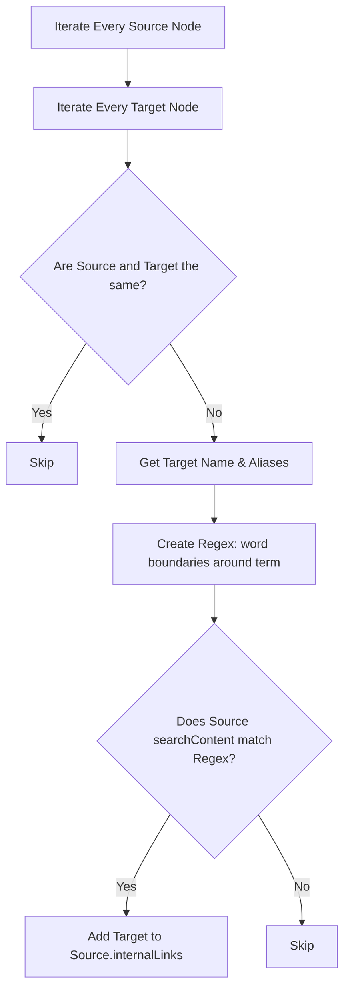

# Understanding `build.js`

Welcome to the architectural guide to **`build.js`**.

This document is designed to be read patiently. We will dive deep into the technical philosophies, algorithmic decisions, and low-level code mechanics of the build pipeline. We will use Mermaid graphs to visualize the data flow, and we will explain *why* certain architectural choices were made over others.

---

## High-Level Architecture

Before looking at the code, we will understand the architecture of `build.js`.

1. **No Backend Required:** Neuron-IQ is designed to be hosted anywhere (GitHub Pages, Netlify, an S3 bucket, or a USB drive). Therefore, `build.js` cannot rely on a database like PostgreSQL or MongoDB. The filesystem *is* the database.
2. **Pre-computation over Runtime Computation:** Parsing Markdown, rendering KaTeX (math equations), and discovering cross-links are expensive operations. If we did this in the browser, the app would be slow and drain the user's battery. `build.js` does all the heavy lifting upfront, shipping pre-rendered HTML and a lightweight JSON graph to the browser.
3. **PWA First:** The output must be fully cacheable and functional completely offline. `build.js` orchestrates the creation of a Service Worker to achieve this.

Here is the high-level view of the entire build process:



---

## Dependencies & Initialization

Let's start at the very top of `build.js`. The script relies on a mix of native Node.js modules and carefully selected third-party libraries.

### The Imports

```javascript
const fs = require('fs');
const path = require('path');
const matter = require('gray-matter');
const { generateSW } = require('workbox-build');
```

- **`fs` and `path`**: Native Node.js modules for interacting with the filesystem and resolving cross-platform file paths.
- **`gray-matter`**: A wildly popular library for parsing YAML frontmatter from Markdown files. It cleanly separates the metadata (like title, category, and distance) from the actual content.
- **`workbox-build`**: Google's industry-standard library for generating Service Workers. We use it to create the offline caching rules.

Wait, where is `marked` (the Markdown parser)? 

If you look closely at the code, `marked` and its KaTeX extension are imported *dynamically* inside the asynchronous `buildGraph()` function:

```javascript
const { marked } = await import('marked');
const { default: markedKatex } = await import('marked-katex-extension');
```

**Why Dynamic Imports?** Modern versions of `marked` are packaged as ESM (ECMAScript Modules). Because `build.js` is a CommonJS script (using `require()`), we cannot use a top-level `import` statement. Node.js allows us to bridge the CommonJS-to-ESM gap by using the asynchronous `await import()` syntax.

### Environment Setup

The script defines its working directories immediately:

```javascript
const contentDir = path.join(__dirname, 'content');
const outputDir = path.join(__dirname, 'public');
const outputFile = path.join(outputDir, 'graph.js');
```

This ensures that no matter where you run `node build.js` from (whether in the project root or a nested folder), it resolves absolute paths based on `__dirname` (the directory of `build.js` itself).

---

## Core Utilities: The `slugify` Function

Every concept needs a unique, URL-friendly identifier. The `slugify` function is responsible for this transformation.

```javascript
const slugify = (text) => text.toString().toLowerCase().trim()
    .replace(/[\s_]+/g, '-')           // Replace spaces and underscores with hyphens
    .replace(/[^\w\-]+/g, '')          // Remove all non-word characters (except hyphens)
    .replace(/\-\-+/g, '-');           // Collapse multiple consecutive hyphens into one
```

**Example Transformations:**
- `"Artificial Intelligence"` ➔ `"artificial-intelligence"`
- `"Computer Science (CS)"` ➔ `"computer-science-cs"`
- `"  Quantum   Mechanics_101!  "` ➔ `"quantum-mechanics-101"`

This guarantees that URLs in `public/` are clean, predictable, and SEO-friendly.

---

## The HTML Templates

Instead of using a bulky templating engine like EJS, Handlebars, or Pug, `build.js` relies on native JavaScript **Template Literals** (`` ` ``). This keeps the build script dependency-free and incredibly fast.

There are three primary template functions:
1. `getArticleTemplate`
2. `getSitemapTemplate`
3. `getBookTemplate`

Firstly, we'll dissect `getArticleTemplate` as it is the most complex.

### `getArticleTemplate(node, parentLink, plainTextDesc, breadcrumbsHTML)`

This function returns the raw HTML string for a standard knowledge node.



**Key Architectural Details in the Template:**

1. **Static vs. Dynamic Scripts:** The template hardcodes links to CSS and JS files that exist in the `public/` directory (`page.css`, `global.js`, etc.). These are the *runtime* engines that take over once the static HTML is loaded.
2. **SEO Metadata:** The `<meta name="description">` tag is populated with `plainTextDesc`—a stripped-down, 150-character excerpt of the node's overview. This is critical for search engine indexing and social media link unfurling (OpenGraph).
3. **Section Mapping:** The Markdown content is not just dumped into a single `<div>`. The build script splits the markdown into sections (we will see this in Phase 1). The template then maps over these sections, wrapping them in `<section class="content-section" id="...">`. This enables direct URL linking to specific paragraphs (e.g., `physics.html#classical-physics`).
4. **The Sidebar & Lineage Tree:** The template generates an "On This Page" Table of Contents (TOC) based on the section titles. Below it, it builds a "Concept Lineage" tree, explicitly linking to the `parentLink`. Note that the `children-list` is left empty (`<ul id="sidebar-children-list"></ul>`)—this is hydrated dynamically by `global.js` at runtime!

### `getBookTemplate`

This template is a specialized variant of the article template. Instead of rendering Markdown text, it renders a full-page `<iframe src="pdfs/file.pdf">`. It is triggered only if the frontmatter contains a `pdf: filename.pdf` attribute. This allows Neuron-IQ to act as a library for textbooks and research papers while keeping them integrated into the graph topology.

---

## ⚙️ The Pipeline: `buildGraph()`

The `buildGraph` function is the massive asynchronous orchestrator. It handles the 5 phases of the build.

### Directory Initialization and File Walking

```javascript
if (!fs.existsSync(outputDir)) fs.mkdirSync(outputDir);
```
First, it ensures the `public/` directory exists.

Next, it needs to find all the Markdown files. It uses a recursive directory walk function:

```javascript
const getAllFiles = function(dirPath, arrayOfFiles) {
    let filesList = fs.readdirSync(dirPath);
    // ... recursive checks using fs.statSync().isDirectory() ...
    return arrayOfFiles;
}
```
This algorithm traverses `content/` and all its subdirectories (no matter how deep). It filters the resulting array to only include files ending in `.md`.

---

### Phase 1: Parse and Load Knowledge Nodes

This is the data extraction phase. We iterate over every `.md` file.

```javascript
files.forEach(file => {
    const rawText = fs.readFileSync(path.join(contentDir, file), 'utf-8');
    const { data: metadata, content: body } = matter(rawText);
    
    // Safety check: skip malformed files
    if (!metadata.name || !metadata.parent || !metadata.category) return;
    // ...
```

#### Section Splitting Algorithm

Neuron-IQ introduces a custom Markdown convention: the `@` symbol denotes a major section title.

```javascript
const parts = body.split(/(?:^|\n)@([^\n]+)\n/);
```
This Regular Expression splits the document whenever it encounters an `@` at the start of a line, capturing the text that follows it until the newline.



The script then iterates through these parts to build an array of section objects:

```javascript
const sections = [];
// Handle the preamble (text before the first @)
if (parts[0].trim()) {
    sections.push({ 
        title: 'Overview', 
        id: 'overview', 
        contentHTML: marked.parse(parts[0].trim(), { breaks: true }), 
        rawContent: parts[0].trim(), 
        isPreamble: true 
    });
}
// Handle the explicit @ sections
for (let i = 1; i < parts.length; i += 2) {
    const title = parts[i].trim();
    const contentText = (parts[i + 1] || '').trim();
    sections.push({ 
        title, 
        id: slugify(title), 
        contentHTML: marked.parse(contentText, { breaks: true }), 
        // ...
    });
}
```

Notice the call to `marked.parse()`. This is where Markdown is converted to HTML. Because we configured `marked` with `markedKatex` earlier, any `$math$` or `$$math$$` blocks in the text are simultaneously converted into KaTeX HTML elements right here on the server.

#### Search Content Stripping

To make fuzzy search fast on the client, we need a plain-text version of the article. `build.js` strips all HTML, math, and markdown formatting:

```javascript
const cleanMarkdown = (text) => text?.replace(/<[^>]+>/g, '') // Strip HTML tags
    .replace(/\$\$/g, '') // Strip KaTeX blocks
    .replace(/\$/g, '')   // Strip inline KaTeX
    .replace(/\*\*|__/g, '') // Strip bold
    .replace(/\*|_/g, '') // Strip italic
    .replace(/\[([^\]]+)\]\([^\)]+\)/g, '$1') // Convert [Link](url) to just "Link"
    .replace(/\n/g, ' ') // Flatten newlines
    .replace(/\s\s+/g, ' ') // Collapse spaces
    .trim() || '';
```
This `searchContent` string is what Fuse.js will scan against in the browser.

#### The Node Object

Finally, the parsed data is bundled into a master `nodeData` object and pushed into `graphData` (a lookup map by name), `nodesList` (a flat array), and `categoriesMap` (grouped by category for the sitemap).

---

### Phase 1.5: Synapse Generation (Internal Links)

A knowledge graph is useless without connections. In Neuron-IQ, the hierarchy (parent/child) is explicit in the frontmatter. But cross-links (e.g., "Physics" casually mentioning "Calculus") are discovered dynamically.

This is an $O(N^2)$ operation, which is why it's done at build time, not runtime!



**The Regex Implementation:**
```javascript
const termEscaped = term.replace(/[.*+?^${}()|[\]\\]/g, '\\$&');
const regex = new RegExp(`(?:^|\\W)${termEscaped}(?=\\W|$)`, 'i');
```
This regex ensures we don't accidentally match substrings. If the target is "AI", we want to match "The AI is smart" but we *do not* want to match "The c**ai**rn terrier". The `(?:^|\W)` ensures the match is preceded by the start of the string or a non-word character. The `(?=\W|$)` ensures it is followed by a non-word character or the end of the string.

---

### Phase 2: HTML Generation & Lineage Tracing

With all data parsed and linked, we can write the HTML files to disk.

For every node, we need to trace its lineage back to the `Root` to build the breadcrumb navigation.

```javascript
const pathArray = [];
let curr = node;
while (curr && curr.name !== 'Root') {
    pathArray.push(curr);
    curr = curr.parent ? graphData[curr.parent] : null;
}
pathArray.reverse();
```
If the graph is `Root -> CS -> AI -> Perceptrons`, the while loop starts at `Perceptrons` and pushes `[Perceptrons, AI, CS]`. Reversing it gives `[CS, AI, Perceptrons]`.

We then iterate over `pathArray` to generate the HTML string for the breadcrumbs:
`<a href="index.html">Home</a> / <a href="cs.html">CS</a> / <a href="ai.html">AI</a> / <span class="current">Perceptrons</span>`

Finally, we call `getArticleTemplate()` (or `getBookTemplate()`) and write the resulting string to disk using `fs.writeFileSync(path.join(outputDir, ${node.slug}.html))`.

---

### Phase 3: The Sitemap

Search engine crawlers (like Googlebot) do not execute JavaScript visualization engines like D3.js. If we only rendered the graph, Google would think the site is empty.

To ensure 100% SEO visibility, we generate a static HTML `sitemap.html`.

The script iterates over the `categoriesMap` we built in Phase 1:
```javascript
for (const [category, nodes] of Object.entries(categoriesMap)) {
    nodes.sort((a, b) => a.name.localeCompare(b.name)); // Alphabetical sorting
    // Generate HTML cards for each category...
}
fs.writeFileSync(path.join(outputDir, 'sitemap.html'), getSitemapTemplate(sitemapCategoriesHTML).trim());
```

---

### Phase 4: Constructing the Digital Brain (`graph.js`)

The browser needs to know about the graph to render the D3 visualization and run the global search modal. However, we cannot send the *entire* parsed graph because it includes the massive `contentHTML` for every article. That would result in a multi-megabyte JSON file.

Instead, we strip the graph down to its bare essentials:

```javascript
const clientGraphData = Object.fromEntries(Object.entries(graphData).map(([key, n]) => [key, {
    name: n.name, 
    parent: n.parent, 
    category: n.category, 
    distance: n.distance, 
    slug: n.slug, 
    sectionTitles: n.sectionTitles, 
    searchContent: n.searchContent, 
    internalLinks: n.internalLinks, 
    aliases: n.aliases || []
}]));

fs.writeFileSync(outputFile, `// AUTO-GENERATED BY BUILD.JS\nwindow.NeuronMap = ${JSON.stringify(clientGraphData, null, 2)};`);
```

By assigning the JSON directly to `window.NeuronMap` inside a `.js` file, the browser can cache it easily and execute it instantly without needing a slow `fetch()` call.

---

### Phase 5: Service Worker & PWA Caching

The final step is to make the entire site work offline. Neuron-IQ uses `workbox-build`.

```javascript
const { count, size, warnings } = await generateSW({
    globDirectory: outputDir,
    globPatterns: ['**/*.{html,js,css,json,svg}'], // Cache all structural assets
    globIgnores: ['sw.js', '**/*.tmp', '**/*.log'], // Don't cache the SW itself!
    swDest: path.join(outputDir, 'sw.js'),
    clientsClaim: true,
    skipWaiting: true,
    navigateFallback: 'index.html', // SPA fallback routing
    runtimeCaching: [
        {
            // Cache CDN dependencies (KaTeX fonts, etc)
            urlPattern: /https:\/\/(?:cdn\.jsdelivr\.net|fonts\.googleapis\.com|fonts\.gstatic\.com)/,
            handler: 'CacheFirst',
            options: {
                cacheName: 'cdn-cache',
                expiration: { maxEntries: 100, maxAgeSeconds: 31536000 } // 1 Year
            }
        }
    ]
});
```

Workbox automatically scans `public/`, generates MD5 hashes for every file, and writes them into `sw.js`. When a user visits the site, the Service Worker downloads these files into the browser's Cache Storage. On subsequent visits (even without WiFi), the site loads instantly.

---

## Conclusion

`build.js` is an exercise in ruthless optimization. By shifting the burden of parsing, math rendering, and link discovery to the build phase, Neuron-IQ achieves blazing fast client-side performance. It requires no databases, no servers, and no runtime environments—just pure, static brilliance delivered via a robust CDN.

The final output logged to the console:
`[Neuron-IQ] SEO Build complete! Processed X pages + generated Sitemap.`
`[Neuron-IQ] Service Worker sw.js compiled by Workbox! Cached Y files...`