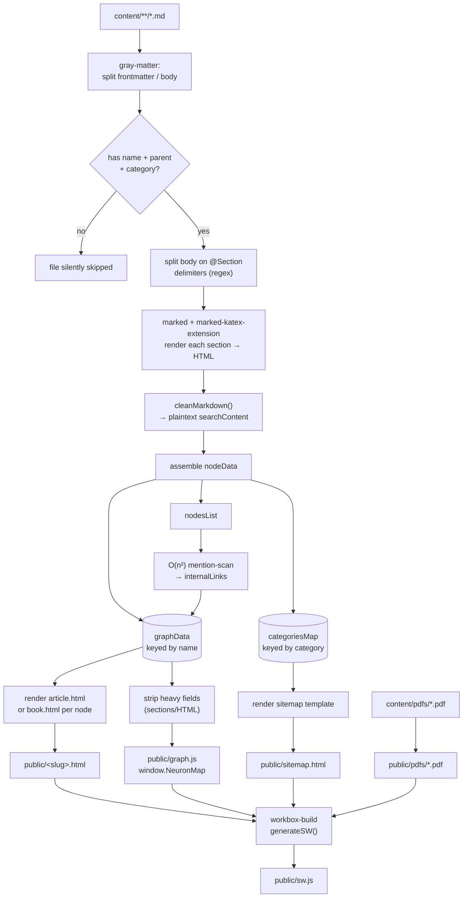
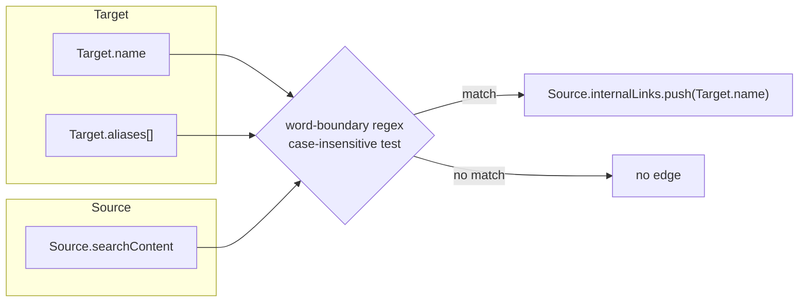
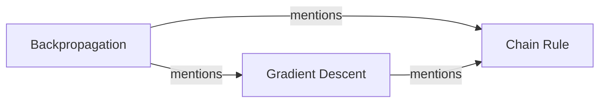
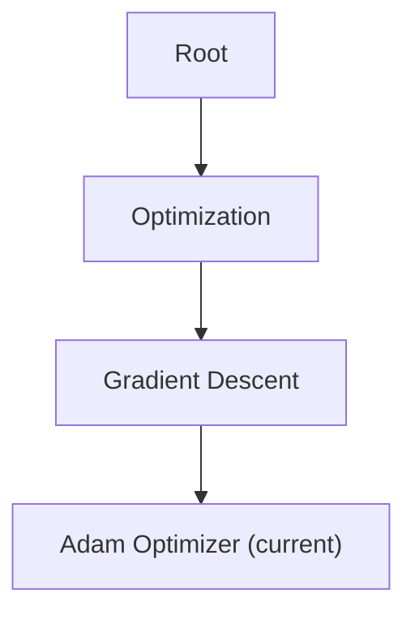

# 🧠 `build.js` — Neuron-IQ Static Knowledge Graph Compiler

> A single-file, zero-server build pipeline that turns a folder of Markdown notes into a fully-linked, searchable, offline-capable PWA — complete with an **auto-inferred knowledge graph**, KaTeX math, and a Workbox service worker.

---

## Table of Contents

1. [What This Script Actually Does](#what-this-script-actually-does)
2. [Dependency Map](#dependency-map)
3. [Directory Contract](#directory-contract)
4. [Content Authoring Model](#content-authoring-model)
5. [Pipeline Walkthrough](#pipeline-walkthrough)
   - [Phase 1 — Discovery & Parsing](#phase-1--discovery--parsing)
   - [Phase 2 — Section Splitting](#phase-2--section-splitting)
   - [Phase 3 — Search Content Extraction](#phase-3--search-content-extraction)
   - [Phase 4 — Node Assembly](#phase-4--node-assembly)
   - [Phase 5 — Automatic Backlink Inference](#phase-5--automatic-backlink-inference)
   - [Phase 6 — Static Asset Passthrough](#phase-6--static-asset-passthrough)
   - [Phase 7 — Page Rendering & Breadcrumbs](#phase-7--page-rendering--breadcrumbs)
   - [Phase 8 — Sitemap Generation](#phase-8--sitemap-generation)
   - [Phase 9 — Client Graph Payload](#phase-9--client-graph-payload)
   - [Phase 10 — PWA Compilation via Workbox](#phase-10--pwa-compilation-via-workbox)
6. [Output Artifact Map](#output-artifact-map)
7. [Template Comparison](#template-comparison)
8. [Known Quirks & Edge Cases](#known-quirks--edge-cases)
9. [Performance Notes](#performance-notes)
10. [Suggested Extension Points](#suggested-extension-points)
11. [Running the Build](#running-the-build)

---

## What This Script Actually Does

`build.js` is a **Node.js static site generator (SSG)** purpose-built for a "digital garden"-style knowledge base. It is not a general-purpose SSG — it encodes a specific mental model:

- Every concept is a **node** (`content/**/*.md`) with a `name`, a `parent`, and a `category`.
- Nodes link to each other **automatically** — there is no `[[wikilink]]` syntax to maintain. If Node A's text merely *mentions* Node B's name (or an alias), the build infers a directed edge `A → B`.
- The entire graph, once computed, is serialized into a single client-side payload (`graph.js`) so that navigation, search, and "sub-concept" sidebars work with zero server round-trips.
- The final output is wrapped in a Workbox-generated service worker, making the whole knowledge base installable and browsable offline.

In short: **content-as-data in, installable PWA out**, in one synchronous `node build.js` invocation.

---

## Dependency Map

| Package | Import Style | Role |
|---|---|---|
| `fs`, `path` | `require` (built-in) | Filesystem traversal, path joining |
| `gray-matter` | `require` | Splits each `.md` file into YAML frontmatter + body |
| `workbox-build` | `require` (`generateSW`) | Compiles `sw.js` from the finished `public/` output |
| `marked` | `await import()` — dynamic | Markdown → HTML (ESM-only package, hence the dynamic import inside an otherwise CJS file) |
| `marked-katex-extension` | `await import()` — dynamic | Teaches `marked` to render `$...$` / `$$...$$` into KaTeX HTML **at build time** |

> **Why the mixed `require`/`import`?** `marked` ships ESM-only in recent majors, so it can't be `require()`'d from a CommonJS module. The script sidesteps this with a top-level `await import(...)` inside the async `buildGraph()` function rather than converting the whole file to ESM.

---

## Directory Contract

```
project-root/
├── content/                  # SOURCE OF TRUTH — hand-authored Markdown
│   ├── pdfs/                 # (optional) PDFs referenced by `pdf:` frontmatter
│   └── **/*.md                # any nesting depth is fine; only .md is read
└── public/                    # BUILD OUTPUT — overwritten on every run
    ├── <slug>.html            # one file per node (article or book template)
    ├── sitemap.html
    ├── graph.js                # window.NeuronMap — the client-side graph
    ├── pdfs/                   # copied verbatim from content/pdfs
    └── sw.js                   # generated last, by Workbox
```

`public/` is expected to **already contain** `page.css`, `global.js`, `router.js`, and `manifest.json` before this script runs — `build.js` references them in every template but never writes them. This script owns *content compilation*, not the static asset pipeline; something upstream (or version control itself) is responsible for those files being present when Workbox globs the directory in Phase 10.

---

## Content Authoring Model

Every node is one Markdown file with YAML frontmatter plus a lightweight custom section syntax:

```markdown
---
name: Gradient Descent
parent: Optimization
category: Machine Learning
distance: 2
aliases: [GD, Steepest Descent]
---

This is the overview text. It renders directly under the H1,
with **no** "## Overview" header — it's the article's lede.

@Mathematical Formulation

The update rule is $\theta \leftarrow \theta - \eta \nabla J(\theta)$.

@Convergence Properties

Discussion of convergence guarantees goes here, and if this text
mentions "Adam Optimizer" by name, a directed link to that node
is created automatically — no markup required.
```

### Frontmatter Schema

| Field | Type | Required | Behavior |
|---|---|---|---|
| `name` | `string` | ✅ | Primary key. Must be **exactly** matched by any child's `parent` field (case-sensitive). Also used to slugify the output filename. |
| `parent` | `string` | ✅ | The literal string `"Root"` for top-level nodes, or another node's exact `name`. |
| `category` | `string` | ✅ | Groups nodes on the sitemap; also shown as a badge on the article page. |
| `distance` | `string`/`number` | optional | Parsed with `parseInt(…, 10)`; displayed as "Distance from core: N". **Author-curated**, not derived from actual graph depth (see [Quirks](#known-quirks--edge-cases)). |
| `aliases` | `string` or `string[]` | optional | Alternate names checked during auto-link inference. |
| `pdf` | `string` (filename or full URL) | optional | Switches the node to the **book template** — an embedded PDF viewer instead of an article. |

### The `@Section Title` Delimiter

The body is split on any line matching `@SomeTitle` (must be on its own line). Text before the first `@` becomes an unlabeled **"Overview"** section (`isPreamble: true`, no rendered `<h2>`); everything after becomes a titled section, slugified into an anchor ID for the sidebar table of contents.

---

## Pipeline Walkthrough



### Phase 1 — Discovery & Parsing

`getAllFiles()` is a hand-rolled recursive directory walker (no `glob` dependency) that returns every file under `content/`, filtered down to `.md`. Each file is read synchronously and handed to `gray-matter`, which cleanly separates the YAML frontmatter block from the Markdown body.

Files missing `name`, `parent`, or `category` are **dropped with a silent `return`** — no warning is printed. This is the single biggest ergonomic gap for content authors (see [Quirks](#known-quirks--edge-cases)).

### Phase 2 — Section Splitting

```js
const parts = body.split(/(?:^|\n)@([^\n]+)\n/);
```

Because the regex has a capturing group, `String.split` interleaves the delimiter matches into the result array:

```
parts = [ <preamble text>, <title1>, <content1>, <title2>, <content2>, ... ]
```

`parts[0]` (if non-empty) becomes the preamble/"Overview" section; the loop `for (let i = 1; i < parts.length; i += 2)` then walks title/content pairs. This is a deliberately minimal alternative to a full Markdown-extension AST parser — cheap to implement, easy for non-technical authors to learn, but strict about the `@Title\n` line format.

### Phase 3 — Search Content Extraction

`cleanMarkdown()` reduces each section's *raw* (pre-HTML) Markdown down to plain, searchable text by stripping, in order: HTML tags → `$$` math fences → lone `$` math delimiters → bold markers → italic markers → link syntax (keeping the link text) → collapsing whitespace/newlines. The result (`searchContent`) is what both the auto-linker (Phase 5) and the client-side Fuse.js search index (via `graph.js`) actually operate on — never the rendered HTML.

### Phase 4 — Node Assembly

Each file becomes a `nodeData` object: the spread frontmatter, plus computed `slug`, `distance` (int-parsed), normalized `aliases` array, concatenated `searchContent`, `sectionTitles`, and the full rendered `sections` array. It's simultaneously:

- stored in `graphData` (keyed by **name**, not slug — this is the key that `parent` fields must match),
- pushed into the flat `nodesList` (used for the O(n²) pass),
- and bucketed into `categoriesMap` (used for the sitemap).

### Phase 5 — Automatic Backlink Inference

This is the script's signature feature. For **every ordered pair** of nodes, it tests whether the target's `name` or any `alias` appears in the source's `searchContent` as a whole word:

```js
new RegExp(`(?:^|\\W)${termEscaped}(?=\\W|$)`, 'i')
```



The result is a **directed, non-reciprocal** graph — Node A mentioning Node B does not imply B mentions A:



No authoring effort, no broken-link rot from renames breaking `[[wikilinks]]` — but see the [O(n²) cost note](#performance-notes) below.

### Phase 6 — Static Asset Passthrough

If `content/pdfs/` exists, every top-level `.pdf` file is copied verbatim into `public/pdfs/`. This is a **shallow** copy — nested subfolders inside `content/pdfs/` are not walked.

### Phase 7 — Page Rendering & Breadcrumbs

For each node:

1. `parentLink` = `"index.html"` if `parent === "Root"`, else `slugify(parent) + ".html"` — computed **without validating that the target node actually exists**.
2. `plainTextDesc` = first section's HTML with tags stripped, hard-truncated to 150 characters (not word- or entity-boundary aware) — used as the `<meta name="description">`.
3. The breadcrumb trail is built by walking `graphData[curr.parent]` upward until `name === "Root"`:


```
Home / Optimization / Gradient Descent / Adam Optimizer
```

4. Depending on whether `node.pdf` is set, either `getBookTemplate` or `getArticleTemplate` is written to `public/<slug>.html`.

### Phase 8 — Sitemap Generation

`categoriesMap` is iterated (relying on JS object insertion order, which V8 preserves for non-numeric string keys), each category's nodes sorted alphabetically, and rendered into card-per-category HTML for `public/sitemap.html` — doubling as both a human-browsable index and an SEO crawl target.

### Phase 9 — Client Graph Payload

A trimmed copy of `graphData` — dropping the heavy `sections` (full rendered HTML) — is serialized to:

```js
window.NeuronMap = { /* name, parent, category, distance, slug,
                         sectionTitles, searchContent,
                         internalLinks, aliases */ };
```

and written to `public/graph.js`, which every page `<script>`-tags in its `<head>`. This is what lets `global.js`/`router.js` populate the "Sub-concepts" sidebar list (by filtering `NeuronMap` for `parent === currentNode.name`) and power Fuse.js-based search — entirely client-side, with a single shared payload instead of per-page fetches.

### Phase 10 — PWA Compilation via Workbox

`generateSW()` globs `public/**/*.{html,js,css,json,svg}`, excludes `sw.js` itself plus generic `*.tmp`/`*.log` patterns, and writes `public/sw.js` with:

- `clientsClaim: true` + `skipWaiting: true` — new service worker versions activate immediately, no waiting for old tabs to close.
- `navigateFallback: 'index.html'` — offline navigation fallback (mostly relevant for deep links not yet precached, since this is a real multi-page site rather than a client-routed SPA).
- A `CacheFirst` runtime-caching rule for `cdn.jsdelivr.net` / `fonts.googleapis.com` / `fonts.gstatic.com` (KaTeX + Fuse.js + any web fonts), capped at 100 entries with a 1-year expiration.

---

## Output Artifact Map

| File | Produced In | Purpose |
|---|---|---|
| `public/<slug>.html` (×N) | Phase 7 | One article or book page per content node |
| `public/sitemap.html` | Phase 8 | Category-grouped index of every node |
| `public/graph.js` | Phase 9 | `window.NeuronMap` — client-side graph/search payload |
| `public/pdfs/*.pdf` | Phase 6 | Copied source PDFs for book-template nodes |
| `public/sw.js` | Phase 10 | Workbox-generated offline service worker |

---

## Template Comparison

| | `getArticleTemplate` | `getBookTemplate` | `getSitemapTemplate` |
|---|---|---|---|
| Used when | `!node.pdf` | `node.pdf` is set | Once, globally |
| Sidebar / TOC | ✅ (sections + lineage tree) | ❌ | ❌ |
| Breadcrumbs | ✅ | ✅ | ❌ |
| KaTeX assets loaded | ✅ | ❌ | ❌ |
| Main content | Rendered Markdown sections | `<iframe>` embedding a PDF (local or external URL) | Category cards |

---

## Known Quirks & Edge Cases

A few things worth knowing before you touch this file — not bugs necessarily, but sharp edges:

- **Silent content drop.** A file missing `name`, `parent`, or `category` is skipped with no console output. A malformed frontmatter block simply vanishes from the build with zero diagnostic trail.
- **`NaN` distance badges.** If `distance` is absent or non-numeric, `parseInt` yields `NaN`, which renders literally as `Distance from core: NaN` in the UI.
- **Unvalidated parent references.** `parent` must match another node's `name` **exactly** (case-sensitive). A typo doesn't throw — the breadcrumb walk just truncates early, and `parentLink` can point at a `.html` file that was never generated.
- **Dead CSS in the book template.** `getBookTemplate` defines a full `.book-container` / `.epub-controls` / `.epub-btn` / `#viewer` / `.pdf-viewer` styling block, but the actual returned markup only uses a bare, inline-styled `<iframe>`. It's ready hook for a richer reader UI, but not with it's own drawbacks which shall be understood with the implementation.
- **Belt-and-suspenders KaTeX.** Math is already rendered to static KaTeX HTML **at build time** via `marked-katex-extension`. The article template *also* loads `katex.min.js` + `auto-render.min.js` client-side — redundant for the page's own content, but plausibly there as a safety net for any math injected dynamically after load (e.g., search-result previews).
- **O(n²) link inference.** Every node's full text is regex-tested against every other node's name/aliases — fine for hundreds of nodes, but will start to show up in build times as the corpus grows into the thousands (see below).
- **Object-order reliance.** `categoriesMap` iteration depends on V8's insertion-order guarantee for string keys — implicit, not enforced, and worth an explicit `Map` if that assumption ever needs to be bulletproof.
- **Non-word-aware truncation.** `plainTextDesc.substring(0, 150)` can cut mid-word or mid-entity in the meta description.
- **Shallow PDF copy.** Only top-level files in `content/pdfs/` are copied — no nested folders.

---

## Performance Notes

The auto-link inference pass (Phase 5) is the one part of this pipeline whose cost scales worse than linearly: for `N` nodes it runs roughly `N²` regex tests, each scanning a full node's `searchContent`. For a personal wiki or team knowledge base (tens to low hundreds of nodes) this is imperceptible. If the corpus grows into the thousands, a single-pass approach — building one Aho-Corasick automaton (or a `RegExp` alternation) over all node names/aliases once, then scanning each node's content exactly once against it — would turn this into `O(N × content length)`. The reason the so has not yet been done is that it's more complicated to implement and with the given corpus it is not needed.

Everything else in the pipeline (frontmatter parsing, Markdown rendering, template writing) is linear in file count and dominated by disk I/O, which Node handles synchronously here — fine for a build script, not something you'd want in a request path.

---

## Suggested Extension Points

- Log a warning (node name + missing field) instead of silently dropping invalid frontmatter.
- Validate `parent` against `graphData` keys before writing `parentLink`, and fail the build (or warn) on dangling references.
- Replace the O(n²) mention-scan with a single automaton pass once the corpus grows.
- Make `distance` optional in the UI (hide the badge) rather than rendering `NaN`.
- Word/entity-aware truncation for `plainTextDesc`.
- Recurse into `content/pdfs/` subfolders during the copy step.
- Decide the KaTeX story deliberately: either drop the client-side auto-render scripts (if nothing ever injects raw `$...$` post-load) or document why they're kept as a fallback.

---

## Running the Build

```bash
node build.js
```

No CLI flags or config file — every path (`content/`, `public/`, `public/graph.js`) is hardcoded relative to `__dirname`. The script expects a `package.json` with `gray-matter`, `workbox-build`, `marked`, and `marked-katex-extension` installed, and expects `public/` to already contain the hand-maintained static assets (`page.css`, `global.js`, `router.js`, `manifest.json`) that this script references but does not generate. On any failure, the promise chain logs the error and calls `process.exit(1)` — safe to wire directly into CI.