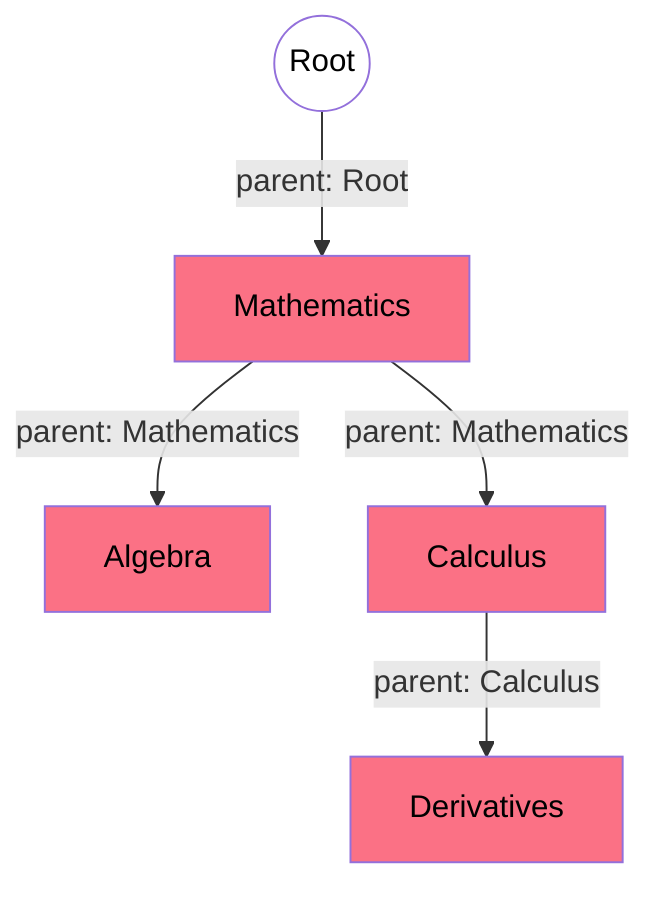

# Neuron-IQ: Content Writer's Guidebook

Welcome to the Neuron-IQ Knowledge Database. 

Unlike traditional platforms, Neuron-IQ does not use a database interface, a complex CMS, or SQL to store knowledge. Instead, it uses a **Docs-as-Code** architecture. To add a new node to the brain, you simply write a Markdown (`.md`) text file. The build engine handles the rest, automatically wiring your concept into the global neural network.

This guide will teach you exactly how to write, structure, and format a file so that it is perfectly understood by the Neuron-IQ parser.

---

## 1. File Placement & Naming Conventions

*   **Location:** Every new concept must be saved inside the `content/` folder (or any subfolder inside it).
*   **Extension:** The file must end in `.md`.
*   **Naming Rule:** Use lowercase letters and hyphens for the filename (e.g., `quantum-mechanics.md`, `linear-algebra.md`). This ensures the generated URLs are clean and web-friendly.

---

## 2. The Anatomy of a Node

Every Markdown file in Neuron-IQ is strictly divided into **two parts**:
1. **The Frontmatter** (The invisible metadata that plots the node on the graph).
2. **The Content Layer** (The actual text, math, and images the user reads).

### Part 1: The Frontmatter (Graph Topology)

At the very top of your file, you must include a YAML metadata block enclosed by `---`. This is the most critical part of the file; it tells the physics engine exactly where this concept belongs in the universe.

```yaml
---
name: Artificial Intelligence
parent: Computer Science (CS)
category: Computer Science
distance: 2
aliases: [AI, Machine Intelligence, Machine Learning]
---
```

#### Field Dictionary:
*   **`name`** *(Required)*: The exact title of your concept. This is what displays on the glowing graph orb and the article's `<h1>` header.
*   **`parent`** *(Required)*: The `name` of the node that directly precedes this one. **This must match the parent's spelling perfectly.** 
    * *Note: If you are creating a massive, top-level pillar (like Physics or Math), write `parent: Root`.*
*   **`category`** *(Required)*: This color-codes your node on the graph. The system will look for keywords here. `CS` or `Computer` triggers yellow; `Math` triggers pink; `Physics` triggers blue.
*   **`distance`** *(Required)*: A number representing how deep into the brain this concept is. 
    *   `1` = Core Pillars (e.g., Physics, Math)
    *   `2` = Sub-fields (e.g., Classical Mechanics, Algebra)
    *   `3` = Specific Concepts (e.g., Gravity, Matrices)
    *   `4+` = Granular details
*   **`aliases`** *(Optional)*: An array of alternative names for this concept. (See Section 4 for why this is incredibly powerful).
*   **`pdf`** *(Optional)*: If you want this node to display a PDF book instead of text, provide the filename (e.g., `pdf: calculus-textbook.pdf`). Place the actual PDF in `content/pdfs/`.



---

### Part 2: The Content Layer

Directly below the frontmatter, you will write your content. 

Neuron-IQ introduces a custom Markdown convention to handle section splitting: **The `@` Symbol.**

Whenever you start a line with `@`, the build engine creates a new section, generates a clickable anchor link, and adds it to the Sidebar Table of Contents.

```markdown
Any text written before the first `@` symbol is considered the "Preamble" or "Overview". 
Keep this short and engaging. It will be used as the SEO description and the hover-card preview.

@Introduction
Welcome to the concept. You can write normal Markdown here, including **bolding**, *italics*, and bullet points.

@Deep Dive
This creates a new section in the Table of Contents automatically!
You can add code blocks:
\`\`\`python
print("Hello World")
\`\`\`

@Mathematical Proof
And you can add more sections as needed.
```

---

## 3. Mathematical Typesetting (KaTeX)

Because Neuron-IQ is heavily tailored for STEM fields, it has first-class, blazing-fast support for mathematical equations via KaTeX. 

You write math exactly as you would in LaTeX:

*   **Inline Math**: Wrap your equation in single dollar signs `$`. 
    * *Example:* The area of a circle is $A = \pi r^2$.
*   **Block Math**: Wrap your equation in double dollar signs `$$`. This will center the equation on its own line.
    * *Example:*
      $$ 
      \hat{H} \Psi = E \Psi 
      $$

*Tip: The build engine pre-renders this math on the server, meaning it loads instantly without layout shifts when the user opens the page.*

---

## 4. The Synapse Engine: Auto-Linking & Aliases

In a traditional wiki, you have to manually write links like `[Artificial Intelligence](artificial-intelligence.md)`. 

**In Neuron-IQ, you never write internal links.** 

The engine uses a high-speed Prefix Trie algorithm to scan your text. If you type a word that matches the `name` of *any* other node in the database, the engine automatically turns it into a clickable Wikipedia-style link.

This is where the **`aliases`** frontmatter field becomes a superpower. 

If the `Artificial Intelligence` node has `aliases: [AI, Machine Learning]`, you can write:
> *"The future of **AI** is heavily dependent on advanced **machine learning** models."*

The engine will automatically detect both "AI" and "machine learning" and link them directly to the Artificial Intelligence page. 

**Best Practice:** Add as many logical aliases as possible to your nodes. It makes the auto-linking network much denser and improves fuzzy search results!

---

## 5. Quick Checklist for Contributors

Before committing your Markdown file, check the following:
- [ ] Is the filename lowercase with hyphens?
- [ ] Does the `parent` field exactly match an existing node?
- [ ] Did you include a short preamble before your first `@` section?
- [ ] Are your math equations properly wrapped in `$` or `$$`?
- [ ] Did you define `aliases` to help the engine auto-link your concept?

Happy writing. By adding a single file, you are physically expanding the boundaries of the digital brain.
