# 🧠 Neuron-IQ

**An interactive, graph-based knowledge exploration platform.**

Neuron-IQ turns plain Markdown text files into a glowing, animated neural knowledge graph you can search, zoom, drag, and click your way through — right in your browser. Think of it like a personal Wikipedia fused with a constellation map: every concept is a glowing orb, every connection is a pulsing neural pathway, and everything is searchable with fuzzy matching.

> **No database. No backend server.** Every page is a static HTML file generated from Markdown at build time — the entire site works offline as a PWA.

---

## Table of Contents

- [Quick Start (Setup in 3 Steps)](#-quick-start-setup-in-3-steps)
- [How It All Works (The Big Picture)](#-how-it-all-works-the-big-picture)
- [Project Structure](#-project-structure)
- [The Build Pipeline (`build.js`)](#-the-build-pipeline--buildjs)
- [The Development Server (`dev.js` & `watch.js`)](#-the-development-server--devjs--watchjs)
- [The Content System](#-the-content-system)
- [The Homepage & Graph Engine (`app.js`)](#-the-homepage--graph-engine--appjs)
- [The Global Module (`global.js`)](#-the-global-module--globaljs)
- [The Client-Side Router (`router.js`)](#-the-client-side-router--routerjs)
- [The PWA & Service Worker (`sw.js`)](#-the-pwa--service-worker--swjs)
- [The Styling System](#-the-styling-system)
- [Deployment (Netlify)](#-deployment--netlify)
- [Dependencies](#-dependencies)

---

## 🚀 Quick Start (Setup in 3 Steps)

### What you'll need first

- [Node.js](https://nodejs.org/) v16 or higher (this comes with npm automatically)
- [Git](https://git-scm.com/)

### Step-by-step

```bash
# 1. Clone (download) the project
git clone https://github.com/Kavyargb/Neuron-IQ.git
cd Neuron-IQ

# 2. Install all the libraries the project uses
npm install

# 3. Start the development server
npm run dev
```

That's it! Now open your browser to **`http://localhost:8080`** and you'll see the Neuron-IQ homepage with the animated knowledge graph.

### What `npm run dev` does behind the scenes

When you run that command, two things start at the same time:   

1. **A web server** — serves the `public/` folder on port 8080 so your browser can see it.
2. **A file watcher** — watches the `content/` folder for any changes to `.md` files, and automatically rebuilds the site whenever you save a file.

### Manual production build

```bash
node build.js
```

This reads every `.md` file in `content/`, and generates:
- All the static HTML article pages → `public/*.html`
- The knowledge graph data → `public/graph.js`
- The sitemap page → `public/sitemap.html`
- The service worker → `public/sw.js`

---

## 🏛 How It All Works (The Big Picture)

Neuron-IQ uses a **static-site generation (SSG) + client-side interactivity** architecture. That's a fancy way of saying:

1. **At build time** (on your computer): A Node.js script reads Markdown files and spits out HTML pages + a JSON knowledge graph.
2. **At run time** (in the browser): JavaScript reads that graph, renders a D3.js force-directed visualization, and lets you search/explore.

There is **no backend server** and **no database** — the entire site is pre-built into static HTML, CSS, and JS files.

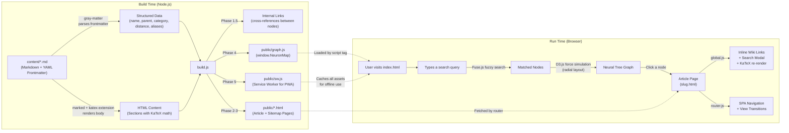

**In plain English:** You write Markdown files with some metadata at the top. The build script turns them into a JSON brain map (`graph.js`) and individual HTML article pages. In the browser, D3.js draws the brain map, Fuse.js powers fuzzy search, KaTeX renders math equations, and a client-side router navigates between pages without reloading.

---

## 📁 Project Structure

```
Neuron-IQ/
├── content/                  # 📝 Knowledge nodes (Markdown files)
│   ├── physics.md            #    Example: Root-level pillar
│   ├── gravity.md            #    Example: Sub-concept of Physics
│   ├── ai.md                 #    Example: Uses aliases for "AI", "Machine Intelligence"
│   ├── perceptrons.md        #    Example: Deep concept (distance: 3)
│   ├── _templates/           #    Obsidian templates (git-ignored)
│   └── .obsidian/            #    Obsidian workspace config (git-ignored)
│
├── public/                   # 🌐 Static output (served to the browser)
│   ├── index.html            #    Landing page + graph container
│   ├── sitemap.html          #    ⚡ AUTO-GENERATED: knowledge sitemap
│   ├── graph.js              #    ⚡ AUTO-GENERATED: the NeuronMap JSON blob
│   ├── sw.js                 #    ⚡ AUTO-GENERATED: PWA service worker
│   ├── app.js                #    Homepage logic: D3 graph, typewriter, search
│   ├── global.js             #    Shared logic: NeuronUtils, search modal, inline links
│   ├── router.js             #    🔀 SPA client-side router + View Transitions
│   ├── manifest.json         #    📱 PWA manifest (installable web app)
│   ├── icon.svg              #    App icon
│   ├── shared.css            #    🎨 Design system: variables, modals, glass panels
│   ├── style.css             #    Homepage styles (dark void aesthetic)
│   └── page.css              #    Article page styles (reader layout)
│
├── build.js                  # 🔧 Static site generator (the brain of the build)
├── dev.js                    # 🖥️  Dev server orchestrator
├── watch.js                  # 👁️  File watcher (auto-rebuild on save)
├── script.js                 # 🐛 Debug utility (verifies graph connectivity)
├── package.json              # 📦 Project manifest & dependencies
├── netlify.toml              # ☁️  Netlify deployment config
├── CONTENT_GUIDE.md          # 📖 Guide for content authors
└── .gitignore                # 🚫 Ignored files & directories
```

### What gets committed vs. generated

| Committed (you write/edit these)           | Generated (the build creates these)        |
|--------------------------------------------|---------------------------------------------|
| `content/*.md`                             | `public/graph.js`                           |
| `public/index.html`                        | `public/{slug}.html` (all article pages)    |
| `public/app.js`, `global.js`, `router.js`  | `public/sitemap.html` (overwritten)         |
| `public/shared.css`, `style.css`, `page.css` | `public/sw.js` (overwritten each build)   |
| `public/manifest.json`, `icon.svg`         |                                             |
| `build.js`, `dev.js`, `watch.js`           |                                             |

The `.gitignore` uses a pattern of `public/*` (ignore everything in public) plus `!public/app.js`, `!public/global.js`, etc. (but keep these specific hand-authored files).

---

## 🔧 The Build Pipeline — `build.js`

`build.js` is the heart of the project — a custom static site generator that runs in **five phases**.

### Phase 1: Parse & Load All Knowledge Nodes

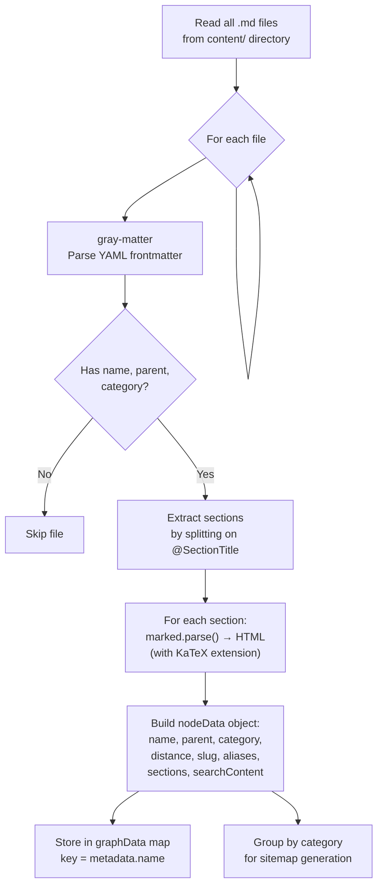

#### Frontmatter Parsing

Each Markdown file starts with a YAML frontmatter block (the metadata that tells the graph where to place this concept):

```yaml
---
name: Artificial Intelligence      # Display title + unique identifier
parent: Computer Science (CS)      # Name of the parent node (must match exactly)
category: Computer Science         # Color-coding group (CS | Math | Physics | Science)
distance: 2                        # Depth from center (1 = pillar, 2 = subfield, 3+ = concept)
aliases: [AI, Machine Intelligence] # (Optional) Alternative names for auto-linking
---
```

The `gray-matter` library separates this metadata from the Markdown body below it.

#### The `aliases` Field

Aliases let you define alternative names for a concept. For example, the "Artificial Intelligence" node has aliases `[AI, Machine Intelligence, Artificial Intelligence (AI)]`. This means:

- Searching for "AI" will find this node.
- If another article mentions "AI" in its text, it will automatically become a clickable link to this page.
- The node won't link to itself — aliases of the current page are excluded from auto-linking.

#### Section Extraction Logic

The body is split into named sections using the `@SectionTitle` delimiter pattern:

```
Input text:
    Some preamble text here.
    @Introduction
    Intro body text.
    @Deep Dive
    Advanced body text.

Output:
    Section 0: { title: "Overview", id: "overview", isPreamble: true }
    Section 1: { title: "Introduction", id: "introduction", isPreamble: false }
    Section 2: { title: "Deep Dive", id: "deep-dive", isPreamble: false }
```

**The regex**: `body.split(/(?:^|\n)@([^\n]+)\n/)` splits on lines starting with `@`. The captured group `([^\n]+)` becomes the section title. Any text before the first `@` is treated as a preamble with the default title "Overview".

#### Slug Generation

The `slugify()` function converts concept names to URL-safe strings:

```
"Real Numbers and their Operations"  →  "real-numbers-and-their-operations"
"Computer Science (CS)"              →  "computer-science-cs"
```

Algorithm: lowercase → replace spaces/underscores with hyphens → strip non-word chars → collapse multiple hyphens.

#### Search Content Generation

For each node, all section HTML is stripped of tags, markdown syntax, and math delimiters to produce a plain-text `searchContent` string. This is embedded in `graph.js` and used by Fuse.js for full-text fuzzy search at runtime.

### Phase 1.5: Compile Internal Cross-Links

After all nodes are parsed, the build script scans every node's `searchContent` to find mentions of other nodes (by name or alias). If a match is found, the target node's name is added to the source node's `internalLinks` array.

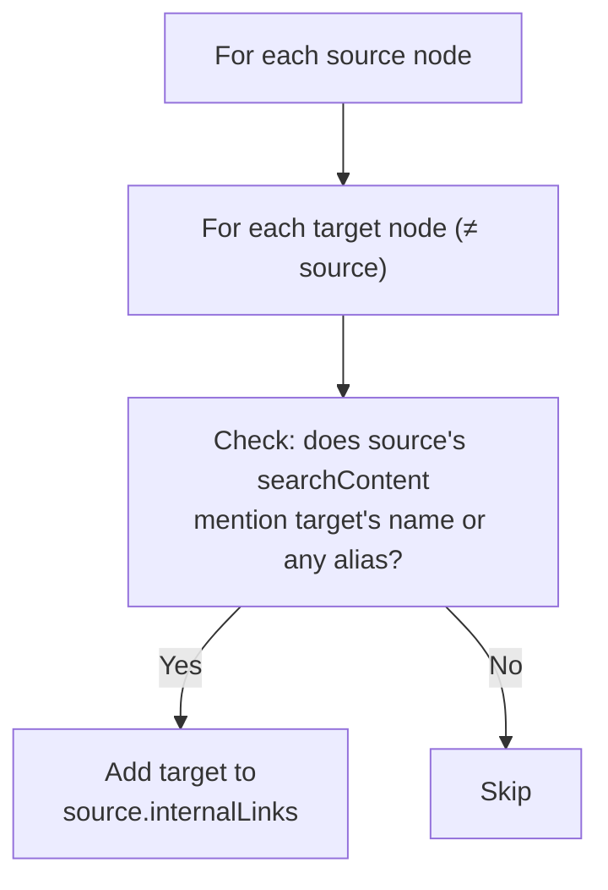

These internal links appear on the graph as **dashed lines** connecting related concepts that aren't in a direct parent-child relationship — like a web of cross-references.

### Phase 2: Generate HTML Pages with Lineage Trace

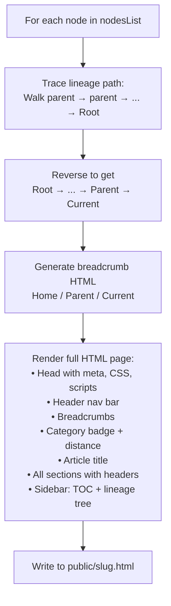

#### Lineage Tracing Algorithm

For each node, the build script walks up the parent chain to construct breadcrumb navigation:

```javascript
// Pseudocode
let pathArray = [];
let current = node;
while (current && current.name !== 'Root') {
    pathArray.push(current);
    current = graphData[current.parent];  // look up parent by name
}
pathArray.reverse();  // Now: [grandparent, parent, current]
```

This produces breadcrumbs like: `Home / Physics / Gravity`

#### Generated Article Page Structure

Each article page includes:
- `page.css` for styling (which imports `shared.css`)
- `graph.js` (the full knowledge graph data — needed for search + inline linking)
- `global.js` (shared utilities — search modal, inline wiki links, KaTeX)
- `router.js` (SPA navigation)
- Fuse.js and KaTeX loaded from CDN
- A sidebar with Table of Contents, parent link, and dynamically-populated child links

### Phase 3: Generate Sitemap Page

All nodes are grouped by category, sorted alphabetically within each group, and rendered into a sitemap page with category cards.

### Phase 4: Compile `graph.js`

The final knowledge graph is serialized to a JavaScript file that attaches the entire graph to `window.NeuronMap`:

```javascript
// AUTO-GENERATED BY BUILD.JS
window.NeuronMap = {
  "Physics": {
    "name": "Physics",
    "parent": "Root",
    "category": "Physics",
    "distance": 1,
    "slug": "physics",
    "aliases": ["Physical Science"],
    "sectionTitles": ["Overview", "Classical Physics", "Modern Physics", ...],
    "searchContent": "Physics is the scientific study of how...",
    "internalLinks": ["Gravity", "Quantum Mechanics", ...]
  },
  "Artificial Intelligence": {
    "aliases": ["AI", "Machine Intelligence", "Artificial Intelligence (AI)"],
    "internalLinks": ["Perceptrons", "Linear Algebra", ...],
    // ... other fields
  }
  // ... all other nodes
};
```

This file is loaded by every page via a `<script>` tag, making the full graph data available client-side for search, inline linking, and graph rendering.

### Phase 5: Compile Service Worker (`sw.js`)

The build script scans the entire `public/` directory, collects every file path, and generates a service worker that pre-caches all local assets. This makes the site work **fully offline** after the first visit.

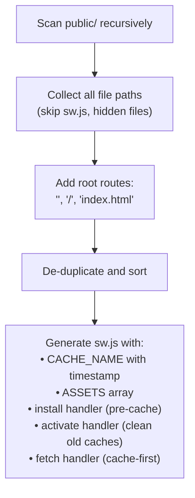

The service worker uses a **cache-first** strategy for local assets and **dynamic caching** for CDN resources (jsDelivr, Google Fonts). If navigation fails offline, it falls back to `index.html`.

---

## 🖥️ The Development Server — `dev.js` & `watch.js`

### `dev.js` — Orchestrator

Spawns two child processes in parallel:

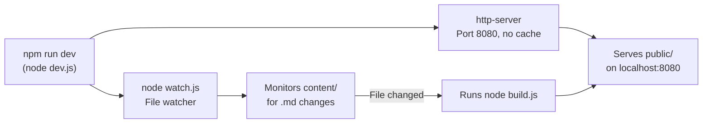

- **HTTP Server**: Uses `npx http-server` with `-c-1` (cache disabled) so browser refreshes always show the latest build.
- **Cross-platform**: Detects Windows vs. Unix to use `npx.cmd` or `npx` accordingly.
- **Graceful Shutdown**: Listens for `SIGINT`/`SIGTERM` and kills both child processes.

### `watch.js` — Debounced File Watcher

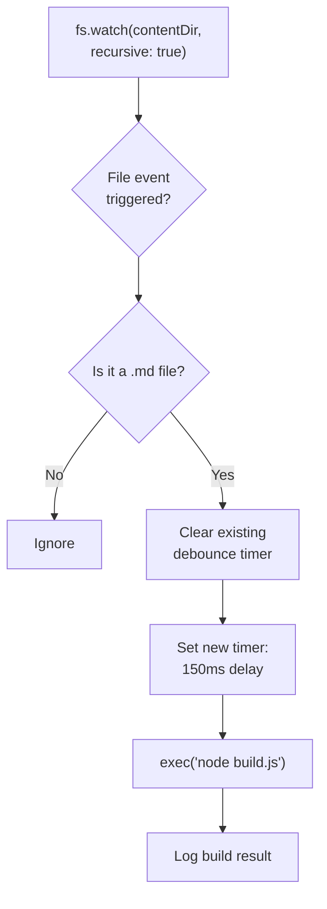

The **150ms debounce** prevents the watcher from triggering multiple rapid builds when an editor saves a file (some editors like VS Code trigger multiple filesystem events per save).

---

## 📝 The Content System

Content follows a **Docs-as-Code** pattern: knowledge is stored as Markdown files in the `content/` directory, versioned with Git, and compiled at build time. You can also edit them with [Obsidian](https://obsidian.md/) (the `.obsidian` config folder is gitignored).

> For full formatting examples, see `CONTENT_GUIDE.md`.

### Node Anatomy

Every `.md` file has two parts:

```
┌─────────────────────────────────────┐
│  YAML Frontmatter                   │
│  ---                                │
│  name: Concept Name                 │
│  parent: Parent Concept Name        │
│  category: Physics | Math | CS      │
│  distance: 1 | 2 | 3 | ...         │
│  aliases: [Alt Name 1, Alt Name 2]  │ ← optional
│  ---                                │
├─────────────────────────────────────┤
│  Markdown Body                      │
│                                     │
│  Optional preamble text...          │
│                                     │
│  @Section Title                     │
│  Section body with **bold**,        │
│  *italic*, $inline math$,           │
│  $$block equations$$, lists, etc.   │
│                                     │
│  @Another Section                   │
│  More content...                    │
└─────────────────────────────────────┘
```

### Frontmatter Field Reference

| Field      | Required | Type         | Description |
|------------|----------|--------------|-------------|
| `name`     | ✅       | string       | The exact display title. Also the unique identifier in the graph. |
| `parent`   | ✅       | string       | The `name` of the parent node. Must match spelling exactly. Use `Root` for top-level pillars. |
| `category` | ✅       | string       | Color-coding group. Built-in colors: `CS` (yellow), `Math` (rose), `Physics` (blue), or anything else (green). |
| `distance` | ✅       | integer      | Depth from center. `1` = core pillar, `2` = subfield, `3` = specific concept, `4+` = deep subtopic. |
| `aliases`  | ❌       | string array | Alternative names for search and auto-linking. Example: `[AI, ML]`. |

### The Knowledge Graph Model

The nodes form a **rooted tree** with `Root` as the invisible apex:

```
                        Root (virtual, not a file)
                       /          |             \
                 Physics     Mathematics    Computer Science (CS)
                /    \           |                    |
          Gravity   Classical   Algebra            AI (AI)
                    Mechanics     |                  |
                            Elem. Algebra      Perceptrons
```

- **`distance: 1`** → Core Pillars (Physics, Math, CS) — the biggest orbs
- **`distance: 2`** → Subfields (Gravity, Algebra, AI)
- **`distance: 3`** → Specific Concepts (Perceptrons, Elementary Algebra)
- **`distance: 4+`** → Deep subtopics (Order of Operations)

### Math Rendering (KaTeX)

Equations are rendered in two passes:

1. **Build-time** (server-side): `marked-katex-extension` converts `$...$` and `$$...$$` in Markdown to pre-rendered KaTeX HTML. Math is visible immediately on page load (good for SEO and speed).
2. **Run-time** (client-side): `global.js` calls `renderMathInElement()` from the KaTeX auto-render script, catching any expressions that were dynamically injected or missed during build.

---

## 🌐 The Homepage & Graph Engine — `app.js`

`app.js` powers the interactive landing page. It's organized into distinct modules:

### Lifecycle Management

The homepage exposes two global functions for the SPA router:
- `window.initHomePage()` — sets up the typewriter, search, and graph
- `window.cleanupHomePage()` — stops the D3 simulation and clears timers when navigating away

### Module 1: Typewriter Animation

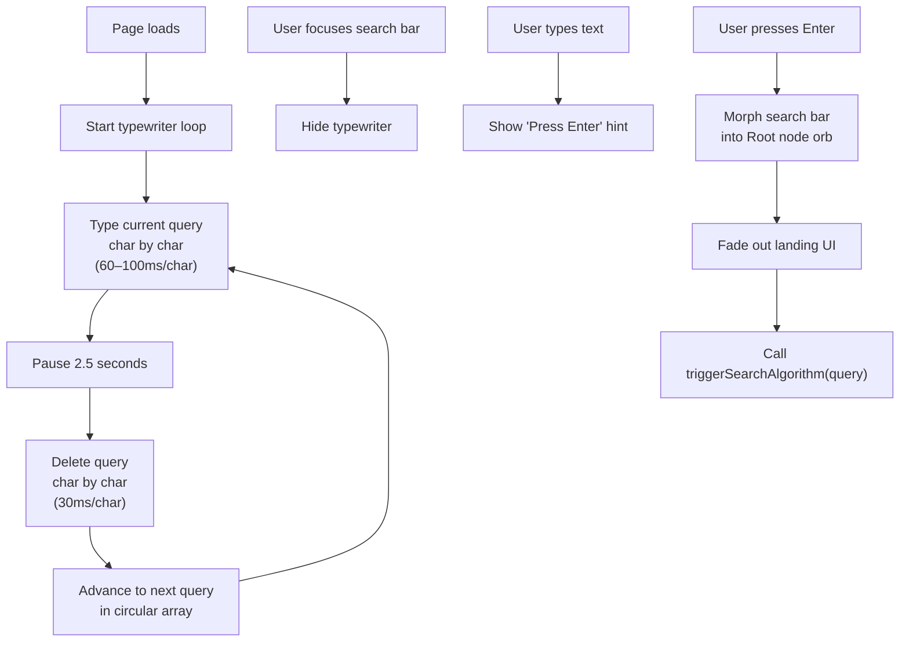

The typewriter cycles through example queries like *"Understand 'Quantum Superposition'"* and *"Explore 'General Relativity'"* to hint at the system's capabilities.

**Search bar morph animation**: When the user presses Enter, CSS transitions shrink the search bar from a `550px` input into a `14px` glowing orb (the Root node), then the landing container fades away to reveal the graph.

### Module 2: Landing Autocomplete Dropdown

As the user types in the search bar on the landing page, a live dropdown shows up to 5 matching results using the same `NeuronUtils.performSearch()` engine. It also shows recently viewed nodes when the input is focused but empty.

### Module 3: Rich Hover Cards

When hovering over a graph node, a glassmorphic popover card appears showing:
- Category badge (color-coded)
- Distance from core
- Node name
- First 140 characters of content
- "Click to explore →" call-to-action

The positioning algorithm centers the card above the node, then clamps it to prevent overflow off screen edges.

### Module 4: D3 Force-Directed Graph Engine

This is the core visualization:

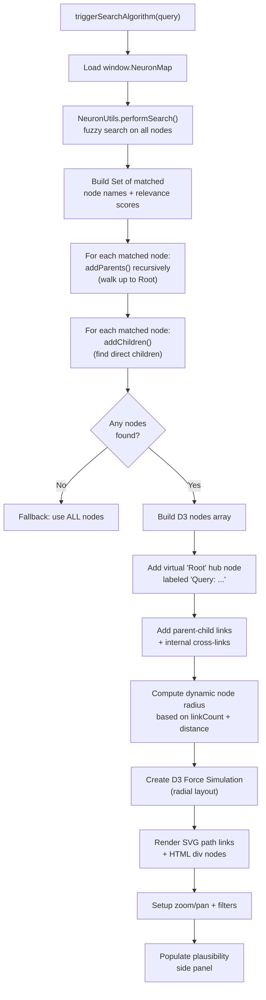

#### Graph Expansion Logic

After the initial fuzzy search, the result set is expanded in two directions:

```
                    ┌────────────┐
                    │ addParents │  Walk UP the tree to Root
                    └─────┬──────┘  (ensures connected paths)
                          │
              ┌───────────┴───────────┐
              │  Matched Nodes (Fuse) │
              └───────────┬───────────┘
                          │
                    ┌─────┴──────┐
                    │ addChildren │  Find direct children
                    └────────────┘  (exposes sub-concepts)
```

This guarantees the graph is always connected — every matched node has a visible path back to the Root hub.

#### Dynamic Node Sizing

Each node's radius is computed dynamically based on how connected it is:

```
radius = max(6, min(30, 10 + 2 × linkCount − 1.5 × distance))
```

The Root node always has a fixed radius of 20. More connections → bigger orb. Higher distance → slightly smaller.

#### D3 Force Simulation (Radial Layout)

The simulation uses five concurrent forces:

| Force | Type | Purpose | Parameters |
|---|---|---|---|
| `link` | `forceLink` | Connects parent-child pairs with spring tension | `distance: 120px` (hierarchical), `160px` (internal cross-links) |
| `charge` | `forceManyBody` | Gentle node repulsion | `strength: -10` |
| `center` | `forceCenter` | Prevents the graph from drifting off-screen | Center of viewport |
| `collision` | `forceCollide` | Prevents node overlap | `radius + 15px` |
| `radial` | `forceRadial` | **Radial layout**: positions nodes in concentric rings by depth | See formula below |

**Radial positioning formula**: Nodes are arranged in concentric circles around the center:

$$
r_{\text{target}}(d) =
\begin{cases}
0 & \text{if } d = \text{Root} \\[6pt]
R_1 + (\text{distance} - 1) \times 150 & \text{otherwise}
\end{cases}
$$

Where $R_1 = 180\text{px}$ is the radius of the first ring (pillars). The `strength: 0.8` makes this a strong constraint. Distance-1 pillars are **pinned** at evenly-spaced angles around this first ring.

#### Internal Cross-Links

In addition to the parent-child tree links, the graph draws **dashed lines** for `internalLinks` — the cross-references discovered in Phase 1.5 of the build. These appear as subtle connections between related but non-hierarchical concepts.

```
Tree link:     ━━━━━━━  (solid, pulsing, color-coded)
Internal link: ┈ ┈ ┈ ┈  (dashed, dim white)
```

#### Link Rendering (Bézier Curves)

Links are drawn as cubic Bézier curves, not straight lines, giving the graph a neural/organic feel:

```
M x1 y1 C (x1+offset) y1, (x2-offset) y2, x2 y2
```

$$
\text{offset} = 0.5 \times |x_2 - x_1|
$$

The control points create a horizontal S-curve between parent and child nodes.

#### Mass-Weighted Physics

Heavier (larger) nodes are deliberately slowed during simulation ticks so they don't fly around chaotically:

```javascript
nodes.forEach(d => {
    if (d.fx === null) {
        d.x += d.vx * (1 / d.mass - 1);
        d.y += d.vy * (1 / d.mass - 1);
        d.vx /= d.mass;
        d.vy /= d.mass;
    }
});
```

#### Zoom & Pan

D3's `zoom` behavior is configured with scale limits `[0.3, 3.0]`. The transform is applied to both the SVG layer (links) and the HTML nodes layer simultaneously via CSS `transform`. Zoom controls (+, −, ⊙ reset) are in a floating glass panel at the bottom-left.

#### Category Filters

Filter buttons dim non-matching nodes to `opacity: 0.15` and disable their pointer events. Links dim to `opacity: 0.05`. The "All" button resets everything.

### The Plausibility Side Panel

After graph rendering, the right-side drawer populates with ranked concept cards:

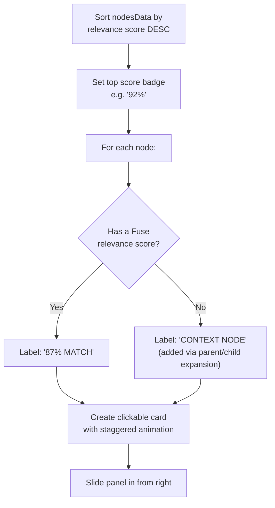

### Node Interaction

- **Hover**: Shows the rich hover card + label
- **Click**: Navigates to the article page (via SPA router if available, else standard navigation)
- **Drag**: Fixes the node position during drag; releases it on drop (Root and pillars stay pinned)

---

## 🌍 The Global Module — `global.js`

`global.js` runs on **every page** (both `index.html` and all article pages). It provides a shared utility object `NeuronUtils` and five initialization features.

### The `NeuronUtils` Object

This is the single shared utility object, attached to `window.NeuronUtils`, containing:

| Module | Key Functions | Purpose |
|---|---|---|
| **Theming** | `getCategoryColor(cat)` | Maps category strings to CSS custom property values |
| **String Helpers** | `escapeRegExp()`, `highlightMatch()` | Safe regex escaping + search term highlighting |
| **UI Generators** | `generatePopoverHTML()`, `positionPopover()`, `generateResultItemHTML()` | Reusable HTML templates for hover cards and search results |
| **History Storage** | `saveSearchQuery()`, `saveClickedNode()`, `getStorage()` | LocalStorage-backed history (last 5 items) |
| **Search Engine** | `performSearch()`, `getCustomSearchScore()`, `getRelevanceScore()` | Fuse.js fuzzy search + custom scoring |
| **Keyboard Nav** | `setupListKeyboardNav()` | ↑/↓/Enter navigation for any result list |

#### The Search Scoring System

Search results use a **two-layer scoring system**:

1. **Custom score** (deterministic) — checks exact matches, acronyms, aliases, word boundaries:

| Match Type | Custom Score | Display |
|---|---|---|
| Exact name match | 1000 | 100% |
| Parenthetical match (e.g., "cs" matches "Computer Science (CS)") | 950 | 98% |
| Exact alias match | 925 | 98% |
| Acronym match | 900 | 98% |
| Name starts with query | 850 | 95% |
| Alias starts with / contains query | 825 | 95% |
| Word boundary match in name | 800 | 95% |
| Exact category match | 700 | 90% |
| Section title match | 600 | 85% |
| Substring match (query > 3 chars) | 400 | 70% |

2. **Fuse.js score** (fuzzy) — Bitap algorithm for approximate matching when custom scoring doesn't find a match.

Results are sorted by custom score first, then Fuse.js score as tiebreaker.

#### Fuse.js Configuration

```javascript
new Fuse(Object.values(window.NeuronMap), {
    includeScore: true,
    threshold: 0.4,        // 0 = exact match only, 1 = match anything
    ignoreLocation: true,  // Don't penalize matches deep in the string
    keys: [
        { name: 'name',          weight: 1.0 },  // Highest priority
        { name: 'aliases',       weight: 0.9 },  // Near-highest
        { name: 'category',      weight: 0.5 },  // Medium
        { name: 'sectionTitles', weight: 0.4 },  // Section headers
        { name: 'searchContent', weight: 0.1 }   // Full-text (low weight)
    ]
});
```

### Feature 1: Dynamic Lineage (Sidebar Children)

On article pages, finds all nodes whose `parent` matches the current page's title, then injects them as clickable links in the sidebar's "Sub-concepts" section. Sorted alphabetically with color-coded distance badges.

### Feature 2: Wikipedia-Style Inline Definitions

Automatically converts plain-text mentions of other knowledge nodes into clickable internal links, similar to Wikipedia's blue links.

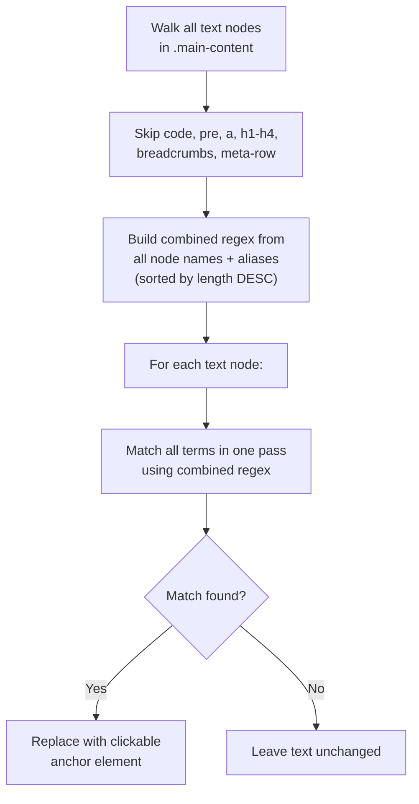

**Key design decisions**:
- Terms are sorted by length descending so "Linear Algebra" is matched before "Algebra" alone.
- Uses a single combined regex for all terms (efficient one-pass matching).
- Aliases are supported — "AI" in text will link to "Artificial Intelligence".
- The current page's own name and aliases are excluded from linking (no self-links).
- A `TreeWalker` traverses only `TEXT_NODE` types, skipping existing links, code blocks, and headers.
- Hover popover cards appear on mouseenter with the same glassmorphic style as graph hover cards.

### Feature 3: Global Search Modal (Command Palette)

A VS Code-style command palette that works on every page:

| Shortcut | Action |
|---|---|
| `Ctrl+K` or `/` | Open search modal |
| `Esc` | Close modal |
| `↑` / `↓` | Navigate results |
| `Enter` | Go to selected result |

The modal is injected into the DOM dynamically. It uses the same `NeuronUtils.performSearch()` engine, limited to **top 8 matches**. When the input is empty, it shows **recently viewed nodes** (from localStorage).

### Feature 4: KaTeX Auto-Renderer

```javascript
renderMathInElement(document.body, {
    delimiters: [
        {left: '$$', right: '$$', display: true},     // Block equations
        {left: '$',  right: '$',  display: false},     // Inline math
        {left: '\\[', right: '\\]', display: true}     // LaTeX block
    ],
    throwOnError: false
});
```

If `renderMathInElement` is not yet available (scripts loading asynchronously), the function retries after 200ms.

### Feature 5: TOC Scroll Observer

Uses `IntersectionObserver` to highlight the current section in the sidebar Table of Contents as the user scrolls:

```javascript
const observerOptions = {
    root: null,                          // Viewport
    rootMargin: "-20% 0px -60% 0px",     // Narrow detection band in upper portion
    threshold: 0                         // Trigger as soon as any part enters
};
```

The `rootMargin` of `-20% top / -60% bottom` creates a narrow detection band in the upper-middle portion of the viewport, so the active section changes when a section header scrolls into that zone.

### PWA Service Worker Registration

At the bottom of `global.js`, the service worker is registered:

```javascript
if ('serviceWorker' in navigator) {
    window.addEventListener('load', () => {
        navigator.serviceWorker.register('sw.js');
    });
}
```

This enables offline access and makes the app installable on mobile devices.

---

## 🔀 The Client-Side Router — `router.js`

`router.js` turns Neuron-IQ into a **Single Page Application (SPA)**. Instead of doing full page reloads when you click a link, it fetches the target page with `fetch()`, swaps the DOM, and updates the browser URL — all without a white flash.

### How It Works

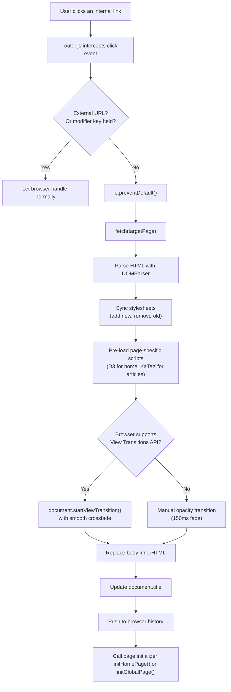

### Key Features

1. **View Transitions API**: Uses the native `document.startViewTransition()` for smooth crossfade animations (with fallback opacity transition for older browsers).
2. **Stylesheet Sync**: Loads new CSS files before swapping content to prevent a "flash of unstyled content" (FOUC).
3. **Script Pre-loading**: Dynamically loads D3.js for the homepage and KaTeX for article pages only when needed.
4. **Browser History**: Supports back/forward navigation via the `popstate` event.
5. **Graceful Fallback**: If the SPA transition fails for any reason, it falls back to a normal page load.
6. **Smart Link Detection**: Skips external links, `target="_blank"`, modifier keys (Ctrl+click), and same-page hash links.

### View Transition Animations (CSS)

Defined in `shared.css`:

```css
::view-transition-old(root) {
    animation: 200ms fade-out, 200ms scale-down;
}
::view-transition-new(root) {
    animation: 300ms fade-in, 300ms scale-up;
}
/* Brand text morphs smoothly between page states */
#brand, .brand { view-transition-name: header-brand; }
```

---

## 📱 The PWA & Service Worker — `sw.js`

Neuron-IQ is a **Progressive Web App (PWA)**, meaning it can be installed on phones and desktops, and works offline.

### `manifest.json`

```json
{
  "name": "Neuron-IQ",
  "short_name": "Neuron-IQ",
  "description": "Illuminating the architecture of the neural knowledge database.",
  "start_url": "index.html",
  "display": "standalone",
  "background_color": "#030712",
  "theme_color": "#030712"
}
```

### Service Worker Strategy

The service worker `sw.js` is generated automatically at build time using `workbox-build`. It creates a precache manifest where each local asset is registered with an individual content hash (e.g., `{ url: "index.html", revision: "f66e4757f801..." }`).

When you rebuild the site, the service worker compares the new content hashes against the existing cache, ensuring the browser only re-downloads files that have actually changed (avoiding full-asset re-downloads for minor edits like fixing a typo).

It uses three caching strategies:

| Asset Type | Strategy | Behavior |
|---|---|---|
| **Local files** (HTML, JS, CSS) | Cache-first, pre-cached with revision hashes | Pre-cached on install; served from cache instantly; only modified files re-cached on update |
| **CDN resources** (jsDelivr, Google Fonts) | Dynamic Cache-First | Fetched from network on first request, cached for future use |
| **Failed navigations** (offline) | Fallback | Returns cached `index.html` as a fallback |

---

## 🎨 The Styling System

Neuron-IQ separates structural page requirements from its global design system across three CSS files:

### `shared.css` — The Design System Foundation

Contains the core styling tokens shared across the entire site. Imported by both `style.css` and `page.css`:

- **Typography**: Imports Google Fonts (Inter for text, JetBrains Mono for code)
- **CSS Custom Properties**: All colors, glass effects, and spacing tokens
- **Glassmorphism**: The `.glass-panel` utility class with blur, border, and shadow
- **Command Palette**: Complete search modal styling
- **Search Result Items**: Unified interactive list items used in both the modal and landing dropdown
- **View Transitions**: Crossfade and scale animations
- **Wiki Popover Cards**: Hover card styling
- **Scrollbars**: Custom webkit scrollbar styling

### `style.css` — Homepage (The Void)

Builds homepage-specific features on top of `shared.css`:

- **Canvas Background**: Layered radial space glows + a dot grid pattern (`30px × 30px`)
- **Glassmorphism Search Bar**: Blurred glass input with a morph animation to a glowing orb
- **Neon Graph Nodes**: Radial box shadows and glowing borders matching category colors
- **Neural Pulse Animation**: Signal flashes on links using `stroke-dasharray` animation
- **Cinematic Focus**: Hovering a node uses CSS `:has()` to dim surrounding nodes/links
- **Landing Autocomplete**: Glassmorphic dropdown below the search bar

### `page.css` — Article Pages

Configures editorial stylesheets for compiled documents:

- **Frost Glass Header**: Sticky header with `backdrop-filter`
- **Layout Grid**: 1200px max-width flex with sidebar and TOC
- **Document Styles**: Headers, lists, blockquotes (left-bordered gradients), code blocks (JetBrains Mono)
- **Lineage Tree**: Interactive parent → current → children navigation

### Color System (CSS Custom Properties)

```css
:root {
    /* Core Theme */
    --bg-void: #030712;         /* Deep black void background */
    --text-main: #f8fafc;       /* Near-white content text */
    --text-muted: #8b9bb4;      /* Gray muted labels */
    --accent: #60a5fa;          /* Blue link highlights */

    /* Category Colors */
    --color-cs: #fcd34d;        /* Yellow — Computer Science */
    --color-math: #fb7185;      /* Rose — Mathematics */
    --color-physics: #60a5fa;   /* Blue — Physics */
    --color-science: #34d399;   /* Green — Science (default) */
    --color-root: #ffffff;      /* White — Query Hub node */

    /* Glassmorphism Tokens */
    --glass-bg: rgba(15, 23, 42, 0.65);
    --glass-border: rgba(255, 255, 255, 0.08);
    --glass-hover: rgba(255, 255, 255, 0.12);
    --glass-shadow: 0 10px 40px -10px rgba(0, 0, 0, 0.5),
                    inset 0 1px 0 rgba(255, 255, 255, 0.05);
}
```

---

## ☁️ Deployment — Netlify

The project deploys to Netlify via Git push. Configuration in `netlify.toml`:

```toml
[build]
  command = "npm install && node build.js"
  publish = "public"
```

**Deployment flow**:

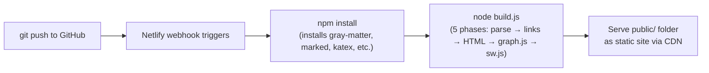

---

## 📦 Dependencies

### Build Dependencies (npm — installed locally)

| Package | Version | Purpose |
|---|---|---|
| `gray-matter` | `^4.0.3` | Parses YAML frontmatter from Markdown files |
| `marked` | `^18.0.4` | Converts Markdown to HTML |
| `marked-katex-extension` | `^5.1.10` | KaTeX math rendering plugin for `marked` |
| `katex` | `^0.17.0` | The underlying LaTeX math rendering engine |
| `striptags` | `^3.2.0` | HTML tag stripper utility |
| `workbox-build` | `^7.4.1` | Generates service worker with content-hash precaching |

### CDN Dependencies (loaded at runtime in the browser)

| Library | Version | Purpose |
|---|---|---|
| [D3.js](https://d3js.org/) | v7 | Force-directed graph layout, zoom, drag, DOM binding |
| [Fuse.js](https://fusejs.io/) | v7.0.0 | Client-side fuzzy search (Bitap algorithm) |
| [KaTeX](https://katex.org/) | v0.16.8 | Client-side math rendering (CSS + auto-render) |

### Dev Dependencies (not installed, used via npx)

| Tool | Purpose |
|---|---|
| `http-server` | Zero-config static file server (used in dev mode) |

---

## License

ISC
