# 🧠 Neuron-IQ

**An interactive, graph-based knowledge exploration platform.**

Neuron-IQ transforms plain Markdown files into an interconnected neural tree — a force-directed knowledge graph powered by D3.js, fuzzy search powered by Fuse.js, and server-rendered math powered by KaTeX. Users type a query, and the system surfaces the most relevant concepts as glowing orbs connected by animated neural pathways.

---

## Table of Contents

- [Quick Start (Setup)](#-quick-start)
- [Architecture Overview](#-architecture-overview)
- [Project Structure](#-project-structure)
- [The Build Pipeline (`build.js`)](#-the-build-pipeline--buildjs)
- [The Development Server (`dev.js` & `watch.js`)](#-the-development-server--devjs--watchjs)
- [The Content System (Docs-as-Code)](#-the-content-system--docs-as-code)
- [The Homepage & Graph Engine (`app.js`)](#-the-homepage--graph-engine--appjs)
- [The Global Shared Module (`global.js`)](#-the-global-shared-module--globaljs)
- [The Styling System](#-the-styling-system)
- [Deployment (Netlify)](#-deployment--netlify)
- [Dependencies](#-dependencies)

---

## 🚀 Quick Start

### Prerequisites

- [Node.js](https://nodejs.org/) (v16 or higher)
- [npm](https://www.npmjs.com/) (bundled with Node.js)
- [Git](https://git-scm.com/)

### Installation

```bash
# 1. Clone the repository
git clone https://github.com/Kavyargb/Neuron-IQ.git
cd Neuron-IQ

# 2. Install dependencies
npm install

# 3. Run the development server (builds + watches + serves)
npm run dev
```

This starts:
- A local HTTP server at `http://localhost:8080` serving the `public/` folder.
- A file watcher on the `content/` directory that auto-rebuilds on every Markdown change.

### Production Build (Manual)

```bash
node build.js
```

This reads every `.md` file in `content/`, generates all static HTML pages + the `graph.js` data file into `public/`.

---

## 🏛 Architecture Overview

Neuron-IQ follows a **static-site generation (SSG) + client-side interactivity** architecture. There is no backend server — the entire site is pre-built into static HTML, CSS, and JS files, then served via a CDN (Netlify).

```mermaid
graph LR
    subgraph "Build Time (Node.js)"
        A["content/*.md<br>(Markdown + YAML Frontmatter)"] -->|"gray-matter<br>parses frontmatter"| B["Structured Data<br>(name, parent, category, distance)"]
        A -->|"marked + marked-katex-extension<br>renders body"| C["HTML Content<br>(Sections with KaTeX math)"]
        B --> D["build.js"]
        C --> D
        D -->|"Generates"| E["public/graph.js<br>(window.NeuronMap)"]
        D -->|"Generates"| F["public/*.html<br>(Article + Sitemap Pages)"]
    end

    subgraph "Run Time (Browser)"
        G["User visits index.html"] --> H["Types a search query"]
        H -->|"Fuse.js fuzzy search"| I["Matched Nodes"]
        I -->|"D3.js force simulation"| J["Neural Tree Graph"]
        J -->|"Click a node"| K["Article Page<br>(slug.html)"]
        K -->|"global.js"| L["Inline Wiki Links<br>+ Search Modal<br>+ KaTeX re-render"]
    end

    E -.->|"Loaded by script tag"| G
    F -.->|"Served as static files"| K
```

**The core idea**: Content authors write Markdown files with YAML metadata. The build script compiles them into a JSON knowledge graph (`graph.js`) and individual HTML article pages. On the client, D3.js renders the graph, Fuse.js powers fuzzy search, and KaTeX renders mathematical equations.

---

## 📁 Project Structure

```
Neuron-IQ/
├── content/                  # 📝 Knowledge nodes (Markdown files)
│   ├── physics.md            #    Example: Root-level pillar
│   ├── gravity.md            #    Example: Sub-concept of Physics
│   ├── perceptrons.md        #    Example: Deep concept (distance: 3)
│   ├── _templates/           #    Obsidian templates (git-ignored)
│   └── .obsidian/            #    Obsidian workspace config (git-ignored)
│
├── public/                   # 🌐 Static output (served to browser)
│   ├── index.html            #    Landing page + graph container
│   ├── sitemap.html          #    Auto-generated knowledge sitemap
│   ├── graph.js              #    ⚡ AUTO-GENERATED: The NeuronMap JSON blob
│   ├── app.js                #    Homepage logic: D3 graph visualization, typing
│   ├── global.js             #    Shared logic: search modal, inline links, math, observers
│   ├── shared.css            #    🎨 CENTRAL DESIGN SYSTEM: common variables, modals, popovers
│   ├── style.css             #    Homepage specific styles (dark void aesthetic)
│   └── page.css              #    Article page specific styles (reader layout)
│
├── build.js                  # 🔧 Static site generator (the heart of the build)
├── dev.js                    # 🖥️  Dev server orchestrator
├── watch.js                  # 👁️  File watcher (auto-rebuild on save)
├── package.json              # 📦 Project manifest & dependencies
├── netlify.toml              # ☁️  Netlify deployment config
├── CONTENT_GUIDE.md          # 📖 Guide for content authors
└── .gitignore                # 🚫 Ignored files & directories
```

### What gets committed vs. generated

| Committed (Source) | Generated (Build Output) |
|---|---|
| `content/*.md` | `public/graph.js` |
| `public/index.html` | `public/{slug}.html` (article pages) |
| `public/app.js`, `global.js` | `public/sitemap.html` (overwritten) |
| `public/shared.css`, `style.css`, `page.css` | |
| `build.js`, `dev.js`, `watch.js` | |

The `.gitignore` is configured to track specific hand-authored files in `public/` (the JS, CSS, and HTML listed above) while ignoring all generated outputs (the slug-based HTML pages and `graph.js`).

---

## 🔧 The Build Pipeline — `build.js`

`build.js` is the heart of the project — a custom static site generator. It runs in two phases:

### Phase 1: Parse & Load All Knowledge Nodes

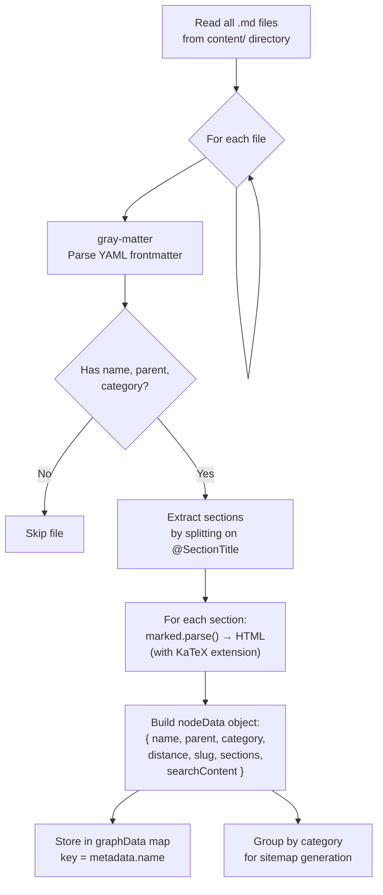

#### Frontmatter Parsing

Each Markdown file starts with a YAML frontmatter block:

```yaml
---
name: Gravity          # Display title + unique identifier
parent: Physics        # Name of the parent node (must match exactly)
category: Physics      # Color-coding group (CS | Math | Physics | Science)
distance: 2            # Depth from center (1 = pillar, 2 = subfield, 3+ = concept)
---
```

The `gray-matter` library separates this metadata from the Markdown body.

#### Section Extraction Logic

The body is split into sections using the `@SectionTitle` delimiter:

```
Input text:
    Some preamble text here.
    @Introduction
    Intro body text.
    @Deep Dive
    Advanced body text.

Output:
    Section 0: { title: "Overview", content: "Some preamble text here.", isPreamble: true }
    Section 1: { title: "Introduction", content: "Intro body text.", isPreamble: false }
    Section 2: { title: "Deep Dive", content: "Advanced body text.", isPreamble: false }
```

**The regex**: `body.split(/(?:^|\n)@([^\n]+)\n/)` splits on lines starting with `@`. The captured group `([^\n]+)` becomes the section title. Any text before the first `@` is treated as a preamble with the default title "Overview".

#### Slug Generation

The `slugify()` function converts node names to URL-safe strings:

```
"Real Numbers and their Operations"  →  "real-numbers-and-their-operations"
"Computer Science (CS)"              →  "computer-science-cs"
```

Algorithm: lowercase → replace spaces/underscores with hyphens → strip non-word chars → collapse multiple hyphens.

#### Search Content Generation

For each node, all section HTML is stripped of tags to produce a plain-text `searchContent` string. This is embedded in `graph.js` and used by Fuse.js for full-text fuzzy search at runtime.

### Phase 2: Generate HTML Pages with Lineage Trace

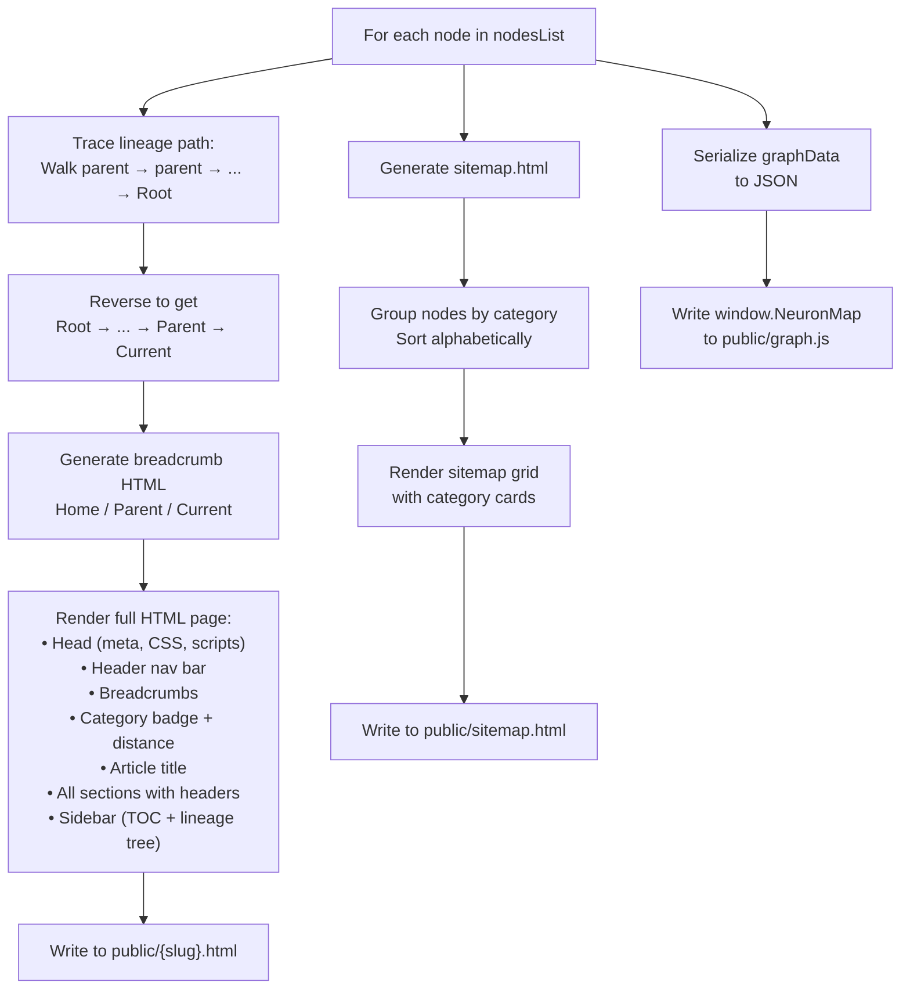

#### Lineage Tracing Algorithm

For each node, the build script walks up the parent chain to construct breadcrumb navigation:

```javascript
// Pseudocode
let pathArray = [];
let current = node;
while (current && current.name !== 'Root') {
    pathArray.push(current);
    current = graphData[current.parent];  // look up parent by name
}
pathArray.reverse();  // Now: [grandparent, parent, current]
```

This produces breadcrumbs like: `Home / Physics / Gravity`

#### The `graph.js` Output

The final output is a JavaScript file that attaches the entire knowledge graph to the global `window` object:

```javascript
// AUTO-GENERATED BY BUILD.JS
window.NeuronMap = {
  "Physics": {
    "name": "Physics",
    "parent": "Root",
    "category": "Physics",
    "distance": 1,
    "slug": "physics",
    "searchContent": "Physics is the scientific study of how...",
    "sections": [ /* ... rendered HTML sections ... */ ]
  },
  "Gravity": { /* ... */ },
  // ... all other nodes
};
```

---

## 🖥️ The Development Server — `dev.js` & `watch.js`

### `dev.js` — Orchestrator

Spawns two child processes in parallel:

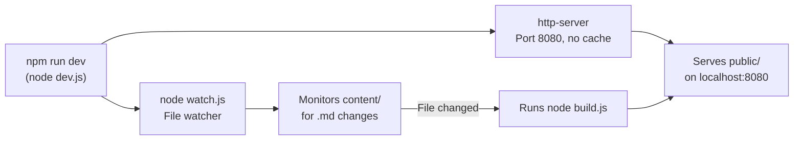

- **HTTP Server**: Uses `npx http-server` with `-c-1` (cache disabled) so refreshes always show the latest build.
- **Graceful Shutdown**: Listens for `SIGINT`/`SIGTERM` and kills both child processes.

### `watch.js` — Debounced File Watcher

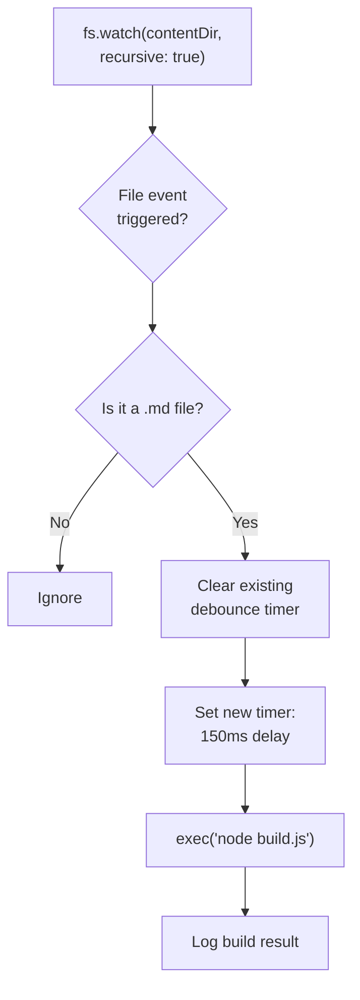

The **150ms debounce** prevents the watcher from triggering multiple rapid builds when an editor saves a file (some editors trigger multiple filesystem events per save).

---

## 📝 The Content System — Docs-as-Code

Content follows a **Docs-as-Code** pattern: knowledge is stored as Markdown files in the `content/` directory, versioned with Git, and compiled at build time.

### Node Anatomy

Every `.md` file has two parts:

```
┌─────────────────────────────────────┐
│  YAML Frontmatter                   │
│  ---                                │
│  name: Concept Name                 │
│  parent: Parent Concept Name        │
│  category: Physics | Math | CS      │
│  distance: 1 | 2 | 3 | ...         │
│  ---                                │
├─────────────────────────────────────┤
│  Markdown Body                      │
│                                     │
│  Optional preamble text...          │
│                                     │
│  @Section Title                     │
│  Section body with **bold**,        │
│  *italic*, $inline math$,           │
│  $$block equations$$, lists, etc.   │
│                                     │
│  @Another Section                   │
│  More content...                    │
└─────────────────────────────────────┘
```

### The Knowledge Graph Model

The nodes form a **rooted tree** with `Root` as the invisible apex:

```
                        Root (virtual)
                       /      \
                  Physics    Mathematics    Computer Science (CS)
                 /    \          |               |
            Gravity   ...    Algebra          AI (AI)
                              |               |
                        Elem. Algebra     Perceptrons
```

- **`distance: 1`** → Core Pillars (Physics, Math, CS)
- **`distance: 2`** → Subfields (Gravity, Algebra, Linear Algebra)
- **`distance: 3`** → Specific Concepts (Perceptrons, Elem. Algebra)
- **`distance: 4+`** → Deep subtopics (Order of Operations)

### Math Rendering (KaTeX)

Equations are rendered in two passes:

1. **Build-time** (server-side): `marked-katex-extension` converts `$...$` and `$$...$$` in Markdown to pre-rendered KaTeX HTML. This ensures math is visible immediately on page load (important for SEO and perceived speed).
2. **Run-time** (client-side): `global.js` runs `renderMathInElement()` from the KaTeX auto-render script, catching any expressions that were dynamically injected or missed during build.

---

## 🌐 The Homepage & Graph Engine — `app.js`

`app.js` powers the interactive landing page. It is organized into modular sections:

### Module 1: Category Color Mapping

```javascript
getCategoryColor(category) → CSS variable
```

Maps category strings to CSS custom property values:

| Category keyword | Color Variable | Hex |
|---|---|---|
| `cs`, `computer` | `--color-cs` | `#fcd34d` (Yellow) |
| `math` | `--color-math` | `#fb7185` (Rose) |
| `physics` | `--color-physics` | `#60a5fa` (Blue) |
| *(default)* | `--color-science` | `#34d399` (Green) |

### Module 2: Landing Interface & Typewriter

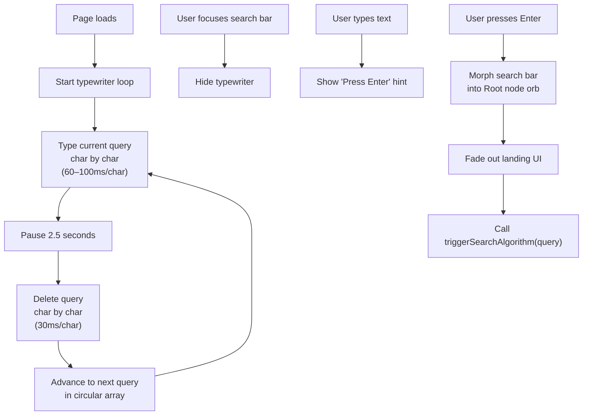

The typewriter cycles through example queries like *"Understand 'Quantum Superposition'"* and *"Explore 'General Relativity'"* to hint at the system's capabilities.

**Search bar morph animation**: When the user presses Enter, CSS transitions shrink the search bar from a `550px` input into a `14px` glowing orb (the Root node), then the landing container fades away to reveal the graph.

### Module 3: Rich Hover Cards

When hovering over a graph node, a glassmorphic popover card appears showing:
- Category badge (color-coded)
- Distance from core
- Node name
- First 140 characters of content
- "Click to explore" call-to-action

The positioning algorithm centers the card above the node, then clamps it to prevent overflow off-screen edges.

### Module 4: D3 Force-Directed Graph Engine

This is the core visualization. The entire flow:

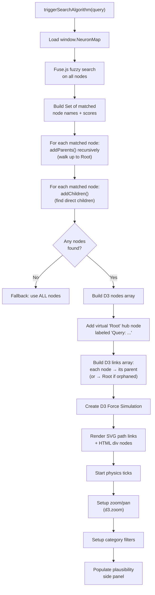

#### The Fuzzy Search Algorithm (Fuse.js)

Fuse.js performs approximate string matching using the [Bitap algorithm](https://en.wikipedia.org/wiki/Bitap_algorithm) with configurable scoring:

```javascript
const fuseOptions = {
    includeScore: true,
    threshold: 0.4,        // 0 = exact match, 1 = match anything
    ignoreLocation: true,  // Don't penalize matches far into the string
    keys: [
        { name: 'name',          weight: 1.0 },  // Highest priority
        { name: 'category',      weight: 0.5 },  // Medium priority
        { name: 'searchContent', weight: 0.8 }   // High priority
    ]
};
```

**Relevance score calculation**:

$$
\text{relevance} = \max\!\Big(0,\;\text{round}\big((1 - \text{fuseScore}) \times 100\big)\Big)
$$

Where `fuseScore` ranges from `0.0` (perfect match) to `1.0` (no match). A Fuse score of `0.1` becomes **90% relevance**.

#### Graph Expansion Logic

After the initial fuzzy search, the result set is expanded in two directions:

```
                    ┌────────────┐
                    │ addParents │  Walk UP the tree to Root
                    └─────┬──────┘  (ensures connected paths)
                          │
              ┌───────────┴───────────┐
              │  Matched Nodes (Fuse) │
              └───────────┬───────────┘
                          │
                    ┌─────┴──────┐
                    │ addChildren │  Find direct children
                    └────────────┘  (exposes sub-concepts)
```

This guarantees the graph is always connected — every matched node has a visible path back to the Root hub.

#### D3 Force Simulation Physics

The simulation uses five concurrent forces:

| Force | Type | Purpose | Parameters |
|---|---|---|---|
| `link` | `forceLink` | Connects parent-child pairs with spring tension | `distance: 140px` |
| `charge` | `forceManyBody` | Nodes repel each other (electrostatic analogy) | `strength: -400` |
| `center` | `forceCenter` | Prevents the graph from drifting off-screen | Center of viewport |
| `collision` | `forceCollide` | Prevents node overlap | `radius: 50px` |
| `x` | `forceX` | **Hierarchical layout**: positions nodes left-to-right by depth | See formula below |

**Hierarchical X-positioning formula**:

$$
x_{\text{target}}(d) = 
\begin{cases}
0.15 \times W & \text{if } d = \text{Root} \\[6pt]
0.15 \times W + d.\text{distance} \times 220 & \text{otherwise}
\end{cases}
$$

Where $W$ is the viewport width. The `strength: 1.2` makes this a strong constraint, ensuring the tree flows left-to-right by depth level.

**Y-positioning**: A gentle centering force (`forceY` with `strength: 0.15`) keeps nodes near the vertical midpoint.

#### Link Rendering (Bézier Curves)

Links are drawn as cubic Bézier curves, not straight lines, giving the graph a neural/organic feel:

```
M x1 y1 C (x1+offset) y1, (x2-offset) y2, x2 y2
```

$$
\text{offset} = 0.5 \times |x_2 - x_1|
$$

The control points create a horizontal S-curve between parent and child nodes.

#### Zoom & Pan

D3's `zoom` behavior is configured with scale limits `[0.3, 3.0]`. The transform is applied to both the SVG layer (links) and the HTML nodes layer simultaneously via CSS `transform`.

#### Category Filters

Filter buttons dim non-matching nodes to `opacity: 0.15` and disable their pointer events. Links dim to `opacity: 0.05`. The "All" button resets everything.

### The Plausibility Side Panel

After graph rendering, the right-side drawer populates with ranked concept cards:

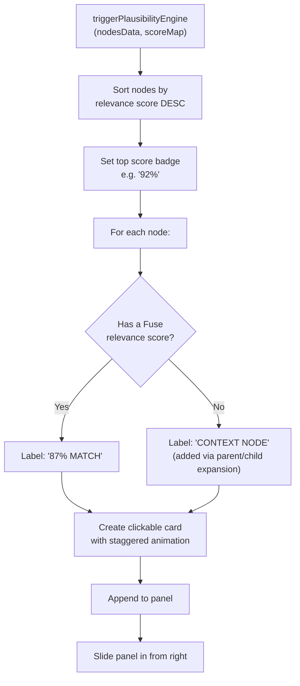

### Node Drag Handler

Nodes are draggable via D3's drag behavior:

1. **dragstarted**: Fixes the node position (`fx`, `fy`) and reheats the simulation (`alphaTarget(0.3)`).
2. **dragged**: Updates fixed position to follow the mouse.
3. **dragended**: Releases the fixed position (`fx = null`) and cools the simulation (`alphaTarget(0)`).

---

## 🌍 The Global Shared Module — `global.js`

`global.js` runs on **every page** (both `index.html` and all article pages). It provides four features:

### Module 1: Dynamic Lineage (Sidebar Children)

On article pages, this module finds all nodes in `NeuronMap` whose `parent` matches the current page's title, then injects them as clickable links in the sidebar's "Sub-concepts" section.

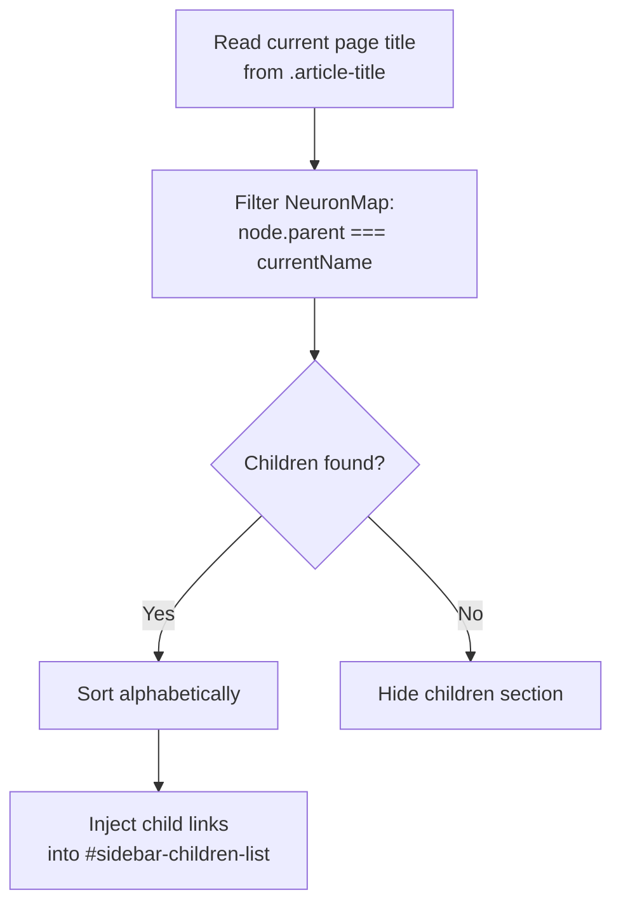

### Module 2: Wikipedia-Style Inline Definitions

This module automatically converts plain-text mentions of other knowledge nodes into clickable internal links, similar to Wikipedia's blue links.

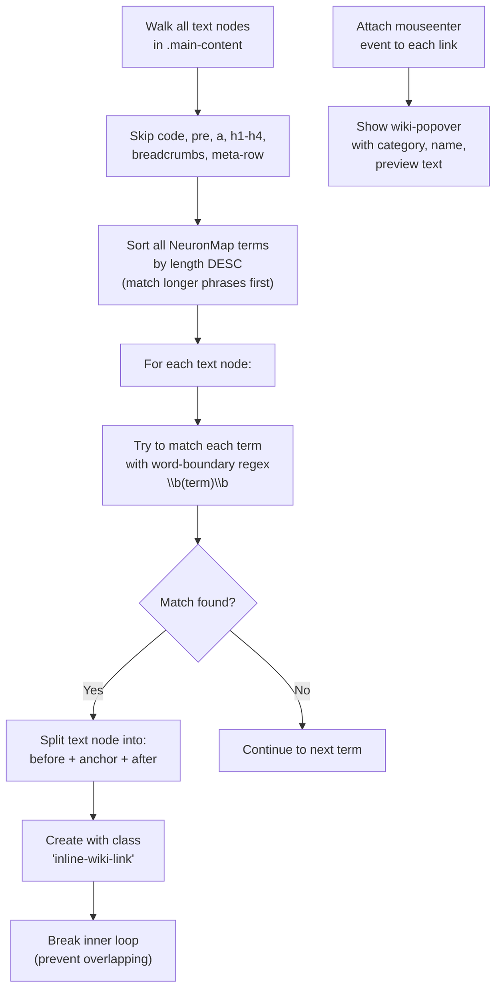

**Key design decisions**:
- Terms are sorted by length descending so "Linear Algebra" is matched before "Algebra" alone.
- Only the first occurrence per text node is linked (prevents excessive linking).
- The algorithm uses a `TreeWalker` to traverse only `TEXT_NODE` types, skipping existing links, code blocks, and headers.

### Module 3: Global Search Modal (Command Palette)

A VS Code-style command palette that works on every page:

| Shortcut | Action |
|---|---|
| `Ctrl+K` or `/` | Open search modal |
| `Esc` | Close modal |
| `↑` / `↓` | Navigate results |
| `Enter` | Go to selected result |

The modal is injected into the DOM dynamically by `injectSearchModal()`. It uses Fuse.js with the same configuration as the homepage search, but limits results to the **top 8 matches** for a compact display.

### Module 4: KaTeX Auto-Renderer

```javascript
renderMathInElement(document.body, {
    delimiters: [
        {left: '$$', right: '$$', display: true},     // Block equations
        {left: '$',  right: '$',  display: false},     // Inline math
        {left: '\\(', right: '\\)', display: false},   // LaTeX inline
        {left: '\\[', right: '\\]', display: true}     // LaTeX block
    ],
    throwOnError: false
});
```

If `renderMathInElement` is not yet available (scripts loading asynchronously), the function retries after 200ms.

### Module 5: TOC Scroll Observer

Uses `IntersectionObserver` to highlight the current section in the sidebar Table of Contents as the user scrolls:

```javascript
const observerOptions = {
    root: null,                          // Viewport
    rootMargin: "-20% 0px -60% 0px",     // Narrow "focus band" in upper portion
    threshold: 0                         // Trigger as soon as any part enters
};
```

The `rootMargin` of `-20% top / -60% bottom` creates a narrow detection band in the upper-middle portion of the viewport, so the active section changes when a section header enters that zone.

---

## 🎨 The Styling System

To maximize maintainability and eliminate layout redundancy, Neuron-IQ separates structural page requirements from its global design system:

### `shared.css` — The Design System Foundation
Contains the core styling tokens and layout blueprints shared across the entire site. It is imported at the top of both `style.css` and `page.css` using standard CSS `@import 'shared.css';` rules:
- **Typography & Resets**: Imports Google Fonts (Inter and JetBrains Mono) and sets baseline resets on all elements.
- **Color Variables**: Consolidates design parameters (`--bg-void`, `--text-main`, `--accent`) and standardizes CSS properties for biological group colors (`--color-cs`, `--color-math`, `--color-physics`, etc.).
- **Common Elements**: Styles custom webkit scrollbars, inline search term highlights (`.search-highlight`), and hover cards (`.wiki-popover`).
- **Command Palette Layout**: Contains all CSS properties, animations, scaling targets, and responsive metrics for the `.search-modal-overlay` structure.

### `style.css` — Homepage (The Void)
Builds homepage specific features on top of `shared.css`:
- **Canvas Backgrounds**: Layered radial space glows + a custom dot grid grid pattern (`30px × 30px`) creating depth.
- **Glassmorphism**: Renders visual aesthetics for the glass search box and landing typewriter components.
- **Neon glow nodes**: Styled using radial box shadows and glowing borders matching parent category attributes.
- **Neural pulse animation**: Emits signal flashes on links using dash offset loop transitions (`stroke-dasharray`).
- **Spotlight focus**: Hovering a node applies cinematic `:has()` filters to dim surrounding nodes and pathways.

### `page.css` — Article Pages
Configures editorial stylesheets for compiled documents:
- **Header Panels**: Frost glass sticky headers (`backdrop-filter`) with search launchers.
- **Layout Grids**: 1200px max-width flex structures containing sidebar elements and TOC lists.
- **Document Styles**: Formats headers, margins, lists, blockquotes (left-bordered gradients), and code blocks (JetBrains Mono syntax boxes).
- **lineage-tree Layouts**: Interactive lists mapping parents, current focus, and child links.

### Color System (CSS Custom Properties inside `shared.css`)

```css
:root {
    /* Central color theme */
    --bg-void: #030712;         /* Deep black void background */
    --text-main: #f8fafc;       /* Near-white content text */
    --text-muted: #8b9bb4;      /* Gray muted labels */
    --accent: #60a5fa;          /* Sleek blue link highlights */

    /* Cyber/Neon Category Colors */
    --color-cs: #fcd34d;        /* Yellow — Computer Science */
    --color-math: #fb7185;      /* Rose — Mathematics */
    --color-physics: #60a5fa;   /* Blue — Physics */
    --color-science: #34d399;   /* Green — Science (default) */
    --color-root: #ffffff;      /* White — Query Hub node */
}
```

---

## ☁️ Deployment — Netlify

The project deploys to Netlify via Git push. Configuration in `netlify.toml`:

```toml
[build]
  command = "npm install && node build.js"
  publish = "public"
```

**Deployment flow**:

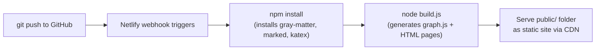

---

## 📦 Dependencies

| Package | Version | Purpose |
|---|---|---|
| `gray-matter` | `^4.0.3` | Parses YAML frontmatter from Markdown files |
| `marked` | `^18.0.4` | Converts Markdown to HTML |
| `marked-katex-extension` | `^5.1.10` | KaTeX math rendering plugin for `marked` |
| `katex` | `^0.17.0` | The underlying LaTeX math rendering engine |

### CDN Dependencies (loaded at runtime in the browser)

| Library | Version | Purpose |
|---|---|---|
| [D3.js](https://d3js.org/) | v7 | Force-directed graph layout, zoom, drag, DOM binding |
| [Fuse.js](https://fusejs.io/) | v7.0.0 | Client-side fuzzy search (Bitap algorithm) |
| [KaTeX](https://katex.org/) | v0.16.8 | Client-side math rendering (CSS + auto-render) |

---

## License

ISC
