<p align="center">
  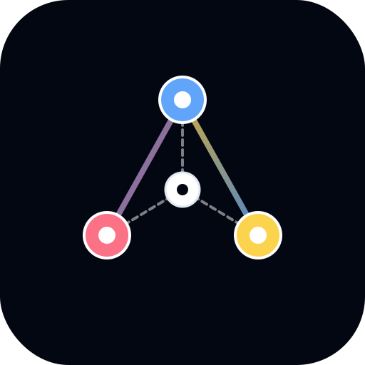
</p>

<h1 align="center">Neuron-IQ</h1>

<p align="center">
  <strong>An interactive, graph-based knowledge exploration platform</strong><br/>
  <em>Where every concept is a glowing neuron and every connection is a pulsing synapse.</em>
</p>

<p align="center">
  <a href="https://github.com/Kavyargb/Neuron-IQ/blob/main/LICENSE"></a>
  <a href="https://nodejs.org/"></a>
  <a href="#"></a>
  <a href="#"></a>
  <a href="#"></a>
</p>

<br/>

<p align="center">
  Neuron-IQ turns plain Markdown files into a <strong>glowing, animated neural knowledge graph</strong> you can search, zoom, drag, and click through — right in your browser. Think of it like a personal Wikipedia fused with a constellation map: every concept is a luminous orb, every connection is a pulsing neural pathway, and everything is searchable with fuzzy matching.
</p>

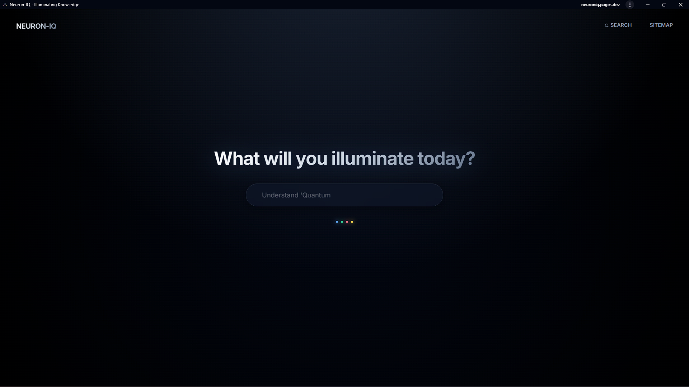

> [!NOTE]
> **No database. No backend server.** Every page is a static HTML file generated from Markdown at build time — the entire site works offline as a PWA.

---

## 📑 Table of Contents

<details>
<summary><strong>Click to expand</strong></summary>

- [⚡ Quick Start](#-quick-start)
- [🏛 Architecture Overview](#-architecture-overview)
- [📁 Project Structure](#-project-structure)
- [🔧 The Build Pipeline](#-the-build-pipeline)
  - [Phase 1: Parse & Load Knowledge Nodes](#phase-1-parse--load-knowledge-nodes)
  - [Phase 1.5: Compile Cross-Links](#phase-15-compile-internal-cross-links)
  - [Phase 2: Generate HTML Pages](#phase-2-generate-html-pages-with-lineage-trace)
  - [Phase 3: Generate Sitemap](#phase-3-generate-sitemap-page)
  - [Phase 4: Compile graph.js](#phase-4-compile-graphjs)
  - [Phase 5: Compile Service Worker](#phase-5-compile-service-worker)
- [🖥️ Development Server](#%EF%B8%8F-development-server)
- [📝 Content System](#-the-content-system)
- [🌐 Homepage & Graph Engine](#-the-homepage--graph-engine)
- [🌍 Global Module](#-the-global-module)
- [🔀 Client-Side Router](#-the-client-side-router)
- [📱 PWA & Service Worker](#-the-pwa--service-worker)
- [🎨 Styling System](#-the-styling-system)
- [☁️ Deployment](#%EF%B8%8F-deployment)
- [📦 Dependencies](#-dependencies)
- [📄 License](#-license)

</details>

---

## ⚡ Quick Start

### Prerequisites

| Tool | Minimum Version | Link |
|:-----|:----------------|:-----|
| **Node.js** | v16+ | [nodejs.org](https://nodejs.org/) |
| **Git** | Any | [git-scm.com](https://git-scm.com/) |

### Setup in 3 Steps

```bash
# 1 · Clone the repository
git clone https://github.com/Kavyargb/Neuron-IQ.git
cd Neuron-IQ

# 2 · Install dependencies
npm install

# 3 · Launch the dev server
npm run dev
```

Open **`http://localhost:8080`** → you'll see the animated knowledge graph.

<details>
<summary>💡 <strong>What happens behind the scenes</strong></summary>

When you run `npm run dev`, two processes start simultaneously:

| Process | What it does |
|:--------|:-------------|
| **HTTP Server** | Serves the `public/` folder on port `8080` with caching disabled |
| **File Watcher** | Monitors `content/` for `.md` changes and auto-rebuilds the site |

</details>

### Manual Production Build

```bash
node build.js
```

This generates all static HTML article pages, the knowledge graph data (`graph.js`), the sitemap, and the service worker — everything needed for deployment.

---

## 🏛 Architecture Overview

Neuron-IQ uses a **static-site generation (SSG) + client-side interactivity** architecture:

| Layer | Technology | Role |
|:------|:-----------|:-----|
| **Build Time** | Node.js | Reads Markdown → generates HTML pages + JSON knowledge graph |
| **Run Time** | Browser JS | D3.js graph rendering, Fuse.js fuzzy search, KaTeX math, SPA routing |
| **Storage** | None | No database, no backend — pure static files |

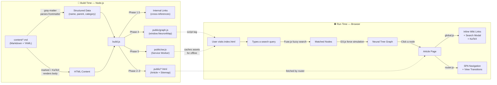

> **In plain English:** You write Markdown files with metadata at the top. The build script turns them into a JSON brain map and individual HTML pages. In the browser, D3.js draws the brain map, Fuse.js powers fuzzy search, KaTeX renders math, and a client-side router navigates without reloading.

---

## 📁 Project Structure

```
Neuron-IQ/
│
├── 📝 content/                   Knowledge nodes (Markdown files)
│   ├── physics.md                Root-level pillar
│   ├── gravity.md                Sub-concept of Physics
│   ├── ai.md                     Uses aliases for "AI", "Machine Intelligence"
│   ├── perceptrons.md            Deep concept (distance: 3)
│   ├── _templates/               Obsidian templates (git-ignored)
│   └── .obsidian/                Obsidian workspace config (git-ignored)
│
├── 🌐 public/                    Static output (served to browser)
│   ├── index.html                Landing page + graph container
│   ├── sitemap.html              ⚡ AUTO-GENERATED: knowledge sitemap
│   ├── graph.js                  ⚡ AUTO-GENERATED: NeuronMap JSON blob
│   ├── sw.js                     ⚡ AUTO-GENERATED: PWA service worker
│   ├── app.js                    Homepage: D3 graph, typewriter, search
│   ├── global.js                 Shared: NeuronUtils, search modal, links
│   ├── router.js                 🔀 SPA router + View Transitions
│   ├── manifest.json             📱 PWA manifest (installable app)
│   ├── icon.svg                  App icon
│   ├── shared.css                🎨 Design system: variables, glass panels
│   ├── style.css                 Homepage styles (dark void aesthetic)
│   └── page.css                  Article page styles (reader layout)
│
├── build.js                      🔧 Static site generator (build brain)
├── dev.js                        🖥️  Dev server orchestrator
├── watch.js                      👁️  File watcher (auto-rebuild on save)
├── script.js                     🐛 Debug utility (graph connectivity)
├── package.json                  📦 Project manifest & dependencies
├── netlify.toml                  ☁️  Netlify deployment config
├── CONTENT_GUIDE.md              📖 Guide for content authors
└── .gitignore                    🚫 Ignored files & directories
```

<details>
<summary>📋 <strong>Committed vs. Generated Files</strong></summary>

| ✍️ Committed (you write these) | ⚡ Generated (build creates these) |
|:-------------------------------|:------------------------------------|
| `content/*.md` | `public/graph.js` |
| `public/index.html` | `public/{slug}.html` (all articles) |
| `public/app.js`, `global.js`, `router.js` | `public/sitemap.html` |
| `public/shared.css`, `style.css`, `page.css` | `public/sw.js` |
| `public/manifest.json`, `icon.svg` | |
| `build.js`, `dev.js`, `watch.js` | |

The `.gitignore` uses `public/*` (ignore everything) with `!public/app.js`, `!public/global.js`, etc. to keep hand-authored files.

</details>

---

## 🔧 The Build Pipeline

> **`build.js`** is the heart of the project — a custom static site generator that runs in **five phases**.

### Phase 1: Parse & Load Knowledge Nodes

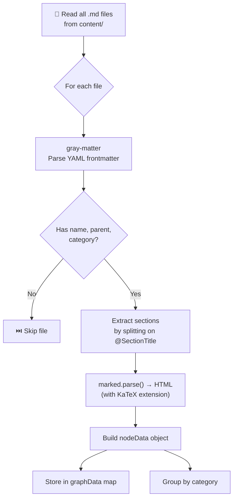

#### Frontmatter Format

Each Markdown file starts with a YAML metadata block:

```yaml
---
name: Artificial Intelligence       # Display title + unique identifier
parent: Computer Science (CS)       # Parent node name (must match exactly)
category: Computer Science          # Color-coding group
distance: 2                         # Depth from center (1 = pillar, 2 = subfield, 3+ = concept)
aliases: [AI, Machine Intelligence] # (Optional) Alternative names for search + auto-linking
---
```

<details>
<summary>🔍 <strong>How aliases work</strong></summary>

Aliases define alternative names for a concept. For example, `"Artificial Intelligence"` with aliases `[AI, Machine Intelligence]` means:

- 🔎 Searching **"AI"** will find this node
- 🔗 If another article mentions **"AI"** in text, it auto-links to this page
- 🚫 The node won't link to itself — self-aliases are excluded

</details>

#### Section Extraction

The body is split into named sections using `@SectionTitle` delimiters:

```
Input text:                           Output sections:
    Some preamble text.       →       Section 0: { title: "Overview", isPreamble: true }
    @Introduction             →       Section 1: { title: "Introduction" }
    Intro body text.
    @Deep Dive                →       Section 2: { title: "Deep Dive" }
    Advanced body text.
```

**Regex**: `body.split(/(?:^|\n)@([^\n]+)\n/)` — lines starting with `@` become section titles. Text before the first `@` becomes a preamble with the default title "Overview".

#### Slug Generation

```
"Real Numbers and their Operations"  →  "real-numbers-and-their-operations"
"Computer Science (CS)"              →  "computer-science-cs"
```

Algorithm: lowercase → spaces/underscores to hyphens → strip non-word chars → collapse hyphens.

#### Search Content

All section HTML is stripped of tags, markdown syntax, and math delimiters to produce plain-text `searchContent`. This powers Fuse.js full-text fuzzy search at runtime.

---

### Phase 1.5: Compile Internal Cross-Links

After all nodes are parsed, the build scans every node's `searchContent` for mentions of other nodes (by name or alias):

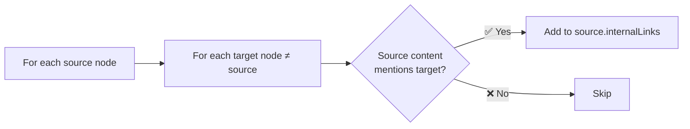

These internal links appear on the graph as **dashed lines** — cross-references between related but non-hierarchical concepts.

---

### Phase 2: Generate HTML Pages with Lineage Trace

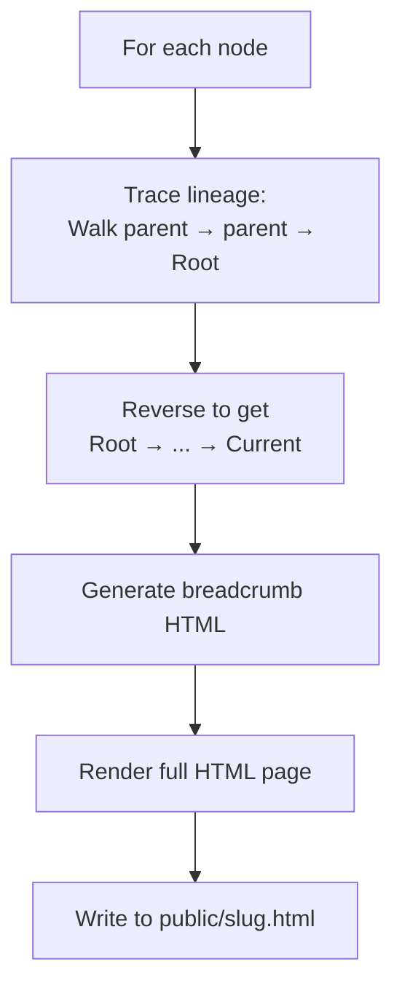

**Lineage tracing** walks up the parent chain to build breadcrumbs:

```javascript
let current = node;
while (current && current.name !== 'Root') {
    pathArray.push(current);
    current = graphData[current.parent];
}
pathArray.reverse();  // [grandparent, parent, current]
```

Each article page includes: `page.css`, `graph.js`, `global.js`, `router.js`, Fuse.js and KaTeX from CDN, and a sidebar with TOC + parent/child links.

---

### Phase 3: Generate Sitemap Page

All nodes are grouped by category, sorted alphabetically, and rendered into a sitemap with category cards.

---

### Phase 4: Compile `graph.js`

The knowledge graph is serialized to JavaScript and attached to `window.NeuronMap`:

```javascript
// AUTO-GENERATED BY BUILD.JS
window.NeuronMap = {
  "Physics": {
    "name": "Physics",
    "parent": "Root",
    "category": "Physics",
    "distance": 1,
    "slug": "physics",
    "aliases": ["Physical Science"],
    "sectionTitles": ["Overview", "Classical Physics", "Modern Physics"],
    "searchContent": "Physics is the scientific study of...",
    "internalLinks": ["Gravity", "Quantum Mechanics"]
  },
  // ... all other nodes
};
```

---

### Phase 5: Compile Service Worker

The build scans `public/`, collects every file path, and generates a service worker with content-hash precaching via `workbox-build`:

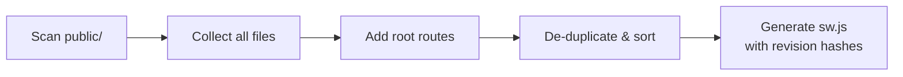

The service worker uses **cache-first** for local assets and **dynamic caching** for CDN resources. Failed navigations fall back to `index.html`.

---

## 🖥️ Development Server

### `dev.js` — Orchestrator

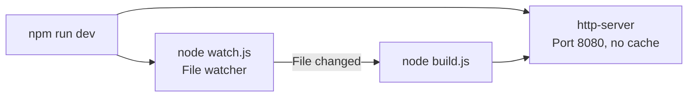

- **Cross-platform**: Detects Windows vs. Unix for `npx.cmd` / `npx`
- **Graceful shutdown**: Listens for `SIGINT`/`SIGTERM` and kills both child processes

### `watch.js` — Debounced File Watcher

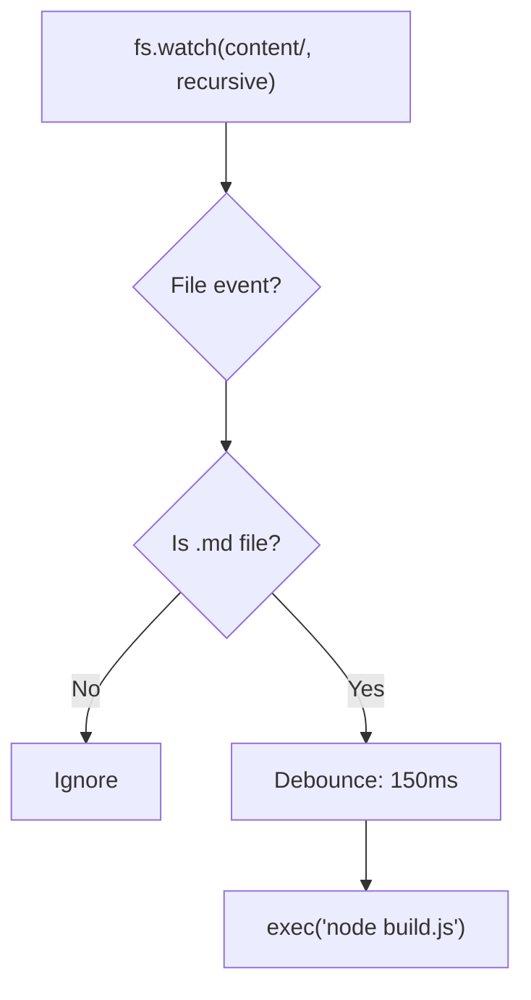

The **150ms debounce** prevents multiple rapid builds when editors like VS Code trigger several filesystem events per save.

---

## 📝 The Content System

Content follows a **Docs-as-Code** pattern: knowledge is stored as Markdown files in `content/`, versioned with Git, and compiled at build time. Compatible with [Obsidian](https://obsidian.md/) (the `.obsidian` config folder is gitignored).

> 📖 See [`CONTENT_GUIDE.md`](CONTENT_GUIDE.md) for full formatting examples.

### Node Anatomy

Every `.md` file has two parts:

```
┌─────────────────────────────────────┐
│  YAML Frontmatter                   │
│  ---                                │
│  name: Concept Name                 │
│  parent: Parent Concept Name        │
│  category: Physics | Math | CS      │
│  distance: 1 | 2 | 3 | ...         │
│  aliases: [Alt Name 1, Alt Name 2]  │  ← optional
│  ---                                │
├─────────────────────────────────────┤
│  Markdown Body                      │
│                                     │
│  Optional preamble text...          │
│                                     │
│  @Section Title                     │
│  Body with **bold**, *italic*,      │
│  $inline math$, $$block math$$      │
│                                     │
│  @Another Section                   │
│  More content...                    │
└─────────────────────────────────────┘
```

### Frontmatter Field Reference

| Field | Required | Type | Description |
|:------|:--------:|:----:|:------------|
| `name` | ✅ | `string` | Display title and unique graph identifier |
| `parent` | ✅ | `string` | Name of parent node (must match exactly). Use `Root` for top-level pillars |
| `category` | ✅ | `string` | Color group: `CS` (yellow), `Math` (rose), `Physics` (blue), or anything else (green) |
| `distance` | ✅ | `integer` | Depth from center. `1` = pillar, `2` = subfield, `3` = concept, `4+` = deep subtopic |
| `aliases` | ❌ | `string[]` | Alternative names for search and auto-linking. Example: `[AI, ML]` |

### Knowledge Graph Model

The nodes form a **rooted tree** with `Root` as the invisible apex:

```
                            Root (virtual, not a file)
                         ╱          │              ╲
                   Physics      Mathematics    Computer Science
                  ╱      ╲          │                   │
            Gravity    Classical   Algebra              AI
                       Mechanics     │                  │
                              Elem. Algebra        Perceptrons
```

| Distance | Role | Node Size |
|:--------:|:-----|:----------|
| `1` | Core Pillars | 🟢 Largest orbs |
| `2` | Subfields | 🔵 Medium orbs |
| `3` | Specific Concepts | 🟡 Smaller orbs |
| `4+` | Deep Subtopics | 🔴 Smallest orbs |

### Math Rendering (KaTeX)

Equations are rendered in **two passes**:

1. **Build-time** (server-side) — `marked-katex-extension` converts `$...$` and `$$...$$` to pre-rendered KaTeX HTML. Math is visible immediately on page load.
2. **Run-time** (client-side) — `global.js` calls `renderMathInElement()` to catch dynamically injected expressions.

---

## 🌐 The Homepage & Graph Engine

> **`app.js`** powers the interactive landing page, organized into distinct modules.

### Lifecycle

The homepage exposes two global functions for the SPA router:
- `window.initHomePage()` — sets up the typewriter, search, and graph
- `window.cleanupHomePage()` — stops the D3 simulation and clears timers when navigating away

---

### Module 1 · Typewriter Animation

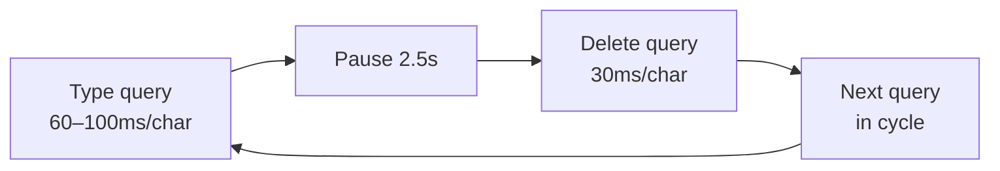

The typewriter cycles through example queries like *"Understand 'Quantum Superposition'"* and *"Explore 'General Relativity'"*.

**Search bar morph**: When the user presses Enter, CSS transitions shrink the `550px` input into a `14px` glowing orb (the Root node), then the landing fades to reveal the graph.

---

### Module 2 · Landing Autocomplete

As the user types, a live dropdown shows up to **5 matching results** using `NeuronUtils.performSearch()`. It also shows recently viewed nodes when the input is focused but empty.

---

### Module 3 · Rich Hover Cards

Hovering over a graph node shows a **glassmorphic popover** with:

| Element | Description |
|:--------|:------------|
| 🏷️ Category badge | Color-coded |
| 📏 Distance | Steps from core |
| 📄 Preview | First 140 characters of content |
| ➡️ CTA | "Click to explore →" |

The positioning algorithm centers the card above the node and clamps it within viewport bounds.

---

### Module 4 · D3 Force-Directed Graph Engine

This is the core visualization:

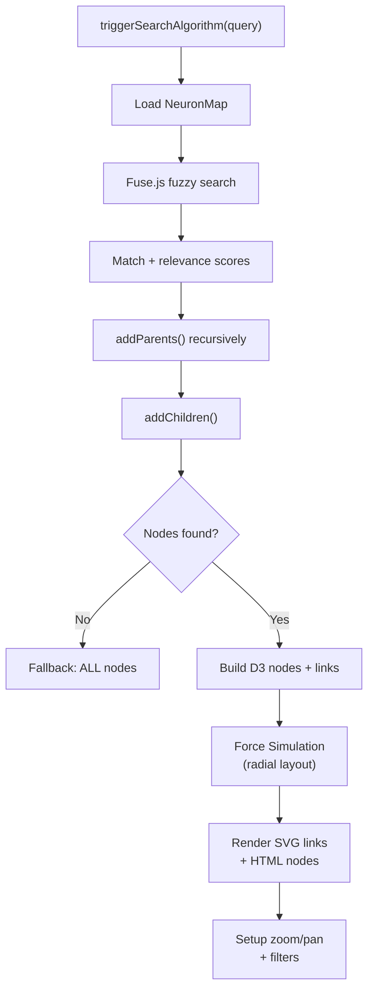

#### Graph Expansion

Results are expanded in two directions to guarantee connectivity:

```
              ┌─────────────┐
              │ addParents() │  Walk UP to Root
              └──────┬──────┘
         ┌───────────┴───────────┐
         │  Matched Nodes (Fuse) │
         └───────────┬───────────┘
              ┌──────┴──────┐
              │ addChildren()│  Find direct children
              └─────────────┘
```

#### Dynamic Node Sizing

```
radius = max(6, min(30, 10 + 2 × linkCount − 1.5 × distance))
```

Root node: fixed radius of `20`. More connections → bigger orb. Higher distance → slightly smaller.

#### D3 Force Simulation

Five concurrent forces shape the layout:

| Force | Type | Purpose | Parameters |
|:------|:-----|:--------|:-----------|
| `link` | `forceLink` | Parent-child spring tension | `120px` (hierarchical), `160px` (cross-links) |
| `charge` | `forceManyBody` | Gentle repulsion | `strength: -10` |
| `center` | `forceCenter` | Prevents off-screen drift | Center of viewport |
| `collision` | `forceCollide` | Prevents overlap | `radius + 15px` |
| `radial` | `forceRadial` | Concentric ring layout by depth | See formula below |

**Radial positioning**: Nodes are arranged in concentric circles:

$$r_{\text{target}}(d) = \begin{cases} 0 & \text{if } d = \text{Root} \\[6pt] R_1 + (\text{distance} - 1) \times 150 & \text{otherwise} \end{cases}$$

Where $R_1 = 180\text{px}$ is the first ring radius. Strength: `0.8`. Distance-1 pillars are **pinned** at evenly-spaced angles.

#### Link Rendering

| Type | Appearance |
|:-----|:-----------|
| Tree links | ━━━━━━━ Solid, pulsing, color-coded |
| Internal links | ┈ ┈ ┈ ┈ Dashed, dim white |

Links use **cubic Bézier curves** for an organic, neural feel:

```
M x1 y1 C (x1+offset) y1, (x2-offset) y2, x2 y2
offset = 0.5 × |x₂ - x₁|
```

#### Mass-Weighted Physics

Heavier nodes are slowed during simulation ticks:

```javascript
nodes.forEach(d => {
    if (d.fx === null) {
        d.x += d.vx * (1 / d.mass - 1);
        d.y += d.vy * (1 / d.mass - 1);
        d.vx /= d.mass;
        d.vy /= d.mass;
    }
});
```

#### Tick Throttling (requestAnimationFrame)

To support rendering large graphs (>500 nodes) smoothly, layout calculations and DOM style/path attribute updates are throttled inside `requestAnimationFrame`. This decouples the simulation updates from redundant DOM draws, preventing layout thrashing and ensuring the client runs smoothly at the display's native refresh rate (60Hz+).

```javascript
let tickPending = false;
window.graphSimulation.on("tick", () => {
    if (nodes.length > 500) {
        if (!tickPending) {
            tickPending = true;
            requestAnimationFrame(() => {
                // Perform physics recalculations & update DOM styles/link geometries
                tickPending = false;
            });
        }
    } else {
        // Run synchronously for smaller graphs to maintain simulation snappiness
    }
});
```

#### Zoom & Pan

D3 zoom with scale limits `[0.3, 3.0]`. Controls: `+`, `−`, `⊙` reset — in a floating glass panel.

#### Category Filters

Filter buttons dim non-matching nodes to `opacity: 0.15` and disable pointer events. Links dim to `opacity: 0.05`. "All" resets.

---

### The Plausibility Side Panel

After graph rendering, the right-side drawer populates with ranked concept cards:

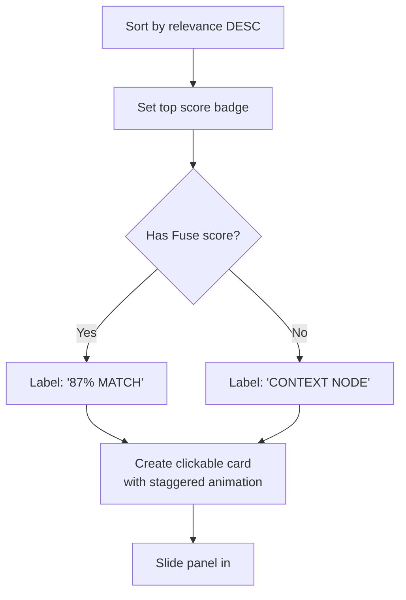

### Node Interaction

| Action | Behavior |
|:-------|:---------|
| **Hover** | Rich hover card + label |
| **Click** | Navigate to article (SPA or standard) |
| **Drag** | Fixes position during drag; releases on drop (Root/pillars stay pinned) |

---

## 🌍 The Global Module

> **`global.js`** runs on every page — both `index.html` and all article pages. It provides the shared `NeuronUtils` object and five initialization features.

### The `NeuronUtils` Object

| Module | Key Functions | Purpose |
|:-------|:-------------|:--------|
| **Theming** | `getCategoryColor(cat)` | Maps categories to CSS custom properties |
| **String Helpers** | `escapeRegExp()`, `highlightMatch()` | Safe regex escaping + highlighting |
| **UI Generators** | `generatePopoverHTML()`, `positionPopover()`, `generateResultItemHTML()` | Reusable HTML templates |
| **History** | `saveSearchQuery()`, `saveClickedNode()`, `getStorage()` | LocalStorage-backed history (last 5) |
| **Search** | `performSearch()`, `getCustomSearchScore()`, `getRelevanceScore()` | Fuse.js fuzzy + custom scoring |
| **Keyboard** | `setupListKeyboardNav()` | ↑/↓/Enter navigation |

#### Search Scoring System

A **two-layer scoring system** ranks results:

<details>
<summary><strong>Layer 1 · Custom Score (Deterministic)</strong></summary>

| Match Type | Score | Display |
|:-----------|:-----:|:--------|
| Exact name match | 1000 | 100% |
| Parenthetical match (e.g., "cs" → "Computer Science (CS)") | 950 | 98% |
| Exact alias match | 925 | 98% |
| Acronym match | 900 | 98% |
| Name starts with query | 850 | 95% |
| Alias starts with / contains query | 825 | 95% |
| Word boundary match in name | 800 | 95% |
| Exact category match | 700 | 90% |
| Section title match | 600 | 85% |
| Substring match (query > 3 chars) | 400 | 70% |

</details>

<details>
<summary><strong>Layer 2 · Fuse.js Score (Fuzzy)</strong></summary>

Bitap algorithm for approximate matching when custom scoring doesn't find a match.

```javascript
new Fuse(Object.values(window.NeuronMap), {
    includeScore: true,
    threshold: 0.4,
    ignoreLocation: true,
    keys: [
        { name: 'name',          weight: 1.0 },
        { name: 'aliases',       weight: 0.9 },
        { name: 'category',      weight: 0.5 },
        { name: 'sectionTitles', weight: 0.4 },
        { name: 'searchContent', weight: 0.1 }
    ]
});
```

</details>

Results are sorted by custom score first, Fuse.js score as tiebreaker.

---

### Feature 1 · Dynamic Lineage (Sidebar Children)

On article pages, finds all nodes whose `parent` matches the current page's title, then injects them as clickable links in the sidebar. Sorted alphabetically with color-coded distance badges.

### Feature 2 · Wikipedia-Style Inline Links

Automatically converts plain-text mentions of other knowledge nodes into clickable internal links:

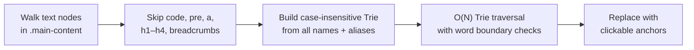

**Key decisions / Implementation**:
- **Trie Search Engine**: Swapped the high-backtracking regular expression engine with a custom prefix `Trie` containing all target concept names and aliases. This guarantees $O(N)$ string matching complexity with respect to the text length $N$, completely independent of the dictionary size.
- **Word Boundary Checking**: Simulates `\b` boundary transitions using character look-behind and look-ahead evaluations: `isWordChar(text[i - 1]) !== isWordChar(text[i])` and `isWordChar(text[j]) !== isWordChar(text[j + 1])` where `isWordChar(c)` matches `/^[a-zA-Z0-9_]$/`.
- **Greedy Matching**: Traverses the Trie path to find the longest matching prefix (e.g. matching "Linear Algebra" first before fallback to "Algebra").
- **Exclusion**: Current page and its aliases are excluded from self-linking. Hover popovers trigger on `mouseenter`.

### Feature 3 · Global Search Modal

A VS Code-style **command palette** on every page:

| Shortcut | Action |
|:---------|:-------|
| <kbd>Ctrl</kbd>+<kbd>K</kbd> or <kbd>/</kbd> | Open search modal |
| <kbd>Esc</kbd> | Close modal |
| <kbd>↑</kbd> / <kbd>↓</kbd> | Navigate results |
| <kbd>Enter</kbd> | Go to selected result |

Top 8 matches displayed. Empty input shows **recently viewed nodes**.

### Feature 4 · KaTeX Auto-Renderer

```javascript
renderMathInElement(document.body, {
    delimiters: [
        { left: '$$', right: '$$', display: true },
        { left: '$',  right: '$',  display: false },
        { left: '\\[', right: '\\]', display: true }
    ],
    throwOnError: false
});
```

Retries after 200ms if not yet available.

### Feature 5 · TOC Scroll Observer

`IntersectionObserver` highlights the current section in the sidebar TOC as the user scrolls:

```javascript
const observerOptions = {
    root: null,
    rootMargin: "-20% 0px -60% 0px",  // Narrow detection band in upper portion
    threshold: 0
};
```

### PWA Registration

```javascript
if ('serviceWorker' in navigator) {
    window.addEventListener('load', () => {
        navigator.serviceWorker.register('sw.js');
    });
}
```

---

## 🔀 The Client-Side Router

> **`router.js`** turns Neuron-IQ into a **Single Page Application**. Instead of full page reloads, it fetches the target page with `fetch()`, swaps the DOM, and updates the URL — all without a white flash.

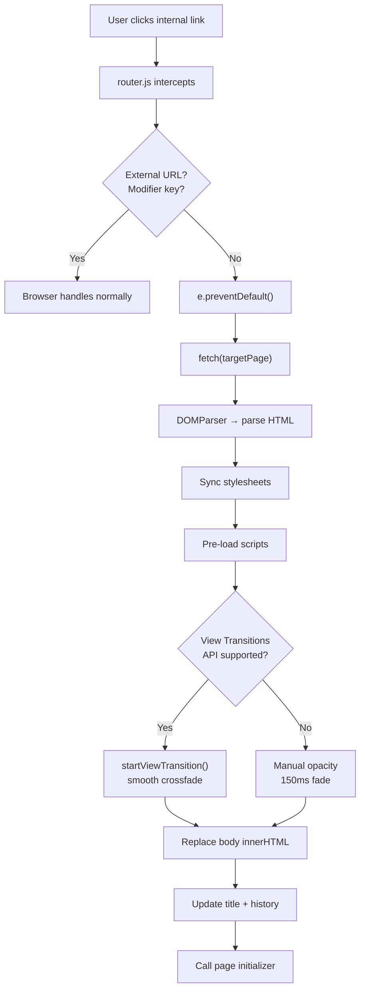

### Key Features

| Feature | Description |
|:--------|:------------|
| **View Transitions** | Native `startViewTransition()` with fallback opacity |
| **Stylesheet Sync** | Loads CSS before swap to prevent FOUC |
| **Script Pre-loading** | D3 for homepage, KaTeX for articles — loaded on demand |
| **Browser History** | Full back/forward via `popstate` |
| **Graceful Fallback** | Falls back to standard navigation on failure |
| **Smart Detection** | Skips external links, `target="_blank"`, modifier keys, hash links |

### View Transition CSS

```css
::view-transition-old(root) {
    animation: 200ms fade-out, 200ms scale-down;
}
::view-transition-new(root) {
    animation: 300ms fade-in, 300ms scale-up;
}
#brand, .brand { view-transition-name: header-brand; }
```

---

## 📱 The PWA & Service Worker

Neuron-IQ is a **Progressive Web App** — installable on phones and desktops, and fully functional offline.

### `manifest.json`

```json
{
  "name": "Neuron-IQ",
  "short_name": "Neuron-IQ",
  "description": "Illuminating the architecture of the neural knowledge database.",
  "start_url": "index.html",
  "display": "standalone",
  "background_color": "#030712",
  "theme_color": "#030712"
}
```

### Service Worker Strategy

The `sw.js` is auto-generated at build time using `workbox-build`. Each asset gets an individual content hash, so only changed files are re-downloaded:

| Asset Type | Strategy | Behavior |
|:-----------|:---------|:---------|
| **Local files** (HTML, JS, CSS) | Cache-first, pre-cached with revision hashes | Served instantly from cache; only modified files re-cached on update |
| **CDN resources** (jsDelivr, Google Fonts) | Dynamic Cache-First | Fetched from network first time, cached for future |
| **Failed navigations** | Fallback | Returns cached `index.html` |

---

## 🎨 The Styling System

Three CSS files separate the design system from page-specific styles:

### `shared.css` — Design System Foundation

Imported by both `style.css` and `page.css`:

| Token | Description |
|:------|:------------|
| **Typography** | Google Fonts — Inter (text), JetBrains Mono (code) |
| **CSS Variables** | All colors, glass effects, spacing tokens |
| **Glassmorphism** | `.glass-panel` utility with blur, border, shadow |
| **Command Palette** | Complete search modal styling |
| **View Transitions** | Crossfade and scale animations |
| **Wiki Popovers** | Hover card styling |
| **Scrollbars** | Custom webkit scrollbar design |

### `style.css` — Homepage (The Void)

| Feature | Implementation |
|:--------|:---------------|
| Canvas Background | Layered radial space glows + dot grid (`30×30px`) |
| Search Bar | Glassmorphic input → morph animation → glowing orb |
| Graph Nodes | Radial box shadows + glowing borders by category |
| Neural Pulse | Signal flashes via `stroke-dasharray` animation |
| Cinematic Focus | CSS `:has()` dims surrounding nodes on hover |
| Autocomplete | Glassmorphic dropdown below search bar |

### `page.css` — Article Pages

| Feature | Implementation |
|:--------|:---------------|
| Header | Frost glass with `backdrop-filter` |
| Layout | 1200px max-width flex with sidebar + TOC |
| Typography | Headers, lists, blockquotes with gradient borders |
| Code | JetBrains Mono blocks |
| Lineage Tree | Interactive parent → current → children navigation |

### Color System

```css
:root {
    /* Core Theme */
    --bg-void:     #030712;     /* Deep black void */
    --text-main:   #f8fafc;     /* Near-white text */
    --text-muted:  #8b9bb4;     /* Gray muted labels */
    --accent:      #60a5fa;     /* Blue highlights */

    /* Category Colors */
    --color-cs:      #fcd34d;   /* 🟡 Yellow — Computer Science */
    --color-math:    #fb7185;   /* 🔴 Rose — Mathematics */
    --color-physics: #60a5fa;   /* 🔵 Blue — Physics */
    --color-science: #34d399;   /* 🟢 Green — Science */
    --color-root:    #ffffff;   /* ⚪ White — Query Hub */

    /* Glassmorphism */
    --glass-bg:     rgba(15, 23, 42, 0.65);
    --glass-border: rgba(255, 255, 255, 0.08);
    --glass-hover:  rgba(255, 255, 255, 0.12);
    --glass-shadow: 0 10px 40px -10px rgba(0, 0, 0, 0.5),
                    inset 0 1px 0 rgba(255, 255, 255, 0.05);
}
```

---

## ☁️ Deployment

The project deploys to **Netlify** via Git push:

```toml
[build]
  command = "npm install && node build.js"
  publish = "public"
```

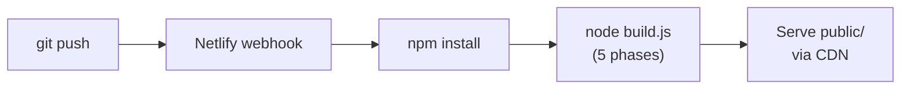

---

## 📦 Dependencies

### Build Dependencies (npm)

| Package | Version | Purpose |
|:--------|:--------|:--------|
| [`gray-matter`](https://github.com/jonschlinkert/gray-matter) | `^4.0.3` | YAML frontmatter parser |
| [`marked`](https://github.com/markedjs/marked) | `^18.0.4` | Markdown → HTML converter |
| [`marked-katex-extension`](https://github.com/UziTech/marked-katex-extension) | `^5.1.10` | KaTeX plugin for `marked` |
| [`katex`](https://katex.org/) | `^0.17.0` | LaTeX math rendering engine |
| [`striptags`](https://github.com/ericnorris/striptags) | `^3.2.0` | HTML tag stripper |
| [`workbox-build`](https://developer.chrome.com/docs/workbox/) | `^7.4.1` | Service worker generator with content-hash precaching |

### CDN Dependencies (runtime)

| Library | Version | Purpose |
|:--------|:--------|:--------|
| [D3.js](https://d3js.org/) | v7 | Force-directed graph, zoom, drag, DOM binding |
| [Fuse.js](https://fusejs.io/) | v7.0.0 | Client-side fuzzy search (Bitap algorithm) |
| [KaTeX](https://katex.org/) | v0.16.8 | Client-side math rendering + auto-render |

### Dev Tools (via npx)

| Tool | Purpose |
|:-----|:--------|
| `http-server` | Zero-config static file server |

---

## 📄 License

[ISC](LICENSE)

---

<p align="center">
  <sub>Built with ❤️ and way too much CSS</sub>
</p>
