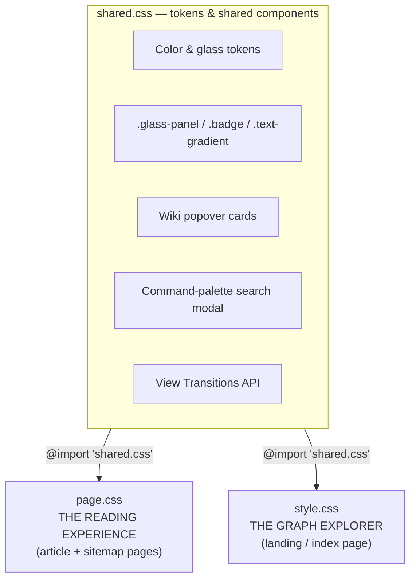
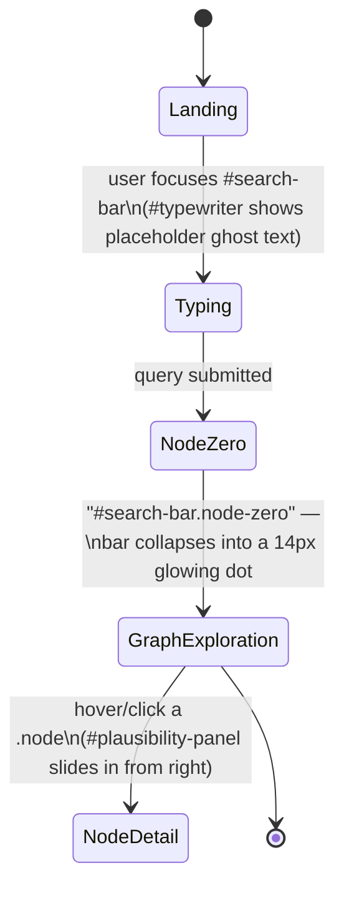

# 🎨 Neuron-IQ Stylesheet Architecture

> Three files, one design system, two completely different interfaces: a calm document-reading experience and a cinematic, canvas-style graph explorer — bound together by a shared token layer and a handful of very deliberate cross-cutting details.

---

## Table of Contents

1. [The Three-File Architecture](#the-three-file-architecture)
2. [Design Tokens](#design-tokens)
3. [Shared Component Library — `shared.css`](#shared-component-library--sharedcss)
4. [`page.css` — The Reading Experience](#pagecss--the-reading-experience)
5. [`style.css` — The Graph Explorer](#stylecss--the-graph-explorer)
6. [How This Ties Back to `build.js`](#how-this-ties-back-to-buildjs)
7. [Cross-File Consistency Notes](#cross-file-consistency-notes)
8. [Responsive Behavior](#responsive-behavior)
9. [Known Quirks & Design Debt](#known-quirks--design-debt)
10. [Quick Reference](#quick-reference)

---

## The Three-File Architecture



Neither `page.css` nor `style.css` duplicates a single token or component — both simply `@import 'shared.css'` at the top of the file and build on it. The split isn't arbitrary: it mirrors two genuinely different UI paradigms living in the same product:

| | `page.css` | `style.css` |
|---|---|---|
| Layout model | Normal document flow (`flex`, scrollable body) | Fixed, `overflow: hidden`, 100vw/100vh viewport lock |
| Mental model | "I'm reading an article" | "I'm inside a live, explorable graph" |
| Positioning | Flow-based (`.layout-grid`, `.sidebar`) | Absolute/fixed overlays (`#void`, `#graph-container`, `#plausibility-panel`) |
| Typical page | Any concept node, sitemap | The landing page only |

---

## Design Tokens

All tokens live in `shared.css`'s `:root` block. Nothing in `page.css` or `style.css` hardcodes a raw color outside of rgba-alpha variants of these.

**Theme colors**

| Token | Swatch | Value | Used for |
|---|---|---|---|
| `--bg-void` |  | `#030712` | `style.css` canvas background |
| `--bg-main` |  | `#030712` | `page.css` document background |
| `--text-main` / `--text-primary` |  | `#f8fafc` | Headings, primary body text |
| `--text-muted` |  | `#8b9bb4` | Nav links, labels, breadcrumbs |
| `--text-subtle` |  | `#cbd5e1` | Paragraph body copy |
| `--accent` |  | `#60a5fa` | Links, focus rings, category badges |

**Concept category colors** — the palette that drives the graph visualization

| Token | Swatch | Value |
|---|---|---|
| `--color-cs` |  | `#fcd34d` (amber) |
| `--color-math` |  | `#fb7185` (rose) |
| `--color-physics` |  | `#60a5fa` (blue) |
| `--color-science` |  | `#34d399` (emerald) |
| `--color-root` |  | `#ffffff` |

**Glassmorphism tokens** (translucent, so shown as raw values rather than swatches)

| Token | Value | Role |
|---|---|---|
| `--glass-bg` | `rgba(15, 23, 42, 0.65)` | Base fill for every `.glass-panel` |
| `--glass-border` | `rgba(255, 255, 255, 0.08)` | Hairline border on glass surfaces |
| `--glass-hover` | `rgba(255, 255, 255, 0.12)` | Defined but not yet referenced by any rule in these three files — see [Quirks](#known-quirks--design-debt) |
| `--glass-shadow` | `0 10px 40px -10px rgba(0,0,0,0.5), inset 0 1px 0 rgba(255,255,255,0.05)` | Depth + inner rim-light on glass panels |

---

## Shared Component Library — `shared.css`

Beyond tokens, `shared.css` is genuinely a small component library — every one of these is written once and consumed by both `page.css`'s and `style.css`'s markup:

| Component | Classes | What it is |
|---|---|---|
| Glassmorphism panel | `.glass-panel` | The single source of the frosted-glass look (`blur(24px)` + translucent fill + hairline border) reused by sidebars, sitemap cards, the graph controls pill, and the plausibility panel |
| Gradient text | `.text-gradient` | White → slate diagonal gradient clipped to text, used on every brand mark and page title |
| Badge | `.badge` | Generic pill chip (`border: 1px solid currentColor`) that inherits whatever `color` its parent context sets — composed with `.category-badge` in `page.css` |
| Search highlight | `.search-highlight` | Glow-underlined match highlighting for in-modal search results |
| **Wiki popover** | `.wiki-popover`, `.popover-*` | A hover-card component (title, distance, description, footer) — the CSS for showing a concept preview when hovering an inline link |
| **Command palette** | `.search-modal-overlay`, `.search-modal-container`, `#modal-search-input`, `.modal-results-container` | A full Cmd-K-style search overlay, complete with kbd-styled footer hints |
| Result list item | `.search-result-item`, `.result-title`, `.result-category`, `.result-relevance` | Shared row styling used by both the command palette **and** the landing page's autocomplete dropdown |
| View Transitions | `::view-transition-old(root)` / `::view-transition-new(root)`, `view-transition-name: header-brand` | Native cross-document page-transition animations (see below) |

Two details worth calling out because they're easy to miss on a first read:

- **`.wiki-popover` and the entire search-modal system have no matching markup in any of the three `build.js` HTML templates.** The templates only render a search *trigger* button (`#global-search-trigger`) and plain inline text — the popover cards and the modal itself must be injected into the DOM at runtime by `global.js`/`router.js`, reading from the `graph.js` payload (`window.NeuronMap`) described in the build pipeline. The CSS is essentially waiting for that JS to mount it.
- **The View Transitions block is doing more than a generic fade.** `#brand` (used in `style.css`'s landing overlay) and `.brand` (used in `page.css`'s sticky top-nav) are *both* tagged `view-transition-name: header-brand`. Because that name is shared across two structurally different elements on two structurally different pages, the browser will morph the logo smoothly between the landing page's absolutely-positioned brand mark and the article page's flow-positioned nav brand — a nice bit of continuity between the two otherwise-unrelated layout systems.

---

## `page.css` — The Reading Experience

This is the stylesheet for every generated concept page and the sitemap — a fairly conventional content-site layout, elevated by the shared glass/gradient language.

**Structure, top to bottom:**

- **Background** — a fixed radial glow plus a two-layer 40px grid (graph-paper texture), giving the "console/graph" feel even on a plain reading page.
- **`.top-nav`** — sticky, blurred header; brand + nav links.
- **`.layout-grid`** — centered 1200px flex container splitting into `.main-content` (flexible) and a fixed `300px` `.sidebar`, separated by a generous 100px gap.
- **Breadcrumbs & meta row** — muted trail with a lit-up `.current` segment, plus the category badge and distance indicator sitting side by side.
- **Article typography** — a 4rem `.article-title`, `1.15rem` body copy at `1.8` line-height, styled blockquotes (left accent border + soft gradient wash), code blocks in JetBrains Mono, and explicit `.katex-display` overflow handling for wide equations.
- **`.inline-wiki-link`** — the dashed-underline treatment for in-text concept mentions that presumably trigger `shared.css`'s `.wiki-popover` on hover.
- **Sidebar** — `.sidebar-card.glass-panel` containing the table of contents (`.toc-list`) and the **Concept Lineage** block (`.lineage-tree` → `.lineage-item.parent/.current/.children`). This is a direct, class-for-class match to the "Concept Lineage" sidebar markup emitted by `getArticleTemplate` in `build.js`.
- **Sitemap grid** — auto-filling card grid (`minmax(320px, 1fr)`), one `.sitemap-category-card.glass-panel` per category, sorted alphabetically inside.
- **One responsive breakpoint at 900px** — sidebar drops below content and loses its sticky/shadow treatment, title shrinks from 4rem to 2.8rem.

---

## `style.css` — The Graph Explorer

This is the landing page: a full-viewport, non-scrolling canvas application, not a document. Nothing here scrolls — `body { overflow: hidden; height: 100vh; width: 100vw; }` sets the tone immediately.



**The pieces:**

- **`#void`** — the full-bleed background: layered radial gradients plus a 30px grid, echoing (at a different scale) the grid texture in `page.css`.
- **Overlay chrome** — `#brand` and `#top-right-nav` are absolutely positioned directly over the void rather than living in a normal header bar, since there's no document flow to anchor them to.
- **Landing hero** — `#hero-text` slides up and fades in on load; `#search-bar` is a large pill-shaped glass input.
- **The "Node Zero" morph** — the standout interaction in this file. Adding `.node-zero` to `#search-bar` collapses the entire 550px search pill down to a 14px circle glowing in `--color-root` white, with `pointer-events: none`. The search bar *becomes* the root node of the graph it's about to render — a literal visual transition from "search" to "graph," not just a fade between two separate UI states.
- **`#typewriter`** — an animated placeholder-text illusion (real text absolutely positioned over the input, with a blinking `::after` cursor colored `--color-cs`).
- **`#loading-dots`** — four small glowing dots, each one explicitly mapped to a category color (`.dot.blue` → physics, `.dot.green` → science, `.dot.red` → math, `.dot.yellow` → cs) — effectively a compact category legend disguised as a loading indicator.
- **Graph canvas** — `#svg-layer` (edges, `.path-line`, with a dash-offset `neural-pulse` animation for "active" paths and a dimmed variant for plain `.internal-link` edges — the same `internalLinks` computed by `build.js`'s auto-linking pass) layered under `#nodes-layer` (absolutely positioned circular `.node` elements colored via `currentColor`, so each node's actual hue is set inline per-category, and `.node-label` tooltips that only show permanently for `.root-node`).
- **Cinematic focus, via native `:has()`:**

```css
#graph-container:has(.node:hover) .path-line { opacity: 0.08 !important; }
#graph-container:has(.node:hover) .node { opacity: 0.15 !important; }
#graph-container .node:hover { opacity: 1 !important; transform: translate(-50%, -50%) scale(1.6); }
```

  No JavaScript hover-tracking needed — a single parent-aware selector dims every node and edge in the container the instant *any* node is hovered, while the hovered node itself pops to 1.6× scale. `:has()` is broadly supported in evergreen browsers today; where it isn't, this block simply fails to match and the graph is left un-dimmed — a safe, silent fallback rather than a breakage.

- **`#graph-controls`** — a floating glass pill (bottom-left) with icon buttons and category `.filter-btn` toggles.
- **`#plausibility-panel`** — a 420px detail panel parked off-screen at `right: -450px` and eased in to `right: 0` with a snappy `cubic-bezier(0.16, 1, 0.3, 1)` curve; populated with `.card` entries (`.card-dist` + `.card-title`) that stagger in with the shared `slideUpFade` keyframe.

---

## How This Ties Back to `build.js`

If you've read the build-pipeline documentation, these three stylesheets are the other half of that story — here's the exact hookup:

| Generated by `build.js` | Stylesheet(s) loaded |
|---|---|
| `getArticleTemplate` → every concept `<slug>.html` | `page.css` (full sidebar/lineage/TOC treatment) |
| `getBookTemplate` → PDF-backed concept pages | `page.css` — but note the template never actually renders its `breadcrumbsHTML` or a `.sidebar` in the body, so most of `page.css`'s sidebar/lineage/TOC rules simply go unused on book pages |
| `getSitemapTemplate` → `sitemap.html` | `page.css` (sitemap grid section only) |
| *(not generated by `build.js`)* `index.html` | `style.css` — the landing/graph explorer, hand-maintained alongside the build rather than produced by it |

The `.node`, `.path-line`, and category-color system in `style.css` is the visual payoff of the `internalLinks` graph that `build.js` computes at build time and serializes into `graph.js` (`window.NeuronMap`) — the CSS has no idea how those edges were derived, it just knows how to draw whatever edge list it's handed.

---

## Cross-File Consistency Notes

A few token/usage patterns worth being deliberate about if you touch this system:

| Observation | Detail |
|---|---|
| **Duplicate token pairs** | `--bg-void` / `--bg-main` and `--text-main` / `--text-primary` currently hold identical values. The distinct names are for their divergence planned later (canvas vs. document background, semantic vs. literal text color) — today they're fully interchangeable. |
| **Accent ≡ Physics** | `--accent` and `--color-physics` are both `#60a5fa`. An intentional design choice (blue is "the" brand color and also "the" physics color) rather than a coincidence, but it means changing one for a rebrand will silently change the other's visual identity too unless split out. |
| **Category colors are graph-only** | `page.css`'s `.category-badge` hardcodes `color: var(--accent)` regardless of the node's actual category — so a Math node and a Science node get the *same blue badge* on their article page, even though `--color-math` and `--color-science` exist and are actively used to color that same node in `style.css`'s graph view. The categorical palette is reserved entirely for the graph explorer; the reading experience is intentionally monochrome-accent. |
| **`--glass-hover` is unused** | Defined in `:root` but no selector in any of the three files references it — either dead, or reserved for an interaction state (e.g., `.glass-panel:hover`) that hasn't been wired up yet. |

---

## Responsive Behavior

| File | Breakpoint | Behavior |
|---|---|---|
| `page.css` | `max-width: 900px` | Sidebar drops below main content (`order: -1`), loses sticky positioning and shadow, article title shrinks 4rem → 2.8rem |
| `style.css` | `max-width: 768px` | `#hero-text` shrinks 3.2rem → 2.2rem with side padding |

Notably, `style.css`'s canvas elements have **no equivalent breakpoint**: `#plausibility-panel` is a fixed `420px` (parked at a fixed `-450px` offset), `#graph-controls` sits at a fixed `45px` from the edges, and the graph nodes/edges are positioned by whatever layout algorithm `global.js` runs, not by CSS media queries. `#search-bar` is the one exception with an explicit `max-width: 90vw` safety net. Worth a look on narrow viewports before assuming the graph experience degrades as gracefully as the reading experience does.

---

## Known Quirks & Design Debt

- **Nested `@import` chain adds a network waterfall.** `page.css`/`style.css` `@import 'shared.css'`, and `shared.css` in turn `@import url(...)`s Google Fonts. The browser must fetch and parse `page.css`, discover the `shared.css` import, fetch that, *then* discover the font import — three sequential round-trips before Inter/JetBrains Mono can even start loading, likely producing a visible flash of fallback-font text on a cold cache. Hoisting the font `<link>` (with `rel="preconnect"`) directly into each HTML `<head>` — alongside the KaTeX and Fuse.js tags already there — would collapse that into a single early, parallelizable request.
- **`.category-badge` ignoring the category palette** (see above) — this is intentional, worth a conscious decision either way.
- **`--glass-hover` unused** — dead token, or a hover state waiting to be written.
- **No responsive handling for the graph canvas UI** — panel/controls widths are fixed pixel values with only one exception (`#search-bar`'s `max-width: 90vw`).
- **`getBookTemplate` under-uses `page.css`** — it links the stylesheet but its markup never emits `.sidebar`, `.lineage-tree`, or the breadcrumb trail it's handed, so a meaningful slice of `page.css` simply never activates on PDF-backed pages.

---

## Quick Reference

**Adding a new concept category color:**
1. Add `--color-<name>` to `shared.css`'s `:root`.
2. Wire it into whatever renders `.node`'s inline `color` (in `global.js`/`router.js`, outside these files).
3. Decide deliberately whether `page.css`'s `.category-badge` should pick it up too, or stay accent-blue by design.

**Adding a new shared component:** put it in `shared.css` under "Shared Utility Classes" or its own labeled block — both `page.css` and `style.css` get it for free via `@import`.

**Adding a new page-specific breakpoint:** follow the existing pattern — a single `@media (max-width: …)` block at the bottom of the relevant file, not scattered inline.