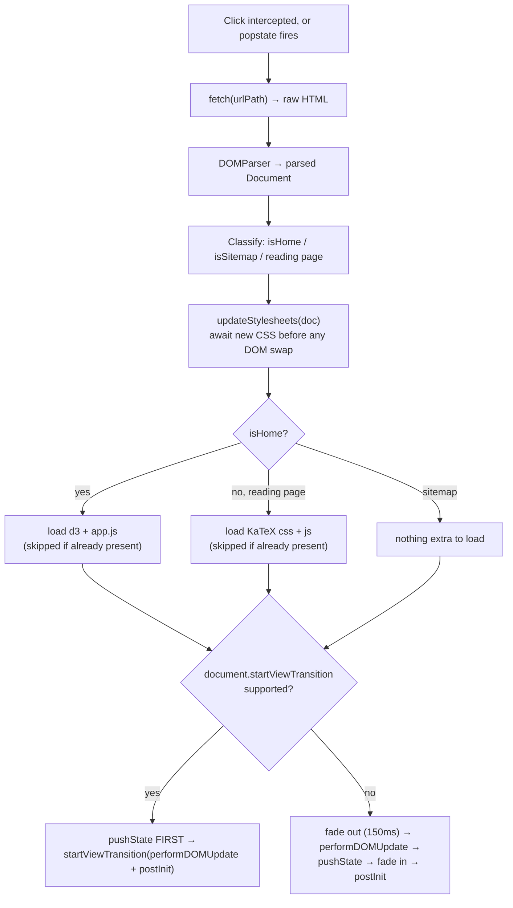
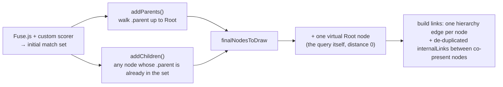

<p align="center">
  <strong>🌐 The Client-Side Runtime</strong><br/>
  <em>Three hand-authored scripts, no bundler, no framework — coordinated entirely through a small, deliberate set of <code>window.*</code> globals.</em>
</p>

<p align="center">
  
  
  
  
</p>

---

This README documents the three permanently-loaded scripts that turn Neuron-IQ's static HTML output into an interactive, SPA-feeling application: **`router.js`** (navigation), **`app.js`** (the homepage graph engine), and **`global.js`** (everything shared across every other page). It assumes you've already read the root `README.md` and `README_BUILDJS.md` for the build pipeline and `STYLES_README.md` for the CSS these scripts drive — this document goes one level deeper, into the actual runtime logic.

## Table of Contents

1. [Where These Three Files Fit](#where-these-three-files-fit)
2. [The Shared Contract — Coordination Through Globals](#the-shared-contract--coordination-through-globals)
3. [`router.js` — The SPA Router](#routerjs--the-spa-router)
4. [`app.js` — Homepage & Graph Engine](#appjs--homepage--graph-engine)
5. [`global.js` — The Global Module](#globaljs--the-global-module)
6. [Bootstrap Lifecycles Compared](#bootstrap-lifecycles-compared)
7. [Cross-File Duplication & Known Quirks](#cross-file-duplication--known-quirks)
8. [Quick Reference](#quick-reference)

---

## Where These Three Files Fit

`graph.js`, `global.js`, and `router.js` are loaded via plain `<script defer>` tags on **every** generated page (article, sitemap, and presumably the hand-authored `index.html`). `app.js` is different: it's only ever needed on the landing page, so it's loaded **on demand**, either as a native tag on a cold load of `index.html` or dynamically injected by `router.js` mid-session.

```mermaid
flowchart TB
    subgraph Always["Loaded on every page via static &lt;script&gt; tags"]
        Graph["graph.js<br/>window.NeuronMap"]
        Global["global.js<br/>NeuronUtils · initGlobalPage"]
        Router["router.js<br/>navigateTo"]
    end
    subgraph OnDemand["Loaded on demand, only by router.js"]
        D3["d3@7 (CDN)"]
        App["app.js<br/>initHomePage · cleanupHomePage"]
        KaTeX["katex + auto-render (CDN)"]
    end
    Router -->|"navigating home &<br/>d3 not yet present"| D3
    Router -->|"navigating home &<br/>window.initHomePage missing"| App
    Router -->|"navigating to a reading page &<br/>katex not yet present"| KaTeX
    Global -.reads.-> Graph
    App -.reads.-> Graph
    App -.calls .utils via.-> Global
```

> **In plain English:** there is no router-level "app shell." Every page is a real, independently-fetchable HTML file. `router.js` is a thin enhancement layer that fetches, swaps, and initializes — it doesn't own any state itself. `global.js` is the one file every page can always assume is present. `app.js` is treated as a lazily-loaded feature bundle, exactly like a route-split chunk in a bundler-based app, just done by hand.

---

## The Shared Contract — Coordination Through Globals

There's no module system here — no `import`/`export`, no event bus, no custom pub/sub. All three files agree on a small vocabulary of `window.*` names and call each other through it. This table **is** the interface between them:

| Global | Defined in | Read by | Purpose |
|---|---|---|---|
| `window.navigateTo` | `router.js` | `app.js` (graph-node click) + implicitly every plain `<a>` on the page via router's own click-delegation | The one public entry point for SPA navigation |
| `window.initHomePage` | `app.js` | `router.js` (`postInit`, entering home) + `app.js`'s own bottom bootstrap | "Boot the landing page" |
| `window.cleanupHomePage` | `app.js` | `router.js` (`postInit`, leaving home) + `app.js`'s own top-of-function guard | Stop the D3 simulation, kill the typewriter timer, hide stray popovers |
| `window.initGlobalPage` | `global.js` | `router.js` (`postInit`, entering any non-home page) + `global.js`'s own bottom bootstrap | "Boot a reading page or the sitemap" |
| `window.NeuronUtils` | `global.js` | `app.js` (aliased locally as `utils`) | The shared utility library (search, popovers, history, keyboard nav) |
| `window.NeuronMap` | `graph.js` (build output, not part of this trio) | `app.js`, `global.js` | The whole knowledge graph, client-side |
| `window.graphSimulation` | `app.js` | `app.js`'s own `cleanupHomePage` | Reference to the live D3 force simulation, so it can be `.stop()`'d |
| `window.typewriterTimeout` | `app.js` | `app.js`'s own `cleanupHomePage` | Reference to the pending typewriter `setTimeout`, so it can be cancelled |
| `window.searchModalWindowListenerAdded` | `global.js` | `global.js` only | A singleton guard — see [Quirks](#cross-file-duplication--known-quirks) |

Notice the asymmetry: `router.js` calls into `app.js`/`global.js` by name, but neither of those files ever calls `router.js` directly for standard link navigation — a plain `<a href="...">` in either file's rendered output is simply left alone and picked up automatically by `router.js`'s document-level click listener. The one place `app.js` *does* call `navigateTo` explicitly (the graph-node click handler) is because it needs to run a synchronous side effect (`saveClickedNode`) before handing off — not because implicit interception wouldn't have worked.

---

## `router.js` — The SPA Router

`router.js` turns a set of independently-servable static HTML files into something that *feels* like a single-page app: no full reloads, animated transitions, correct browser history — while remaining a pure enhancement that degrades to normal navigation the moment anything goes wrong.



**Design points worth knowing:**

- **FOUC-safe stylesheet swap.** `updateStylesheets` diffs `<link rel="stylesheet">` tags between the current and incoming `<head>`, *awaits* every new stylesheet's `load` (or `error`) event before anything else proceeds, and only removes stale stylesheets afterward. Since `index.html` uses `style.css` and every other page uses `page.css`, this is the difference between a jarring unstyled flash mid-navigation and a clean crossfade.
- **Manual code-splitting.** D3 and `app.js` are only ever fetched for the home page; KaTeX is only ever fetched for reading pages. Each load is guarded (`typeof d3 === 'undefined'`, `!window.initHomePage`, `typeof katex === 'undefined'`) so navigating back and forth between pages of the same type never re-downloads or re-executes anything.
- **Two different `pushState` orderings.** On the View-Transition path, `history.pushState` happens *before* the transition callback runs. On the fallback (fade) path, it happens *after* `performDOMUpdate` but before the fade back in. Both end up consistent, but it's a real asymmetry in the code, not an oversight to "fix" without checking both call sites.
- **`performDOMUpdate` explicitly clears `body.style.overflow`.** This exists specifically to undo the scroll-lock that `global.js`'s search modal applies (`document.body.style.overflow = 'hidden'`) — a concrete case of these two files' defensive coding being complementary rather than coincidental. 
- **Total graceful degradation.** Any failure anywhere in `navigateTo` — a failed `fetch`, a parsing error, anything — is caught, logged as a warning, and resolved with a real `window.location.href` navigation. The SPA layer can never leave the app in a broken, half-navigated state; worst case, it behaves like a normal website.
- **Click interception rules.** The document-level click listener explicitly steps aside for `target="_blank"`, any modifier key (respecting "open in new tab"), cross-origin links, and same-page hash-only links (letting the browser's native anchor-scroll handle in-page TOC jumps without SPA involvement).
- **`popstate` passes `pushToHistory = false`.** Back/forward navigation re-runs the exact same `navigateTo` pipeline — same stylesheet sync, same conditional asset loading, same transitions — just without re-pushing a history entry the browser already manages itself.

---

## `app.js` — Homepage & Graph Engine

`app.js` owns the entire landing-page experience: the typewriter hero, the search autocomplete, and — its centerpiece — a hand-tuned D3 force-directed graph that renders a *contextual neighborhood* of the knowledge base around whatever the user just searched for.

### From search bar to graph: the handoff

The transition from "typing a query" to "looking at a graph" is a single orchestrated sequence, triggered either by pressing Enter with nothing highlighted in the dropdown, or (functionally) by picking a result:

1. Fade out the hero text, typewriter, dots, and enter-hint.
2. Clear the search bar and add `.node-zero` — this is the exact CSS class documented in `STYLES_README.md` that collapses the 550px pill into a 14px glowing dot.
3. After the CSS transition has had time to play (500ms), hide the landing container entirely, reveal the `#graph-controls` bar, and call `triggerSearchAlgorithm(query)`.

The visual morph is CSS's job; the *sequencing* of when each fade/hide/reveal happens is entirely orchestrated here in JS.

### `triggerSearchAlgorithm(query)` — building the graph



A few things about this that are easy to miss on a skim:

- **The graph you see is never just search hits.** Matches are expanded upward (full ancestor chain to the real content root) and downward (one level of children), so a hit always renders inside its actual hierarchical context rather than as an isolated dot. If that expansion somehow yields nothing, the whole `NeuronMap` is drawn instead.
- **There are two different "Root" concepts, and they're easy to conflate.** Every search draws one *virtual* `{ id: 'Root', name: 'Query: "..."' }` node representing the query itself — this is **not** the same as any real content node literally named `Root` from `build.js`'s parent-chain. It's the gravitational center of *this particular search's* subgraph, pinned to the exact viewport center.
- **Sizing is a function of connectivity, not content.** Each node's radius (and simulation mass) is derived from `10 + 2×linkCount − 1.5×distance`, clamped to `[6, 30]` — well-connected, shallow concepts render as large circles; deep, sparsely-linked ones shrink.
- **The layout is seeded, not fully organic.** The query node is pinned dead-center; every `distance === 1` "pillar" node is pre-positioned in a perfect 180px-radius circle around it. `forceRadial` then keeps everything else roughly at a ring distance proportional to its `distance` value. The result reads as concentric rings by conceptual depth rather than a formless blob — that structure comes from these fixed seeds and the radial force, not from the link/charge forces alone.
- **Dragging the skeleton is permanent; dragging a leaf isn't.** On drag-end, `fx`/`fy` are only released (returning the node to free physics) for nodes that are *neither* the Root *nor* a distance-1 pillar. Rearrange the central hub or a top-level pillar and it stays exactly where you drop it for the rest of the session; drag a deeper concept and it snaps back into the simulation the moment you let go.
- **Edges are curved, not straight.** Every tick redraws links as cubic Bézier paths with control points offset by half the horizontal distance between endpoints — a cheap, angle-agnostic "always bow outward" curve rather than a true per-edge geometric calculation.
- **An adaptive performance branch kicks in above 500 nodes.** Below that threshold, tick math runs synchronously on every simulation tick. Above it, the same per-tick position/opacity math is wrapped in a `requestAnimationFrame` call guarded by a `tickPending` flag, so simulation ticks firing faster than the browser can paint don't queue up redundant frames.
- **Graph nodes are real `<a>` tags,** not `<div>`s — every node is a genuine, right-clickable hyperlink to `{slug}.html` (except the virtual Root, whose `href` is explicitly `null`).
- **The "median" badge isn't a median.** `#median-val` is populated from `scoreMap[nodesData[0].name]` after sorting matches by descending relevance — i.e., it's the *top* match's score, not a statistical median of anything. Harmless, but worth knowing if you ever touch that label.

### Bootstrap

At the bottom of the file: if `document.readyState === 'loading'`, wait for `DOMContentLoaded`; otherwise call `initHomePage()` immediately — but only if `#landing-container` actually exists on the page. This dual path exists because `app.js` genuinely loads two different ways: as a normal deferred `<script>` tag on a cold load of `index.html` (where the DOM may or may not have finished parsing yet), and as a dynamically-injected `<script>` from `router.js` mid-session (where the DOM has, by definition, already finished loading, so a `DOMContentLoaded` listener alone would simply never fire).

---

## `global.js` — The Global Module

If `app.js` is the landing page's engine, `global.js` is everything else: the shared utility library (`NeuronUtils`), the client-side inline auto-linker, the command palette, and the initializer every non-home page runs.

### The Trie-based inline auto-linker

`global.js` ships its own small `Trie`/`TrieNode` implementation and a `searchTrie(text, trie)` scanner — built from scratch, no library. It's worth being precise about what this does versus `build.js`'s own auto-linking pass, because they solve *related but distinct* problems:

| | `build.js` (build time) | `global.js` (runtime) |
|---|---|---|
| Operates on | Each node's plaintext `searchContent`, scanned against every other node's name | The *currently rendered* article's live text nodes |
| Method | One `RegExp` per target term, tested per source | A single Trie walk with longest-match-at-each-position + word-boundary checks |
| Output | The `internalLinks` graph data (feeds the D3 force graph) | Real `<a class="inline-wiki-link">` elements spliced into the DOM, each with a hover popover |

`searchTrie` walks the trie from every character position, tracking the *longest* valid terminal match found at that position (verifying a word-char/non-word-char transition on both sides of the span so "cat" won't fire inside "category"), then jumps past the whole matched span rather than restarting inside it. It's functionally an Aho-Corasick-lite — true Aho-Corasick would add failure links to avoid the inner "start over from `i`" loop and run in strict linear time; this version is closer to O(text length × longest term length), a reasonable trade for realistic article-length text.

The result is spliced into the DOM via a real `DocumentFragment` rebuild (text node → mixed text + `<a>` elements) rather than an `innerHTML` string replace — the safer approach when you don't want to risk re-parsing or corrupting nearby real markup. A `TreeWalker` restricted to text nodes explicitly rejects `<code>`, `<pre>`, existing `<a>`, headings, and a few structural regions (`.breadcrumbs`, `.meta-row`, `.tier-tabs`) up front, and the term list itself excludes the *current* page's own name and aliases, so an article never links to itself.

### `NeuronUtils` at a glance

| Section | What's in it |
|---|---|
| **Theming** | `getCategoryColor(cat)` — maps a category string to a `var(--color-*)` reference |
| **String helpers** | `escapeRegExp`, `highlightMatch` (feeds `.search-highlight` from `shared.css`) |
| **UI generators** | `generatePopoverHTML`, `positionPopover`, `generateResultItemHTML` — the *same* result-row markup powers both the landing autocomplete and the command-palette modal |
| **History** | A 5-entry, de-duplicated, `localStorage`-backed MRU list for search queries and viewed nodes |
| **Search & scoring** | A hand-tuned rule-based scorer layered on top of Fuse.js (see below) |
| **Keyboard nav** | `setupListKeyboardNav` — one reusable arrow-key/Enter handler shared by both search surfaces |

### The hybrid search engine — and a real scoring-precedence bug

Search isn't pure Fuse.js. `getCustomSearchScore(item, query)` runs a sequence of `if...return` checks, seemingly ranked by the point value each branch returns:

```
1000  exact name match
 950  parenthetical match, e.g. "Machine Learning (ML)" vs query "ML"
 900  acronym match
 850  name starts with query        ←
 925  exact alias match             ← (checked AFTER 850, despite the higher value)
 825  fuzzy/word-boundary alias match
 800  word-boundary match in name
 700  category exact match
 600  section-title match
 500  category prefix match
 400  name substring (query > 3 chars)
 300  section-title substring (query > 3 chars)
```

Because these are sequential early returns rather than a computed maximum, **the code's actual precedence doesn't match the point values' implied ranking.** A node whose *name* happens to start with the query returns 850 immediately — even if that same node also has an alias that *exactly* matches the query and would "deserve" 925. Concretely: two different nodes both carrying the exact alias `"GD"` for a query of `"gd"` will **not** score the same — one named e.g. `"GD Momentum"` scores 850 (its name-prefix check fires first), while another named something that doesn't start with `"gd"` correctly scores 925. Both have an identically-strong alias match; only one gets credit for it. Worth fixing by moving the alias-exact check ahead of the name-prefix check if this is ever revisited.

`getRelevanceScore` then converts these raw scores into the percentages users actually see, using a lookup table for the "clean" tiers (1000→100%, 900→98%, etc.) and falling back to `(1 − fuseScore) × 100` — nudged up slightly — for every tier *not* in that table (950, 925, 850, 825, 300). `performSearch` builds a single memoized Fuse.js instance (weighted: name 1.0, aliases 0.9, category 0.5, sectionTitles 0.4, searchContent 0.1), post-filters very short (≤3 char) queries down to only custom-scorer-positive results to suppress fuzzy noise, and finally re-sorts everything by custom score first, Fuse distance second — meaning Fuse's own ranking is effectively demoted to a tiebreaker whenever the custom scorer has an opinion, which is almost always.

### Page initialization — `initGlobalPage`

Run on every non-home navigation. It reads the current concept's name directly off the rendered `.article-title` element's text (no separate data attribute needed — pragmatic, but it does mean the H1's exact text must match the node's canonical `name`), then:

- `setupDynamicLineage` — fills the sidebar's "Sub-concepts" list by filtering `NeuronMap` for children of the current node, hiding the section entirely if there are none.
- `setupInlineDefinitions` — the Trie-based auto-linker described above.
- Unconditionally: `injectSearchModal` (idempotent — checked against `#search-modal` existing), `setupSearchModalLogic`, `setupKatexAutoRender` (polls every 200ms until `renderMathInElement` is defined, since KaTeX may still be mid-download), `setupTOCScrollObserver`, and a re-bound TOC smooth-scroll handler.

The command palette's global keydown listener (`/` and `Ctrl+K` to open, `Escape` to close) is registered behind a `window.searchModalWindowListenerAdded` guard — a deliberate singleton, since `initGlobalPage` fires on *every* SPA navigation and an unguarded `addEventListener` here would stack up one duplicate global listener per page visited over a session.

---

## Bootstrap Lifecycles Compared

`app.js` and `global.js` both end with a `readyState === 'loading' ? wait for DOMContentLoaded : run now` block — but they mean something subtly different in each file, because of *how* each script actually gets onto the page:

| | `app.js` | `global.js` |
|---|---|---|
| Loaded via a static `<script>` tag | Only on `index.html` (presumed) | On every page |
| Also dynamically re-injected by `router.js`? | **Yes** — every time the user navigates *to* home | **No** — never re-injected; loaded once per real page load |
| So its bottom bootstrap block fires... | Once on a real cold load, *and* once per dynamic injection (since `loadScript` only skips re-injection if a `<script src="app.js">` tag already exists) | Exactly once, ever, for the whole session |
| How does its init function run again on later navigations? | `router.js`'s `postInit()` calls `window.initHomePage()` directly | `router.js`'s `postInit()` calls `window.initGlobalPage()` directly |

In other words: `app.js`'s bottom-of-file bootstrap and `router.js`'s explicit call are two genuinely different code paths that can both fire for the same script. `global.js`'s bottom-of-file bootstrap only ever matters for the very first page of a session — every subsequent invocation of `initGlobalPage` happens exclusively through `router.js`.

---

## Cross-File Duplication & Known Quirks

- **Scoring precedence bug** — see above: `name.startsWith(q)` (850) is checked before exact-alias-match (925), so two equally-strong alias matches can rank differently based on unrelated name coincidence.
- **An orphaned scroll-spy schema.** `setupTOCScrollObserver` hardcodes a translation from TOC hrefs `#beginner` / `#intermediate` / (anything else) to section IDs `overview` / `deeper-dive` / `technical-details`. Current `build.js` output never produces `#beginner` or `#intermediate` links — section IDs are `slugify()`d directly from each `@Section Title`, and the only fixed ID is `overview` for the preamble. This function almost certainly filters its own input down to nothing on every current page and silently no-ops — a leftover from an earlier, fixed beginner/intermediate/technical content tier system that predates the current freeform `@Section` syntax.
- **The TOC click handler is wired up twice.** `build.js`'s `getArticleTemplate` bakes an inline `<script>` directly into every article's HTML that attaches smooth-scroll + active-class-toggle behavior to `.toc-list a` — and `global.js`'s `initGlobalPage` does the *exact same thing* again, every time it runs. On a cold page load, both fire; the work is idempotent so nothing visibly breaks, but it's duplicate binding worth consolidating into one place.
- **Two independent, near-identical hover-card implementations.** `app.js`'s `showRichHoverCard`/`hideRichHoverCard` (for graph nodes) and `global.js`'s inline popover handlers (for in-text wiki links) each reimplement the same 150ms/300ms/200ms debounce-and-fade timing from scratch rather than sharing one utility function, despite populating the exact same `.wiki-popover` markup via the exact same `NeuronUtils.generatePopoverHTML`.
- **The "median" badge is the top score, not a median** (see the `app.js` section above).
- **`positionPopover` never flips downward.** It always positions the popover *above* the hover target with a fixed 12px gap and clamps horizontally to stay on-screen — but has no fallback for a target near the very top of the viewport, where the popover could render partially off-screen above it.
- **`getCategoryColor`'s silent fallback.** Any category string that doesn't match "computer"/"cs", "math", "physics", or "root" falls through to `--color-science` by default — meaning a typo'd or novel category name in frontmatter renders visually identical to a genuine Science node, with no visible signal that anything's off.
- **Filter-button category matching is a little ad hoc.** The `isMatch` check in `app.js`'s filter handler special-cases `"cs"` to also match any category containing the substring `"computer"` — a manual patch for the mismatch between a `data-category="cs"` button and a frontmatter value like `"Computer Science"`, rather than a general normalization step applied to all categories.

---

## Quick Reference

**Adding a new page type to the router:** extend the `isHome`/`isSitemap` classification in `navigateTo` and add a matching branch to the asset-preload step — follow the existing pattern of a guarded `typeof x === 'undefined'` / `!window.y` check so repeat navigations stay cheap.

**Adding a new search-result surface** (a third place besides the landing dropdown and the command palette): reuse `NeuronUtils.generateResultItemHTML` for markup and `NeuronUtils.setupListKeyboardNav` for arrow-key/Enter behavior — that's the whole reusable contract; don't reimplement either.

**Hooking additional per-page setup:** add it inside `global.js`'s `initGlobalPage` if it should run on every non-home page, or `app.js`'s `initHomePage` if it's landing-page-only. Either way, make sure `router.js`'s `postInit()` is still the only thing that calls it on subsequent navigations — don't rely on a bottom-of-file bootstrap firing more than once per real page load.